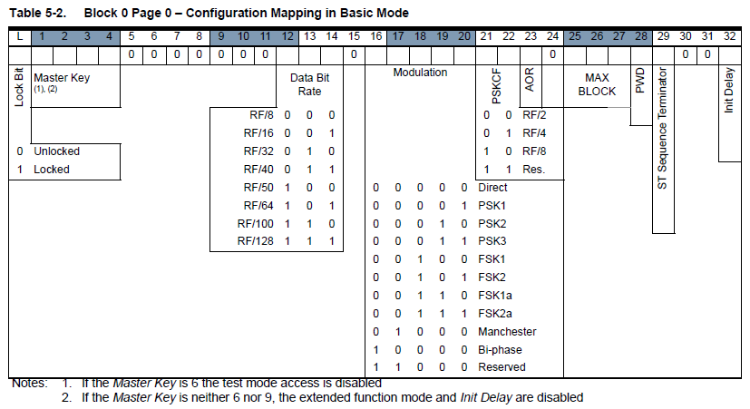

# T5577 Introduction Guide
<a id="Top"></a>

### Based on Iceman Proxmark3 repo

### Ver.1 8 Sep 2019
### Ver.2 7 March 2021

# Table of Contents

| Contents                                                                            |
| ----------------------------------------------------------------------------------- |
| [Part 1](#part-1)                                                                   |
| [Introduction](#introduction)                                                       |
| [T5577 Overview](#t5577-overview)                                                   |
| [What data is on my T5577](#what-data-is-on-my-t5577)                               |
| [Read and Write Blocks of Data](#read-and-write-blocks-of-data)                     |
| [Exercise 1](#exercise-1)                                                           |
| [How do I use a password](#how-do-i-use-a-password)                                 |
|                                                                                     |
| [Part 2 – Configuration Blocks](#part-2-configuration-blocks)                       |
| [The configuration Block – Block 0 Page 0](#the-configuration-block-block-0-page-0) |
| [Exercise 2](#exercise-2)                                                           |
| [The configuration Block – Block 3 Page 1](#the-configuration-block-block-3-page-1) |
| [Sniffing commands](#sniffing-commands) |
| [T5577 and Keysy](#t5577-and-keysy) |

# Part 1
^[Top](#top)

## Introduction
^[Top](#top)

The T5577 is a generic LF (Low Frequency) RFID card that is used in the
125 Khz frequency space. It is a good card to use to learn about RFID and
learn how to use the proxmark3.

It is highly recommended that when learning about RFID that learning how
to read the data sheets be near the top of the list. It can be very hard
as the data sheet will hold the information you need, but you don’t yet
know what it means. As such, I will attempt to point to sections of the
data sheet and would highly advise that you look at the data sheet as
you go. Overtime the data sheet may change, as a result things may not
always be referenced correctly.

As at writing this guide, the data sheet can be found at :

<http://ww1.microchip.com/downloads/en/DeviceDoc/Atmel-9187-RFID-ATA5577C_Datasheet.pdf>

This guide is not a how do I clone document. It is meant to help people
learn how to use the T5577 and in the process learn about rfid and the
proxmark3.

Throughout this guide I will give examples. It is recommended that you
try these as we go. To do so, have a blank T5577 card that you can use
for this purpose.

## T5577 Overview
^[Top](#top)

The T5577 is a chip that can hold data and a configuration (Section
4.12).

In the diagram below, all white blocks can hold data. Some can be used
for a second purpose, such as the ‘password’ and ‘traceability data’.
The ‘Configuration Data’ and ‘Analog front end option setup’ will tell
the chip how to behave.


 #### What is "Traceability Data"?

 Traceability data is manufacturer-programmed (and locked) data that contains information related to the manufacture of the chip - presumably so that issues can be "traced back" to the point and date of manufacture.  It contains data such as the year and quarter of manufacture, the wafer number on which the chip was produced, and the die number on the wafer.   The traceabiltiy data occupies blocks 1 and 2 of Page 1, and is normally NOT writeable, although some T5577 clones will allow you to overwrite these blocks.   You can read the traceability data with the `lf t55xx trace` command.
 

## What data is on my T5577
^[Top](#top)

Let’s have a look and see what a card might look like in the proxmark3
software. Since we can change the configuration of how the T5577 will
output data, the proxmark3 software needs to work out how to interpret
the data it receives, we do this with the following command.

It should be noted that the T5577 has many clones. As such the default
setup of each card may be different. If the tractability data is
present, then this will vary based on the batch of cards.

Always run this command when you place a t5577 on the proxmark3. In all
examples shown, it will be assumed you have run the detect command.
```
[usb] pm3 --> lf t55xx detect
```
You should see a results similar to the following:
```
    [=]  Chip type......... T55x7                    
    [=]  Modulation........ ASK                      
    [=]  Bit rate.......... 2 - RF/32                
    [=]  Inverted.......... No                       
    [=]  Offset............ 33                       
    [=]  Seq. terminator... Yes                      
    [=]  Block0............ 000880E0 (auto detect)   
    [=]  Downlink mode..... default/fixed bit length 
    [=]  Password set...... No                       

```
Now that the proxmark3 has detected a T55x7 chip, and found some
information about it, we should be able to see all the data on the chip.
```
[usb] pm3 --> lf t55xx dump
```
Your results should look similar to the following:
```
[+] Reading Page 0:
[+] blk | hex data | binary                           | ascii
[+] ----+----------+----------------------------------+-------
[+]  00 | 000880E0 | 00000000000010001000000011100000 | ....
[+]  01 | 00000000 | 00000000000000000000000000000000 | ....
[+]  02 | 00000000 | 00000000000000000000000000000000 | ....
[+]  03 | 00000000 | 00000000000000000000000000000000 | ....
[+]  04 | 00000000 | 00000000000000000000000000000000 | ....
[+]  05 | 00000000 | 00000000000000000000000000000000 | ....
[+]  06 | 00000000 | 00000000000000000000000000000000 | ....
[+]  07 | 00000000 | 00000000000000000000000000000000 | ....
[+] Reading Page 1:
[+] blk | hex data | binary                           | ascii
[+] ----+----------+----------------------------------+-------
[+]  00 | 000880E0 | 00000000000010001000000011100000 | ....
[+]  01 | 00000000 | 00000000000000000000000000000000 | ....
[+]  02 | 00000000 | 00000000000000000000000000000000 | ....
[+]  03 | 00000000 | 00000000000000000000000000000000 | ....
```
I will cover the meaning of this data as we go, but for now, lets keep
it simple.

## Read and Write Blocks of Data
^[Top](#top)

The basic function of using the proxmark3 with rfid cards is to read and
write data. This reading and writing must be done in the correct way
needed for the chip (and its configuration). Lucky for us, the
developers have done a great job and gave us commands. What we need to
know is that with the T5577, data is read/written one complete block at a
time. Each block holds 32 bits of data (hence the binary output shown)  
  
Since we know that the card has data and configuration blocks, lets stay
away from those while we learn how to read and write. I suggest you
follow along and perform each command and check the results as we go.

We can store our own data in blocks 1-7 (remember that block 7 will be
needed if we want to set a password).

(Don’t forget to run the detect command: lf t55xx detect, and ensure you
can see the card)

1)  Check what is stored in block 1. The following command can be read
    as, run a low frequency (lf) command for the T55xx chip (t55xx) and
    read block (b) number 1.
    ```
    [usb] pm3 --> lf t55xx read -b 1
    ```
    result:
    ```
    [+] Reading Page 0:
    [+] blk | hex data | binary                           | ascii
    [+] ----+----------+----------------------------------+-------
    [+]  01 | 00000000 | 00000000000000000000000000000000 | ....
    ```
    Note: Depending on the history of your card, your data may vary, but
    should match the dump data.

2)  Write some new data into block 1 on the card.

    We use the -d option to supply the data ‘12345678’
    ```
    [usb] pm3 --> lf t55xx write -b 1 -d 12345678
    ```
    result:
    ```
    [=] Writing page 0  block: 01  data: 0x12345678
    ```
3)  Now, lets check if the data was written.
    ```
    [usb] pm3 --> lf t55xx read -b 1
    ```
    result:
    ```
    [+] Reading Page 0:
    [+] blk | hex data | binary                           | ascii
    [+] ----+----------+----------------------------------+-------
    [+]  01 | 12345678 | 00010010001101000101011001111000 | .4Vx
    ```
4)  The data is written in Hexadecimal. A single hex digit holds 4 bits
    of data. So to store 32 bits in a block, we need to supply 8 hex
    digits (8 \* 4 = 32). If you are not familiar with hex and binary do a
    little bit of home work to learn. The following is a quick start.
    
    | Hex | Binary | Decimal |
    |:---:|:------:|:-------:|
    |  0  |  0000  |    0    |
    |  1  |  0001  |    1    |
    |  2  |  0010  |    2    |
    |  3  |  0011  |    3    |
    |  4  |  0100  |    4    |
    |  5  |  0101  |    5    |
    |  6  |  0110  |    6    |
    |  7  |  0111  |    7    |
    |  8  |  1000  |    8    |
    |  9  |  1001  |    9    |
    |  A  |  1010  |   10    |
    |  B  |  1011  |   11    |
    |  C  |  1100  |   12    |
    |  D  |  1101  |   13    |
    |  E  |  1110  |   14    |
    |  F  |  1111  |   15    |

    To use all the bits we supply the data in Hex format and it will
    always be 8 hex digits.

    Lets try and write 89ABCDEF
    ```
    [usb] pm3 --> lf t55xx write -b 1 -d 89abcdef
    ```
    result:
    ```
    [=] Writing page 0  block: 01  data: 0x89ABCDEF
    ```
    and check
    ```
    [usb] pm3 --> lf t55xx read -b 1
    ```
    result:
    ```
    [+] Reading Page 0:
    [+] blk | hex data | binary                           | ascii
    [+] ----+----------+----------------------------------+-------
    [+]  01 | 89ABCDEF | 10001001101010111100110111101111 | ....
    ```

### Exercise 1
^[Top](#top)

Using the read and write commands you have learnt see if you can make
the lf t55 dump command show the following data for blocks 1-7 (Page 0).
Do not write to block 0 or try and change the data on page 1.
```
[usb] pm3 --> lf t55 dump
```
result:
```
[+] Reading Page 0:
[+] blk | hex data | binary                           | ascii
[+] ----+----------+----------------------------------+-------
[+]  00 | 000880E0 | 00000000000010001000000011100000 | ....
[+]  01 | 89ABCDEF | 10001001101010111100110111101111 | ....
[+]  02 | 00000000 | 00000000000000000000000000000000 | ....
[+]  03 | 00000000 | 00000000000000000000000000000000 | ....
[+]  04 | 00000000 | 00000000000000000000000000000000 | ....
[+]  05 | 00000000 | 00000000000000000000000000000000 | ....
[+]  06 | 00000000 | 00000000000000000000000000000000 | ....
[+]  07 | 00000000 | 00000000000000000000000000000000 | ....
[+] Reading Page 1:
[+] blk | hex data | binary                           | ascii
[+] ----+----------+----------------------------------+-------
[+]  00 | 000880E0 | 00000000000010001000000011100000 | ....
[+]  01 | 00000000 | 00000000000000000000000000000000 | ....
[+]  02 | 00000000 | 00000000000000000000000000000000 | ....
[+]  03 | 00000000 | 00000000000000000000000000000000 | ....
```

Practice reading and writing to blocks 1 to 6 until you are happy you
can do it and get the results you wanted (i.e. the data you want stored
is written to the block you want it stored in).  I recommend staying
away from block 7 as this is where the password is stored, if used.
If you forget this data/password, you won't be able to read or write
to the card.

## How do I use a password
^[Top](#top)

This can be a little tricky for beginners. 
***If you forget your password you will lose access to your card***.

To tell the T5577 to use a password, we have to change the data in the
configuration block (0). To help learn this and make it as simple as I
can, please read and follow exactly. If your results DON’T match 100% as
required, please do not proceed.

1)  Lets start with a known card state and wipe the card. This will set
    a default configuration to block 0 and set all the data in blocks
    1-7 to a default.
    ```
    [usb] pm3 --> lf t55xx wipe
    ```
    Result:
    ```
    [=] Target T55x7 tag
    [=] Default configuration block 000880E0

    [=] Begin wiping...
    [=] Writing page 0  block: 00  data: 0x000880E0
    [=] Writing page 0  block: 01  data: 0x00000000
    [=] Writing page 0  block: 02  data: 0x00000000
    [=] Writing page 0  block: 03  data: 0x00000000
    [=] Writing page 0  block: 04  data: 0x00000000
    [=] Writing page 0  block: 05  data: 0x00000000
    [=] Writing page 0  block: 06  data: 0x00000000
    [=] Writing page 0  block: 07  data: 0x00000000
    ```

2)  Check that the card is in the desired state.
    ```
    [usb] pm3 --> lf t55xx detect
    ```
    result:
    ```
    [=]  Chip type......... T55x7                   
    [=]  Modulation........ ASK                     
    [=]  Bit rate.......... 2 - RF/32               
    [=]  Inverted.......... No                      
    [=]  Offset............ 33                      
    [=]  Seq. terminator... Yes                     
    [=]  Block0............ 000880E0 (auto detect)  
    [=]  Downlink mode..... default/fixed bit length
    [=]  Password set...... No                      
    ```
    
    If block 0 does not hold the hex data **0x000880E0 resolve this
    first before proceeding.**

3)  Set the password we want to use. For this example lets use the
    password : ***12345678***

    The password is saved in block 7 of page 0.
    ```
    [usb] pm3 --> lf t55xx write -b 7 -d 12345678
    ```
    result:
    ```
    [=] Writing page 0  block: 07  data: 0x12345678
    ```

4)  Lets verify both block 0 and block 7
    ```
    [usb] pm3 --> lf t55xx dump
    ```
    result:
    ```
    [+] Reading Page 0:
    [+] blk | hex data | binary                           | ascii
    [+] ----+----------+----------------------------------+-------
    [+]  00 | 000880E0 | 00000000000010001000000011100000 | ....
    [+]  01 | 00000000 | 00000000000000000000000000000000 | ....
    [+]  02 | 00000000 | 00000000000000000000000000000000 | ....
    [+]  03 | 00000000 | 00000000000000000000000000000000 | ....
    [+]  04 | 00000000 | 00000000000000000000000000000000 | ....
    [+]  05 | 00000000 | 00000000000000000000000000000000 | ....
    [+]  06 | 00000000 | 00000000000000000000000000000000 | ....
    [+]  07 | 12345678 | 00010010001101000101011001111000 | .4Vx
    [+] Reading Page 1:
    [+] blk | hex data | binary                           | ascii
    [+] ----+----------+----------------------------------+-------
    [+]  00 | 000880E0 | 00000000000010001000000011100000 | ....
    [+]  01 | 00000000 | 00000000000000000000000000000000 | ....
    [+]  02 | 00000000 | 00000000000000000000000000000000 | ....
    [+]  03 | 00000000 | 00000000000000000000000000000000 | ....
    ```
    ***Important : If block 0 and block 7 don’t match exactly, do not continue.***

5)  Now we have a known configuration block and a known password of
    12345678, we are ready to tell the card to use the password.
    
    To do this the datasheet tells us we need to set the 28<sup>th</sup>
    bit “PWD”. Check your datasheet and see the entire table (remember
    the data sheet is your friend).
    
    
    
    We will cover other things in the configuration later. But the key
    note here, is we ONLY want to change bit 28 and nothing else.
    
    Current Block 0 : ***000880E0***  
    New Block 0     : ***000880F0***
    
    To understand what happened to get from 000880E0 to 000880F0 we need
    to look at the binary data.
    
    While this can be confusing, it is important to understand this as we
    do more advanced things.
    
    Bit Location (28)  
    000000000011111111112222222 ***2*** 2233  
    123456789012345678901234567 ***8*** 9012
    
    | Hex Data | Binary Data                            |
    |:--------:|:---------------------------------------|
    | 000880E0 | 000000000000100010000000111***0***0000 |
    | 000880F0 | 000000000000100010000000111***1***0000 |
    
    See how in the above we changed the bit in location 28 from a 0 to 1  
    0 = No Password, 1 = Use Password

    Note how we did NOT change any other part of the configuration, only bit 28.

    To re-cap.  
        We put the card into a known configuration Block 0 : 000880E0  
        We set the a known password Block 7 : 12345678  
        We altered the config data to tell the T5577 to use the password.  
            New Block 0 : 000880F0  

    If you have completed all steps and have the exact same results, we are
    ready to apply the new configuration.
    ```
    [usb] pm3 --> lf t55xx write -b 0 -d 000880F0
    ```
    result:
    ```
    [=] Writing page 0  block: 00  data: 0x000880F0
    ```

6)  Lets check what happens when the password is set.
    ```
    [usb] pm3 --> lf t55 detect
    ```
    result:
    ```
    [!] Could not detect modulation automatically. Try setting it manually with 'lf t55xx config'
    ```
    Note how the lf t55 detect no longer seems to work\!
    
    In this case, this is due to needing a password to read/write to the
    card.
    
    Lets try again, but this time supply the password. We use the option
    -p followed by the password.
    ```
    [usb] pm3 --> lf t55 detect -p 12345678
    ```
    result:
    ```
    [=]  Chip type......... T55x7
    [=]  Modulation........ ASK
    [=]  Bit rate.......... 2 - RF/32
    [=]  Inverted.......... No
    [=]  Offset............ 33
    [=]  Seq. terminator... Yes
    [=]  Block0............ 000880F0 (auto detect)
    [=]  Downlink mode..... default/fixed bit length
    [=]  Password set...... Yes
    [=]  Password.......... 12345678
    ```
    
7)  Write a block of data with a password
    ```
    [usb] pm3 --> lf t55xx write -b 1 -d 1234abcd -p 12345678
    ```
    result:
    ```
    [=] Writing page 0  block: 01  data: 0x1234ABCD pwd: 0x12345678
    ```
    
8)  Read a block of data with a password
    
    ***\*\*\*\* Important \*\*\*\****
    
    ***Reading a T5577 block with a password when a password is not
    enabled can result in locking the card. Please only use read with a
    password when it is known that a password is in use.
    
    At least don't use block 0 for this and password with `1` in the most significant bit***
    
    The proxmark3 has a safety check\!
    ```
    [usb] pm3 --> lf t55xx read -b 1 -p 12345678
    ```
    result:
    ```
    [+] Reading Page 0:
    [+] blk | hex data | binary                           | ascii
    [+] ----+----------+----------------------------------+-------
    [!] Safety check: Could not detect if PWD bit is set in config block. Exits.
    ```
    
    Note that the proxmark3 did not read the block, the safety kicked in
    and wants us to confirm by supply the override option ‘-o’.

    Lets try again with the ‘-o’ option as we know the password is set.
    ```
    [usb] pm3 --> lf t55xx read -b 1 -p 12345678 -o
    ```
    result:
    ```
    [+] Reading Page 0:
    [+] blk | hex data | binary                           | ascii
    [+] ----+----------+----------------------------------+-------
    [=] Safety check overridden - proceeding despite risk
    [+]  01 | 1234ABCD | 00010010001101001010101111001101 | .4..
    ```
    This time, we can see the data we wrote to block 1 is found with the
    read command.

9)  Remove the need to supply the password.
    
    To do this we need to clear Bit 28 (set to 0) in the config. We have
    this from above.
    
    Remember if we don’t know the config and write this config to the
    card, it will overwrite all other settings. This can recover the
    card, but will lose any settings you may want. So it’s a good idea
    to read the config, and set bit 28 to 0, rather than just overwrite
    the config and change the way the card works.
    
    In our examples we know what it should be : 000880E0
    ```
    [usb] pm3 --> lf t55xx write -b 0 -d 000880E0 -p 12345678
    ```
    result:
    ```
    [=] Writing page 0  block: 00  data: 0x000880E0 pwd: 0x12345678
    ```
    Now check if we can detect without a password
    ```
    [usb] pm3 --> lf t55 detect
    ```
    result:
    ```
    [=]  Chip type......... T55x7                    
    [=]  Modulation........ ASK                      
    [=]  Bit rate.......... 2 - RF/32                
    [=]  Inverted.......... No                       
    [=]  Offset............ 33                       
    [=]  Seq. terminator... Yes                      
    [=]  Block0............ 000880E0 (auto detect)   
    [=]  Downlink mode..... default/fixed bit length 
    [=]  Password set...... No                       
    ```
    Yes we can!  We can see Block 0 is the correct config 000880E0

# Part 2 – Configuration Blocks
^[Top](#top)

One of the things a lot of people have trouble with or miss, is that the
T5577 has two different and separate communications protocols, each with
their own sub-protocols.

  - Card to Reader  
  - Reader to Card  

In Card to Reader, the T5577 will encode its data using the settings
from Block 0 in Page 0. It will use this in both default read mode
(where is sends out the blocks from 1 to x on power up), as well as when
it responds to commands.

In the Reader To Card, the T5577 will encode the data using the settings
from Block 3 Page 1. If the command is not encoded correctly it will
ignore the command and revert back to default read mode.

## The configuration Block – Block 0 Page 0
^[Top](#top)

For this configuration the settings chosen will be for the purpose of
the card when used in production. E.G. If you want the card to act like
an EM4100, then we need to choose the settings that work like the
EM4100; same goes for others like HID. I am not going to cover these
here, rather use an example. Others have collected these and posted on the
forum or can be found by searching the web.

To get started lets look back at the data sheet.



The non-password protect EM4100 could have a block 0 config of 00148040,
so what does it mean.

To decode this config, we need to look at it in binary
00000000000101001000000001000000. Note that it had 32 bits and the
config block 0 is 32 bits. Now we can break it down.

| Bits    | Purpose                | Value       |
| ------- | ---------------------- | ----------- |
| 0000    | Master Key             | Nothing Set |
| 0000000 | Not used in Basic Mode |             |
| 101     | Data Bit Rate          | RF/64       |
| 0       | Not used in Basic Mode |             |
| 01000   | Modulation             | Manchester  |
| 00      | PSKCF                  | RF/2        |
| 0       | AOR                    | Not Set     |
| 0       | Not used in Basic Mode |             |
| 010     | Max Block              | 2           |
| 0       | Password               | Not Set     |
| 0       | ST Sequence Terminator | Not Set     |
| 00      | Not used in Basic Mode |             |
| 0       | Init Delay             | Not Set     |

To get more detail on each item, read through the data sheet.

Lets see how the proxmark3 can help us learn. We will assume the T5577
is in the same state from Part 1, where we can write to the card with no
password set (if not, review and get you card back to this state).

1)  Lets turn you T5577 into an EM4100 with ID 1122334455
    ```
    [usb] pm3 --> lf em 410x clone --id 1122334455
    ```
    result:
    ```
    [+] Preparing to clone EM4102 to T55x7 tag with ID 1122334455 (RF/64)
    [#] Clock rate: 64
    [#] Tag T55x7 written with 0xff8c65298c94a940

    [+] Done
    ```
    
2)  Check this has work.
    ```
    [usb] pm3 --> lf search
    ```
    result:
    ```                                                             
    [=] NOTE: some demods output possible binary                         
    [=] if it finds something that looks like a tag                      
    [=] False Positives ARE possible                                     
    [=]                                                                  
    [=] Checking for known tags...                                       
    [=]                                                                  
    [+] EM 410x ID 0F0368568B                                            
    [+] EM410x ( RF/64 )                                                 
    [=] -------- Possible de-scramble patterns ---------                 
    [+] Unique TAG ID      : F0C0166AD1                                  
    [=] HoneyWell IdentKey                                               
    [+]     DEZ 8          : 06837899                                    
    [+]     DEZ 10         : 0057169547                                  
    [+]     DEZ 5.5        : 00872.22155                                 
    [+]     DEZ 3.5A       : 015.22155                                   
    [+]     DEZ 3.5B       : 003.22155                                   
    [+]     DEZ 3.5C       : 104.22155                                   
    [+]     DEZ 14/IK2     : 00064481678987                              
    [+]     DEZ 15/IK3     : 001034014845649                             
    [+]     DEZ 20/ZK      : 15001200010606101301                        
    [=]                                                                  
    [+] Other              : 22155_104_06837899                          
    [+] Pattern Paxton     : 259822731 [0xF7C948B]                       
    [+] Pattern 1          : 9750181 [0x94C6A5]                          
    [+] Pattern Sebury     : 22155 104 6837899  [0x568B 0x68 0x68568B]   
    [=] ------------------------------------------------                 
                                                                     
    [+] Valid EM410x ID found!                                           
                                                                     
    [+] Chipset detection: T55xx                                         
    [?] Hint: try `lf t55xx` commands                                    
    ```
    Looks good.

3)  Now lets see what the T5577 detect and info shows
    ```
    [usb] pm3 --> lf t55 detect
    ```
    result:
    ```
    [=]  Chip type......... T55x7                   
    [=]  Modulation........ ASK                     
    [=]  Bit rate.......... 5 - RF/64               
    [=]  Inverted.......... No                      
    [=]  Offset............ 33                      
    [=]  Seq. terminator... Yes                     
    [=]  Block0............ 00148040 (auto detect)  
    [=]  Downlink mode..... default/fixed bit length
    [=]  Password set...... No                      
    ```
    ```
    [usb] pm3 --> lf t55xx info
    ```
    result:
    ```
                                                                 
    [=] --- T55x7 Configuration & Information ---------              
    [=]  Safer key                 : 0                               
    [=]  reserved                  : 0                               
    [=]  Data bit rate             : 5 - RF/64                       
    [=]  eXtended mode             : No                              
    [=]  Modulation                : 8 - Manchester                  
    [=]  PSK clock frequency       : 0 - RF/2                        
    [=]  AOR - Answer on Request   : No                              
    [=]  OTP - One Time Pad        : No                              
    [=]  Max block                 : 2                               
    [=]  Password mode             : No                              
    [=]  Sequence Terminator       : No                              
    [=]  Fast Write                : No                              
    [=]  Inverse data              : No                              
    [=]  POR-Delay                 : No                              
    [=] -------------------------------------------------------------
    [=]  Raw Data - Page 0, block 0                                  
    [=]  00148040 - 00000000000101001000000001000000                 
    [=] --- Fingerprint ------------                                 
    [+] Config block match        : EM unique, Paxton                
                                                                 
    ```
    We can see that the info gave us more information and confirmed what
    we decoded by hand. But remember, the detect is still needed so the
    proxmark3 software will know how to decode the info block.

    We can see that for the EM4100 emulation we have two blocks of data
    (Max Block = 2). On the T5577 these will be Blocks 1 and 2.

## Exercise 2
^[Top](#top)

Using the skills form part 1, see if you can view the data in blocks 1 and 2.

Note: the EM4100 ID of 1122334455 is encoded, so don’t expect to see
      those bytes as such. To learn how to do that, you guessed it, find the
      datasheet and review.

At this point we have an EM4100 card. If we wanted to password protect
it, we can follow the password section and update the config from
00148040 to 00148050.

***Important : Don’t forget to set a valid password in block 7 and remember it.***

## The configuration Block – Block 3 Page 1
^[Top](#top)

_to be written_


## Sniffing commands
^[Top](#top)

Some readers work with cards via T55xx commands (read/write/etc) and think that they are safe)
The password in this case is sent in clear text.
So) There is a sniff command to get this command from the buffer or the field:

    [usb] pm3 --> lf t55xx sniff

    result:
                               
    [=] T55xx command detection
    [+] Downlink mode           |  password  |   Data   | blk | page |  0  |  1  | raw
    [+] ------------------------+------------+----------+-----+------+-----+-+---------------------------------------------
    [+] Default write/pwd read  | [FFxxxxxx] | FFxxxxxx |  6  |   0  |  16 |  45 | 1011111111101xxxxxxxxxxxxxxxx100000110
    [+] Default write/pwd read  | [FFxxxxxx] | FFxxxxxx |  6  |   0  |  17 |  46 | 1011111111101xxxxxxxxxxxxxxxx100000110
    [+] -------------------------------------------------------------------------------------------------------------------


## T5577 and Keysy
^[Top](#top)

The Keysy tag cloning tool (https://tinylabs.io/keysy/) uses T5577 tags that have a special "password" value (NOT the password described above) written in Block 6 that is tied to the traceability data.  The Keysy checks and computes the proper value for Block 6 and will not write to a tag that does not contain the proper value.   This DRM technology relies on the face that genuine T5577 chips cannot have their traceability data (Blocks 1 and 2 of Page 1) re-written and that the method to computer the proper value for Block 6 is proprietary, therefore compelling you to buy their branded tags.

As noted earlier, certain T5577 clones DO allow you to overwrite the traceability data, thereby allowing a dump of a new Keysy tag to completely overwrite the entire memory and tricking the Keysy into using that tag.   This also implies that you should NEVER overwrite Block 6 on a Keysy tag, as doing so will prevent the use of the Keysy to program that tag in the future without restoring that value.
