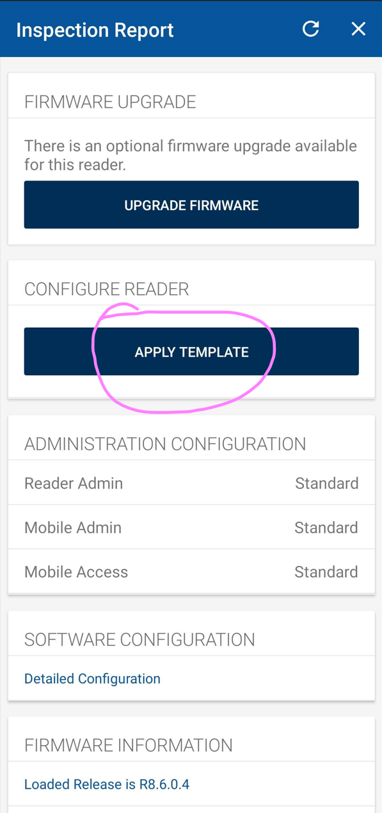
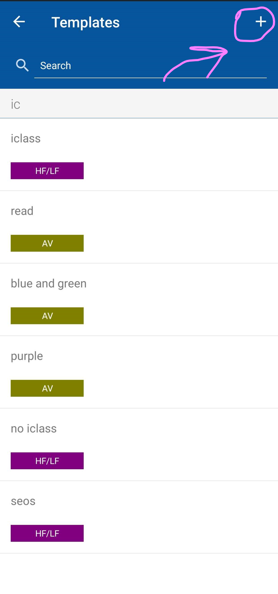
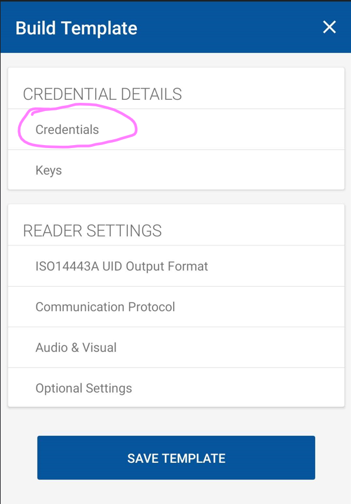
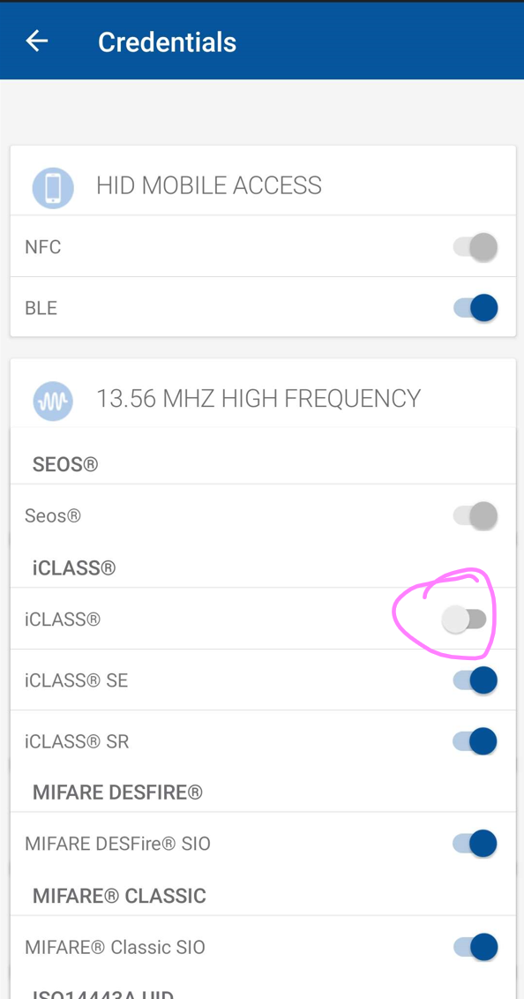

# Notes on downgrade attacks
<a id="top"></a>

Author [@kitsunehunter](https://gist.github.com/kitsunehunter) 2023

This is a reworked text. You find the [original text here](https://gist.github.com/kitsunehunter/c75294bdbd0533eca298d122c39fb1bd)

The collective notes on iCLASS SR / iCLASS SE / SEOS downgrade attacks.

This document targets both Proxmark3 and Flipper Zero devices. 

# Table of Contents
- [Notes on downgrade attacks](#notes-on-downgrade-attacks)
- [Table of Contents](#table-of-contents)
- [Terminology](#terminology)
- [Useful links](#useful-links)
- [Downgrade concept](#downgrade-concept)
- [Success rate](#success-rate)
- [Getting started](#getting-started)
  - [Verfiy reader has iCLASS legacy enabled](#verfiy-reader-has-iclass-legacy-enabled)
  - [Inspect reader with HID reader manager](#inspect-reader-with-hid-reader-manager)
  - [Verify reader has ProxII enabled](#verify-reader-has-proxii-enabled)
  - [Test files](#test-files)
- [Simulate a standard keyed iCLASS legacy credential](#simulate-a-standard-keyed-iclass-legacy-credential)
- [Write a downgraded iCLASS legacy credential](#write-a-downgraded-iclass-legacy-credential)
  - [Using Omnikey Reader 5427CK Gen2 and Proxmark3](#using-omnikey-reader-5427ck-gen2-and-proxmark3)
  - [Using Flipper Zero with NARD](#using-flipper-zero-with-nard)
  - [Using Weaponized HID Reader](#using-weaponized-hid-reader)
- [Write ProxII credential to a T5577](#write-proxii-credential-to-a-t5577)
  - [Using Proxmark3](#using-proxmark3)
  - [Using Flipper Zero](#using-flipper-zero)


# Terminology
^[Top](#top)

* Credential - an access token that acts as carrier of a SIO

* SIO - Secure Identity Object

* PACS - Physical Access Control System

* PACS Payload - The binary encoded credential data.

* Downgrade attack - Read the PACS payload off a SIO and encode it as a lesser secure legacy format

* Omnikey - Official HID desktop reader to read PACS payload off iCLASS SE and SEOS cards

* Weaponized reader - "DIY" omnikey reader to perform the same job as the omnikey using a actual HID reader you might find on a wall

* NARD / SAM - SIM add-on for Flipper, used with HID SAM to read iCLASS SE and SEOS

* SAM - HID Secure Access Module responsible for encoding and decoding PACS payload inside a SIO among others

* T5577 - a low frequency multi purpose card. Used as clone card.

# Useful links
^[Top](#top)

[HID iCLASS Credentials tech primer](https://forum.dangerousthings.com/t/types-of-hid-iclass-cards/12243)

[What does all data on my card mean?!](https://www.hidglobal.com/doclib/files/resource_files/an0109_a.2_credential_id_markings_application_note.pdf)


# Downgrade concept
^[Top](#top)

There is not much you can do with just a card and a Proxmark3 or Flipper Zero.  There is no card-only attack vectors.  There are however reader/card vectors but that is outside the scope of this note.

Your iCLASS SR/iCLASS SE/SEOS credential has a SIO (Secure Identity Object) that stores your access control information also known as the PACS payload. We will need to extract the SIO with one of the methods outlined below and write that data onto a Picopass or a T5577.

In short:
We are downgrading from a secure credential to a lesser secure legacy format

# Success rate
^[Top](#top)

Unfortantely not all readers will have iCLASS legacy enabled and your **downgrade** will not work. The good thing is that **most** readers are left in their default configuration with iCLASS legacy enabled which allows us to easily take your secure credential and make a logical copy onto a less secure format. We can easily test if the reader is standard keyed and will accept a credential downgrade attack with the steps below.

# Getting started
^[Top](#top)

For the next steps, you will need a `Proxmark3` or `Flipper Zero` device.

## Verfiy reader has iCLASS legacy enabled
^[Top](#top)

Present a standard keyed iCLASS legacy credential at the reader and see if it beeps.
If the reader beeps, proceed to [Write a downgraded iCLASS legacy credential](#write-a-downgraded-iclass-legacy-credential)

Instructions:
To check if your legacy credential is standard keyed.

PM3 
`hf iclass dump --ki 0` if it dumps == standard key

F0 
`Picopass app > Read card` check if key == standard 


## Inspect reader with HID reader manager
^[Top](#top)

Install [HID reader manager](https://play.google.com/store/apps/details?id=com.hidglobal.pacs.readermanager&hl=en&gl=US) and register before proceeding

A Android phone with NFC is recommended for this next step as iPhone can only inspect readers that are bluetooth enabled natively or have a BLE backpack installed as a add-on. 

This method of inspection will not work if the reader has a MOB key or ELITE key. 

Reader inspection is only possible on official HID readers, not third party readers using HID credentials. 

Click use NFC and hold the phone to the reader and follow the prompts. Click on apply template.



Click on the plus button



Click on credentials



Make sure the switch for iCLASS is switched on (blue)



If you have successfully confirmed that iCLASS legacy is switched on then proceed to the next step 

## Verify reader has ProxII enabled
^[Top](#top)

You can verify that the low frequency ProxII is enabled by using one of the following methods:

 * Hold a [RF field detector](https://sneaktechnology.com/product/rf-detector-by-proxgrind-2/) at the reader and see if the RED LED flashes
 * Use the Flipper RFID detector app `apps > tools > RFID detector` and make sure RFID symbol is active
 * Use [reader manager](#inspect-reader-with-hid-reader-manager) and inspect the reader and check if 125khz prox is enabled at the bottom of the credentials page


## Test files
^[Top](#top)

Below are two dump files provided for easy testing.

- PM3 - Download [hf-iclass-dump.json](../traces/iclass/hf-iclass-dump.json)
- F0  - Download [iclass-flipper.picopass](../traces/iclass/iclass-flipper.picopass)


How to restore the dump files on each device.

PM3
- run the follwing command to restore hf-iclass-dump.json to a picopass card
 `hf iclass restore -f hf-iclass-dump.json --ki 0`

F0 
- Drop the iclass-flipper.picopass file here and write to card on Flipper
 `qflipper > SD card > apps data > picopass` 


# Simulate a standard keyed iCLASS legacy credential
^[Top](#top)

For [Test files](#test-files) if needed.

Instructions:
Once you loaded the file and started the simulation. Hold the device to the reader. If it beeps, proceed to [Write a downgraded iCLASS legacy credential](#write-a-downgraded-iclass-legacy-credential)

PM3 
```
hf iclass eload -f hf-iclass-dump.json
hf iclass sim -t 3
```

F0 
`qflipper > SD card > apps data > picopass` 
drop iclass-flipper.picopass file here and simulate on Flipper


# Write a downgraded iCLASS legacy credential
^[Top](#top)

## Using Omnikey Reader 5427CK Gen2 and Proxmark3
^[Top](#top)

1. Download latest version of Omnikey workbench [here](https://www3.hidglobal.com/drivers/14994)
2. Plug in Omnikey reader
3. Start Omnikey workbench
4. Switch reader mode to CCID mode
5. Go to reader upload tab 
6. Use the "load file" function and load the `encoder.cfg` [config file](../traces/iclass/encoder.cfg)
7. Launch PM3 client, place iCLASS/Picopass card on HF antenna and read your original card on the Omnikey reader
8. Press enter

## Using Flipper Zero with NARD
^[Top](#top)

Prequisite, you must already have a [NARD add-on board](https://github.com/killergeek/nard) and a HID SAM

If not, you can buy a [kit](https://www.redteamtools.com/nard-sam-expansion-board-for-flipper-zero-with-hid-seos-iclass-sam/) from RTA webshop.

Follow these steps:

1. Launch Seader application

 if `credential == iClass` use read picopass
 
 if `credential == SEOS` use read 14443A
 
2. Place flipper on credential and read
3. Save as picopass
4. Go to picopass app and write your credential to a card

## Using Weaponized HID Reader
^[Top](#top)

OBS!
This method involves more technical steps, wiring, and is recommended for advanced users. If this is your first time with RFID technology and downgrade attacks, we suggest any of the two options above.

Prequisite, you will need the following bill of materials (BOM):
* A standard keyed iCLASS SE reader
* A ESPKEY [Github project](https://github.com/rfidtool/ESP-RFID-Tool)
* Some 20-24 AWG wire or ethernet cable
* Your preferred power source (5-9v)

The easiest way is to buy a [ESPKEY](https://www.aliexpress.com/item/32850151497.html)

Follow these steps:

1. Connect the `Data 0, Data 1, Ground, Power` to the respective terminals on the ESPKEY
2. Provide 5-9V power to the reader and ESPKEY at the same time using your preferred power source

IT IS ABSOLUTELY NECESSARY THAT THE READER AND ESPKEY SHARE THE SAME GROUND EVEN IF YOU ARE POWERING ESPKEY AND READER SEPERATELY

3. Connect to the wifi network the ESPKEY and navigate to `192.168.1.1` for the interface
4. Scan your credential on the reader
5. Open `log.txt` and copy the binary string WITHOUT the preamble
6. Use `hf iclass encode --bin <COPIED BINARY STRING> --ki 0` to encode the PACS payload to a iCLASS legacy card


# Write ProxII credential to a T5577
^[Top](#top)

OBS!  Downgrading to a T5577 will only work if reader has low frequency (125 kHz) / Prox II enabled.
A good indicator to look out for is the "multiCLASS" sticker on the reader.

## Using Proxmark3
^[Top](#top)

1. Copy the raw PACS binary from your [Omnikey](#using-omnikey-reader-5427ck-gen2-and-proxmark3) output
2. PM3 ``wiegand decode --bin <raw PACS binary>``

Below is example syntax, you will use your specific card information gathered in the previous step.

3. `lf hid clone -w c1k48s --fc 69 --cn 69420`
4. `lf hid reader` to verify output

## Using Flipper Zero
^[Top](#top)

1. After reading your credential with [NARD / Seader](#using-flipper-zero-with-nard)
2. select the ``save RFID`` option 
3. Use the 125kHz RFID app and write the data to a T5577

