# PM5 VERE Technical Manual

> This document is intended for firmware developers and community maintainers. It systematically describes the hardware features, power control, peripheral interfaces, and design rationale of **PM5** (the upgraded hardware system of the PROXMARK3 project).
> This document is a **hardware overview manual**; for the registers and communication protocols of specific peripherals, refer to the individual manuals in the same directory (given as links).

- Author: DXL & KOMBI
- Document version: v1.0
- Date: 2026-08-25

---

## Table of Contents

1. [Overview](#1-overview)
2. [Core Processor and FPGA Architecture](#2-core-processor-and-fpga-architecture)
3. [System Power Architecture](#3-system-power-architecture)
4. [Internal Peripherals](#4-internal-peripherals)
5. [External Interfaces](#5-external-interfaces)
6. [Storage and Clock](#6-storage-and-clock)
7. [Debug Interfaces](#7-debug-interfaces)
8. [Standard Antenna](#8-standard-antenna)
9. [system I2C bus Peripheral Address Table](#9-system-i2c-bus-peripheral-address-table)
10. [Appendix: Terms and Abbreviations](#10-appendix-terms-and-abbreviations)

---

## 1. Overview

PM5 is the upgraded hardware system developed by the PROXMARK3 project. Compared with PROXMARK3 RDV4 and PROXMARK3 EASY, its hardware design has multiple adjustments and modifications. To facilitate community software maintenance and iterative development, this manual aims to systematically explain PM5's hardware features and design rationale.

Overview of PM5's core hardware features:

| Category | Content |
|------|------|
| Main processor | AT32F435 (ARM Cortex-M4F, 288 MHz) |
| FPGA | GOWIN GW1N-UV4 (4608 LUTs, built-in flash) |
| Power control | No dedicated SoC; relies on the main MCU to maintain power |
| Communication bus | `system I2C bus` (connecting multiple peripherals) |
| External interfaces | Main board 10P Connect header, dual TYPEC (USB / CEP), FPGA debug port |
| Antenna | Dual-band (HF / LF) antenna, supporting I2C parameter configuration |

---

## 2. Core Processor and FPGA Architecture

### 2.1 Key Processor Changes

The PM5 project almost completely restructured the PM3 system framework, replacing the aging AT91 processor `AT91SAM7S512` (ARM7-based, 55 MHz) and the SPARTAN FPGA `XC2S30` (972 LUTs) with more modern ones:

- **Main processor**: `AT32F435` (ARM Cortex-M4F, 288 MHz)
- **FPGA**: `GOWIN GW1N-UV4` (4608 LUTs)

This replacement provides a higher ceiling for hardware performance and leaves more capacity and headroom for future software development.

### 2.2 FPGA Firmware Framework Changes

Because the new GOWIN FPGA has more than 4 times the logic capacity of the original SPARTAN FPGA, PM5 now **no longer needs to distinguish** the three firmwares `HF.BIT`, `LF.BIT`, and `HF_15.BIT` — as of release, all current functional code occupies less than half of the FPGA's resources.

At the same time, the new GOWIN FPGA has **internal flash** and can boot directly from internal flash (which is much faster than having the ARM "load" it at boot), so PM5's boot and flashing flow can be greatly simplified.

**Recommended firmware development / flashing method:**

| Scenario | Approach |
|------|------|
| During development and debugging | Use the ARM to load SRAM data into the FPGA via **emulated JTAG**, for debugging and testing, cf `hw fpga config --sram` |
| Releasing firmware (for non-developer users) | Use the ARM to write firmware to the FPGA's flash via **emulated JTAG**, cf `hw fpga config` |

This way there is no longer a 2–4 s FPGA programming wait at each boot; and since high/low-frequency firmware no longer needs to be distinguished, we no longer need to wait for FPGA programming while switching high/low-frequency card commands.

---

## 3. System Power Architecture

PM5's power system is fairly complex. This section explains it step by step, from the overall block diagram and the on/off control circuit to each control point.

### 3.1 Power System Overview

The overall architecture of PM5's power system is shown below:

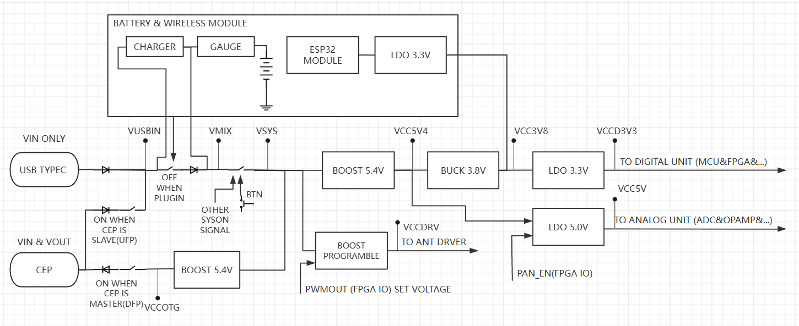

### 3.2 Power On/Off Control Circuit

The figure below is a **simplified functional description** of PM5's power on/off control circuit; a high level on each signal can effectively trigger system power-on.

> Note: this figure has been simplified and is intended only to describe the signal relationships.

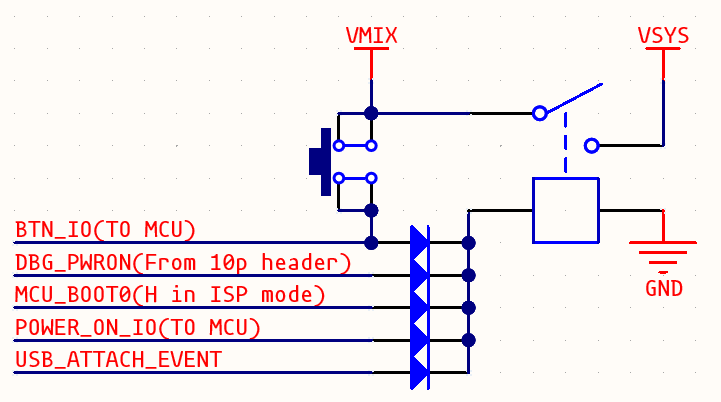

### 3.3 Power Control Points

**① Power-on hold (`POWER_ON_IO`)**

In normal applications, the power on/off control circuit is controlled jointly by the external button and the MCU: after a button press powers on the system, the MCU must pull `POWER_ON_IO` (`PB0`) high at the appropriate moment to keep the system powered on and running.

**② Charger and Coulomb counter**

A charger and a Coulomb counter are designed on the external battery wireless module. Communication with these two chips is carried out over the `system I2C bus` (addresses in [Section 9](#9-system-i2c-bus-peripheral-address-table)).

**③ Controllable antenna drive voltage (BOOST)**

PM5 adds a controllable antenna drive voltage mechanism. This voltage is controlled by a **BOOST** circuit with an adjustable boost ratio:

- The FPGA's `PWMOUT` (`38`) is used to set this voltage;
- A high level on the FPGA's `PDP_EN` (`42`) is used to start the BOOST.

**④ Low-power design (`PAN_EN`)**

PM5 implements basic low-power design. Because the ADC consumes a lot of power while running, on PM5 a low level on the FPGA's `PAN_EN` (`24`) can be used to turn off the analog unit's power.

**⑤ Forced restart and ISP mode (button controller)**

PM5 has an additional hardware circuit (the button controller) used to forcibly restart the entire system by button when the host MCU is out of control or has no firmware (long-press the button for 6 s); and if USB is inserted when the restart is triggered, this hardware circuit pulls the AT32's `BOOT0` high (this signal is also used to maintain system power, see the on/off control circuit above), placing the system in **ISP mode**.

In ISP mode:

- The **hardware UART** (on the 10P Connect header, see [Section 5.1](#51-main-board-10p-header-interface)) or the **USB interface** (either TYPEC port) can be used with the **Artery ISP** tool to flash and update the MCU firmware;
- Long-pressing the button again for 3 s triggers a forced restart (system power-cycle restart);
- If ISP mode lasts more than 300 s, a forced restart is also triggered.

> For the button controller's complete button logic and timing parameters, refer to [Button Controller Technical Manual](../PM5_Controllers/PM5_Button_Controller_RM.md).

**⑥ USB insertion wake-up**

PM5 has an additional hardware circuit that, after a USB insertion (with or without a battery present), powers the system on for a short period (untested, about several tens of ms), intended to allow the USB insertion event to wake the device.

**⑦ Reset precautions (avoid accidental shutdown)**

Because the power circuit does not use a dedicated SoC, PM5 relies on the main MCU to keep the power on. Therefore, we **do not recommend** that the main MCU performs any behavior that causes the GPIO registers to reset (such an operation would cause the I/O that controls the main power switch to float, which would then cause the intended RESET to power down the system, manifesting as an accidental shutdown), for example:

- `NVIC_RESET`
- `WDT` triggering, etc.

If a software RESET is needed, use an **interrupt vector table jump** behavior instead; for WDT behavior, it may be kept if it is acceptable that a WDT event directly causes a shutdown.

### 3.4 Power-on and On/Off Flow

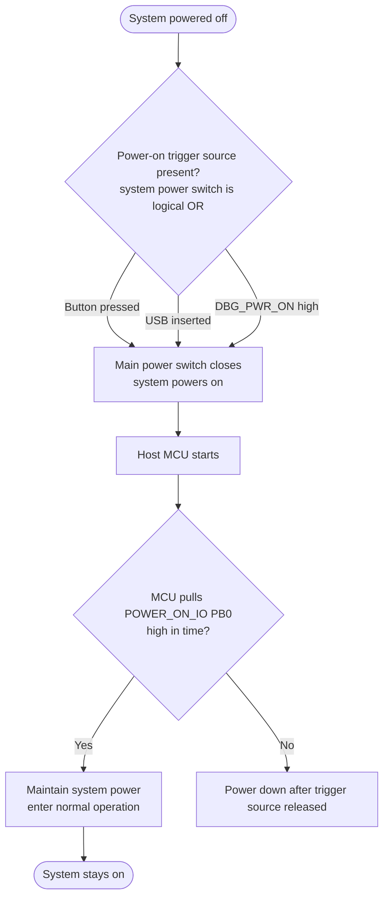

### 3.5 Forced Restart and ISP Mode Entry Flow

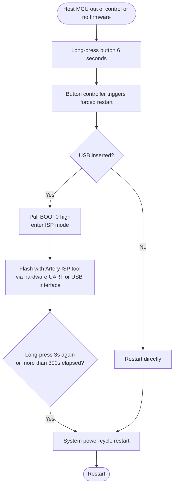

---

## 4. Internal Peripherals

### 4.1 RGB LED

PM5's hardware adds an RGB LED. This LED has an independent RGB controller, and communication with the RGB controller is carried out over the `system I2C bus`.

> For details on the RGB controller, refer to [RGB Controller Technical Manual](../PM5_Controllers/PM5_RGB_Controller_RM.md).

### 4.2 Buzzer

PM5's hardware adds a buzzer. This buzzer is controlled by two signals:

| Signal | Description |
|------|------|
| `BEEPER_EN` (`PB13`) | Enable signal; GPIO configured as OUTPP, pulled high to enable the buzzer |
| `BEEPER` (`PC9_TIM3_CH4`) | Waveform output, driving the buzzer to sound |

How it works:

- `BEEPER` can produce outputs such as SPWM using the internal timer / DMA;
- After `BEEPER_EN` is pulled low, the hardware RC produces a roughly 100 ms **sustain**, used to create a fading audio effect.

**Recommended implementation:**

- If the sustain is **not needed**: pull `BEEPER` low to turn it off directly for a clean cutoff effect;
- If the sustain is **needed**: keep sending the `BEEPER` signal during the sustain period, using the hardware's fade to obtain a soft tail.

The buzzer-related circuit is shown below (simplified schematic):

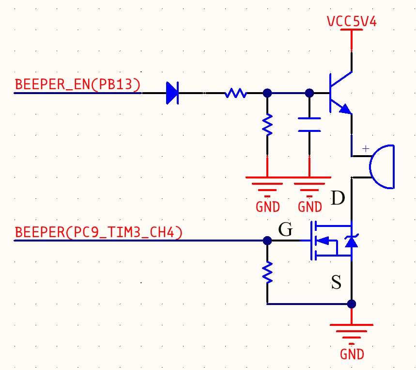

---

## 5. External Interfaces

### 5.1 Main Board 10P Connect Header & ICX301 Antenna Interface

On PM5's **main board** there is a **2x5P 2.54 mm Connect header** as a communication interface. This interface provides multiple IO functions (used by peripherals such as the antenna),
and have a ICX301 as the antenna interface.

About ICX301: [ICX301 Datasheet](../../datasheets/AMASS_ICX301PT_SPEC.pdf)

The following image shows the positional relationship between the 10P HEADER and ICX301 in detail.
And shows the signal definition of the 10P HEADER and the ICX301 interface.
> It is not completely accurate(position), may deviate due to welding precision issues. You will need to measure and confirm. 

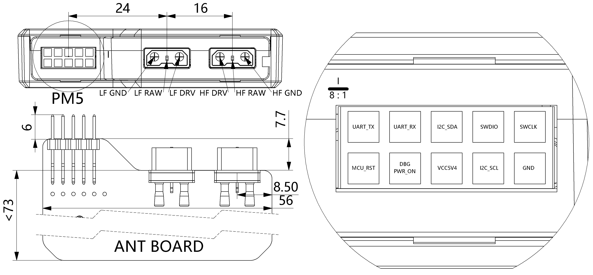
> The picture's orientation is the order as seen "directly viewing the 10P connector with the machine's decorative side facing up" (with the antenna's yellow ICX301 connectors on the right side of the visible area).

Signal definitions:

| Signal | Internal connection | Description |
|------|----------|------|
| UART TX / RX | MCU `PA2` / `PA3` | Usable for UART or other I/O functions, not shared with other circuits; there is an ESD bleed circuit on the line, recommended level 3.3 V |
| I2C SDA / SCL | MCU `PC7` / `PC6` | I.e., the `system I2C bus`, used to communicate with various peripherals; not recommended for functions other than connecting to I2C slaves (on the multi-frequency antenna board shipped with the host, this port is used to communicate with the antenna controller), recommended level 3.3 V |
| SWDIO / SWCLK | MCU `PA13` / `PA14` | Usable for SWD debugging or other I/O functions, not shared with other circuits; there is an ESD bleed circuit on the line, recommended level 3.3 V; this interface can directly flash or debug the MCU |
| MCU_RST | Main MCU RESET | Built-in 3.3 V pull-up resistor; pull low to reset the MCU; this port is internally connected to the power control's restart circuit and cannot be used for other functions |
| DBG_PWR_ON | — | Debug-only power control signal; input high level (2.0–15 V) to turn on the system's internal main power switch (VMIX–VSYS path); note that the system power switch is a "logical OR" relationship, and this signal overrides all other on/off signals (but does not affect the MCU and reset circuit reading the button signal) |
| VCC5V4 | — | Output voltage of the internal DCDC circuit; for output only, must not be used to input any power; voltage about 5.4 V, and it is a BOOST-boosted output, so an external LDO is required if ripple requirements apply; output capability is less than 300 mA, and since fault isolation is not implemented, drawing excessive current is not recommended, otherwise the internal operating state of the PM5 may become unstable |

### 5.2 TYPE-C Ports

PM5 has two TYPE-C ports located in different positions:

| Port | Tongue color | Position | Function | USB connection |
|------|----------|------|------|----------|
| USB port | Orange | Same side as the button | The familiar USB port on the traditional PM3, powering (charging) and communicating with the whole device | MCU USB2 (`PB14` / `PB15`) |
| CEP interface | Black | Side | Can power (charge) the whole device, and can also output power externally | MCU USB1 (`PA11` / `PA12`) |

> For more information on the CEP interface, see [Section 5.3](#53-cep-interface-typec_external_port).

### 5.3 CEP Interface (TYPEC_EXTERNAL_PORT)

On PM5, we introduced a **"dual-device interconnect"** capability for interconnecting two PM5s, for example to implement behaviors such as man-in-the-middle sniffing. To achieve **high bandwidth + high real-time + high compatibility** interconnect, we added an additional USB TYPE-C port to PM5. Its basic structure is identical to a standard 24-pin USB TYPEC port, and its interface definition is shown below:

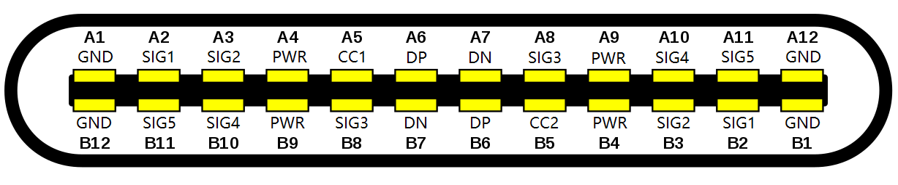

**Signal symmetry:** the signal connections of the CEP interface (except the CC signals) are vertically reversed (centrosymmetric), which allows the cable to be inserted in either orientation.

**CC handshake:** the CEP uses the CC lines for the handshake. PM5 has a built-in Type-C configuration channel chip `TUSB320`; this chip handles the CC handshake information of the CEP interface and communicates with the main MCU over the `system I2C bus`.

**SIG signal assignment:** due to the requirements of dual-device interconnect and reversible cable insertion, as well as circuit layout constraints, the five signals `SIG1`–`SIG5` in the CEP port definition are used in the following connection scheme:

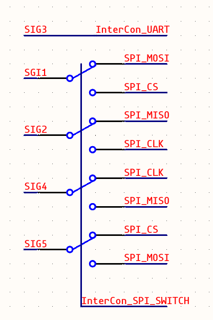

In this connection scheme:

| Signal | Purpose | Connection |
|------|------|------|
| SIG1 / SIG2 / SIG4 / SIG5 | SPI signals interconnecting the internal MCUs of two PM5s | Uses GPIO `A4` / `A5` / `A6` / `A7` |
| Switch control | Swap the cable order | Controlled by the MCU's `InterCon_SPI_SWITCH` (`PB2`) |
| SIG3 | Single-wire UART or ordinary I/O communication | Connected to the MCU's `InterCon_UART` (`PA9`) |
| DP / DM | USB 2.0 portion | Directly interconnected |

> Since `PB2` is also the MCU's `BOOT1`, this signal has an external pull-down resistor.

**Identity handling for dual-device interconnect:**

Since both PM5s may both be DRP when interconnected, the handshake result is random. When using the dual-device interconnect feature, we recommend adapting the CC handshake identity handling in software, for example:

- Manually designate one device as the host; or
- Automatically switch when the handshake result is affected by the running function, etc.

We recommend that **the CC handshake result be used to switch `InterCon_SPI_SWITCH`**; only two PM5s with different `InterCon_SPI_SWITCH` levels can correctly use SPI communication.

**Compatibility specification and safety:**

- Because compatibility with the standard TYPEC specification is required, before confirming that the peer is a usable PM5 device, it is recommended to set these five IOs to **floating state**; identity confirmation can be performed using USB 2.0 or single-wire UART handshaking.
- Because the single-wire UART is floating (floating input) while the peer's identity is unconfirmed, the MCU can receive external signals through the single-wire UART without causing non-compliant electrical effects on the interface. Therefore, when the CEP port is used to communicate with Flipper 0, it also uses single-wire UART handshaking first and then enables the SPI slave function.

**External power supply capability:**

The CEP port has the ability to supply power externally, and the on/off of this capability is controlled by the CC handshake result: if the current identity is MASTER (DFP), the output power is enabled. This power supply provides about 5.1 V, but its supply capability is limited — due to the capacity of the internal lithium battery and system power consumption, the effective external output capability does not exceed 500 mA over the long term. This port has overcurrent and short-circuit protection.

> **Recommendation**: in dual-device interconnect scenarios, install the "BWM module" on both devices and, in software, disable the lithium battery charger charging function (if present) or reduce the charging current, to prevent (when only one PM5 is connected to external power) drawing excessive current from the external power source and causing a fault; and we do not recommend operating PM5 in scenarios that require a stable output power source, such as a power bank.

**CEP dual-device interconnect handshake flow:**

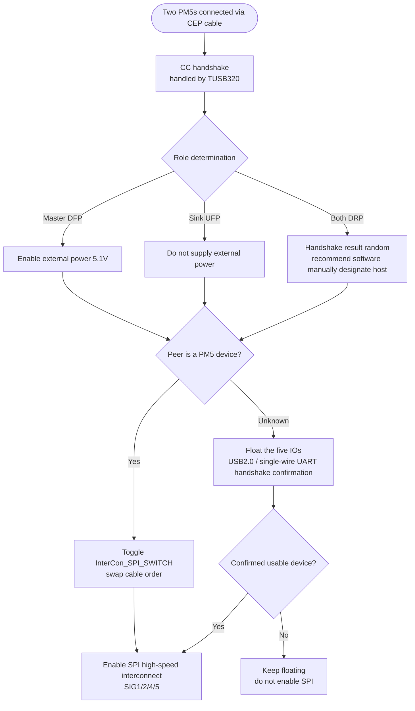

---

## 6. Storage and Clock

### 6.1 Memory

In PM5's system structure, in addition to the traditional `25Q flash`, we added a **read-only** `24C02 EEPROM`, which stores some factory and production information.

- The hardware pulls the **WP** signal high to prevent accidental writes;
- The hardware reserves a jumper (soldering required) to enable writes — **if you do not know what you are doing, please do not enable it lightly**.

This EEPROM is connected to the `system I2C bus`.

### 6.2 Drive Clock Bypass

Because the FPGA's internal processing introduces significant phase noise to the clock (especially the 13.56 MHz clock), this can manifest as frequency-to-amplitude conversion interference on PM3's high-Q antenna system. For this reason, we added an additional **external clock bypass circuit**:

- This circuit can pass the 13.56 MHz crystal signal, after gating, directly to the RF circuit's driver, **bypassing the FPGA's internal complex processing**;
- The gating signal is `FE_GATE_EN` (`29`).

The clock signal path is shown below:

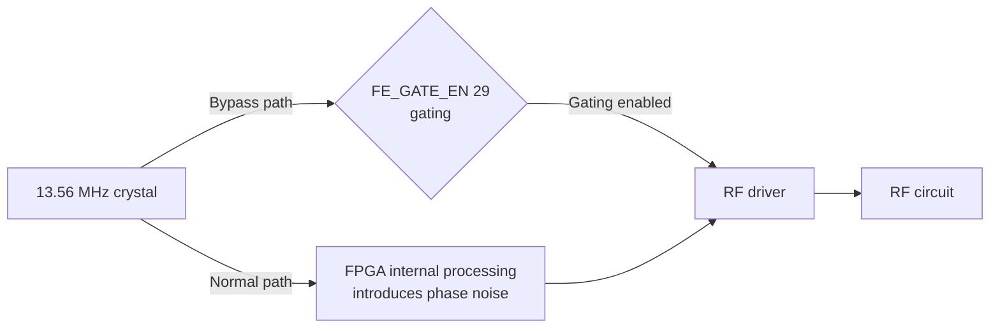

---

## 7. Debug Interfaces

### 7.1 FPGA Debug Port

We reserved an FPGA debug port on the PCB, defined as shown below (this information is also printed on the PCB surface):

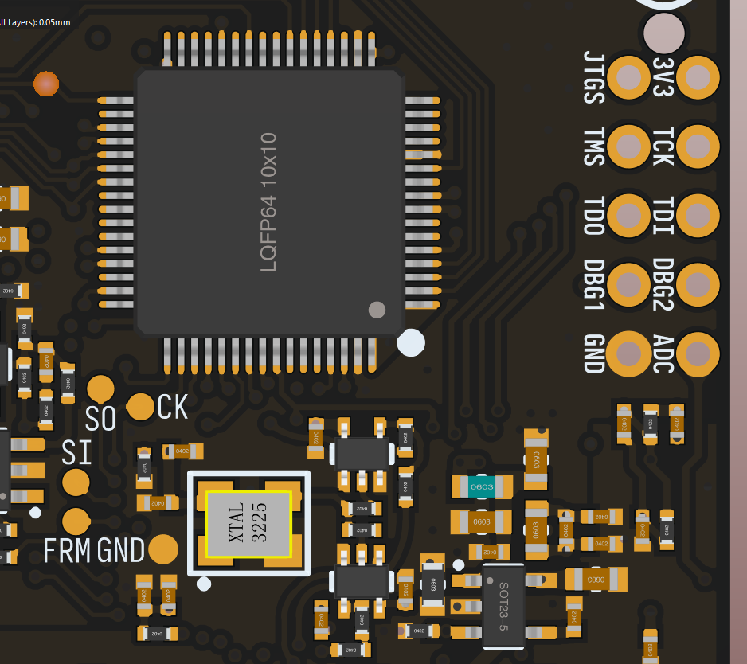

Signal descriptions:

| Signal | Description |
|------|------|
| ADC | The raw input of the ADC in the acquisition circuit, unrelated to the FPGA |
| DBG1 / DBG2 | Debug signal pins broken out from the FPGA, dedicated circuits; this port can withstand 3.3 V levels |
| JTAG (TDO / TDI / TMS / TCK) | The FPGA's JTAG pins |

**Notes:**

- The JTAG signals are shared with the ARM–FPGA communication **SPI (not SSP)** used during normal system operation;
- For the GOWIN FPGA, restoring JTAG requires **pulling the `JTAGSEL` signal low**;
- If an external debugger is connected here, the main MCU firmware must **float these five signals** at the same time, otherwise there is a risk of I/O conflict;
- You can also monitor the ARM–FPGA communication here — we have already implemented JTAG flashing based on this port, and it is SPI while running the PM3 firmware normally.

The four **non-plated-through test points** on the left side of the figure are the ARM–FPGA SPP signals. Note: due to the peripheral differences between the AT32 and the AT91, we changed the SSP signal to **SPI-TIMODE**; its basic principle is the same as the traditional SSP, with only a difference in timing, which will not be elaborated here. These test points can be used to measure and debug the communication.

Additionally, a separate LED on the back of the button is also a debug I/O dedicated to the FPGA, which can be used for signal indication during development (this LED is not visible outside the enclosure).

### 7.2 Port Definition Information

The figure below is the external interface definition of the main MCU (`AT32F435RxTx`):

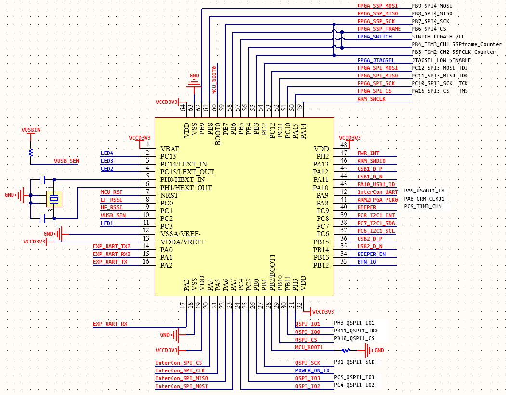

The figure below shows the FPGA and clock circuit:

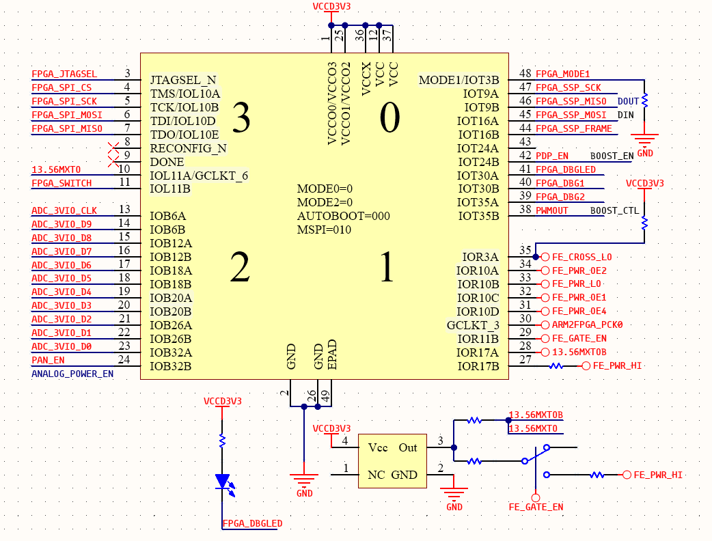

---

## 8. Standard Antenna

### 8.1 Changes vs. RDV4

Changes of the standard dual-band (HF, LF) antenna relative to RDV4:

- Added an **antenna controller chip** to provide the ability to modify antenna hardware parameters via I2C;
- Replaced with the **ICX301 interface**, which is commonly used for RC model battery connections and has very solid interface performance and a relatively high insertion/removal life (>1000 times), making it convenient for users to swap antennas;
- **Q value switching** changed from a physical button to I2C switching (antenna controller);
- Added **two blue LEDs**, expanding the antenna's operating-state indication capability, configurable via I2C (antenna controller);
- **LF supports multiple frequencies**: 125, 134, 250 (new), 375 (new), 500 (new), configurable via I2C (antenna controller);
- Longer read range, and it reduces some of the blind-zone problems relative to RDV4 (in some cases the RF drive voltage needs to be adjusted).

> For details on the antenna controller, refer to [Antenna Controller Technical Manual](../PM5_Controllers/PM5_ANT_Controller_RM.md).

---

## 9. system I2C bus Peripheral Address Table

The peripherals connected to the `system I2C bus` and their 7-bit slave addresses are as follows:

| Peripheral name | Peripheral address (7-bit) | Description |
|----------|:----------------:|----------------|
| RGB controller | `0x48` | [RGB Controller Technical Manual](../PM5_Controllers/PM5_RGB_Controller_RM.md)|
| Antenna controller | `0x51` |[Antenna Controller Technical Manual](../PM5_Controllers/PM5_ANT_Controller_RM.md)|
| BQ27427 | `0x55` |battery Coulomb counter / fuel gauge (on the optional BWM)|
| AW32001 | `0x49` |battery charger (on the optional BWM)
| 24C02 | `0x50` | read-only EEPROM (see [Section 6.1](#61-memory))|
| TUSB320 | `0x47` |Type-C configuration channel (CC) chip for the CEP interface|

---

## 10. Appendix: Terms and Abbreviations

| Term / abbreviation | Meaning |
|-------------|------|
| PM5 | The PROXMARK3 upgraded hardware system, the subject of this manual |
| PM3 / RDV4 / EASY | PROXMARK3 and previous hardware versions |
| MCU | Microcontroller; here it refers to the main controller chip AT32F435 |
| FPGA | Field-Programmable Gate Array; here it refers to the GOWIN GW1N-UV4 |
| system I2C bus | The system's internal I2C bus, used to connect various peripherals |
| ISP | In-System Programming |
| CEP | TYPEC_EXTERNAL_PORT, the extended TYPE-C port used for dual-device interconnect |
| CC | Type-C Configuration Channel |
| DRP / DFP / UFP | Type-C roles: dual-role / downstream (power source) / upstream (power sink) |
| SPWM | Sinusoidal Pulse-Width Modulation |
| OUTPP | Push-Pull Output |
| LUTs | Number of FPGA lookup tables, a measure of logic capacity |
