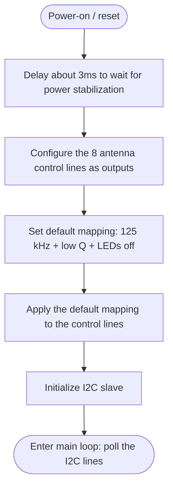
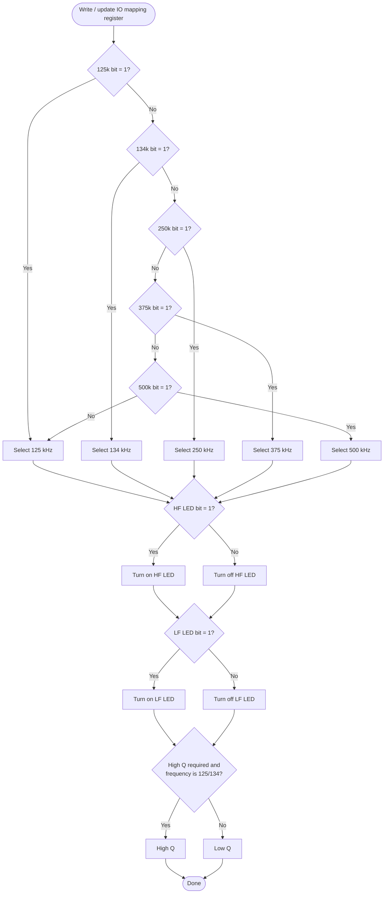
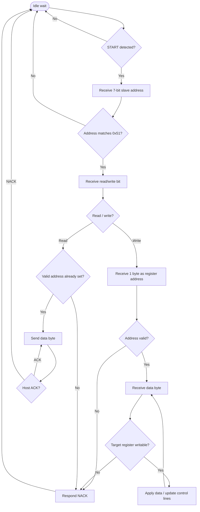
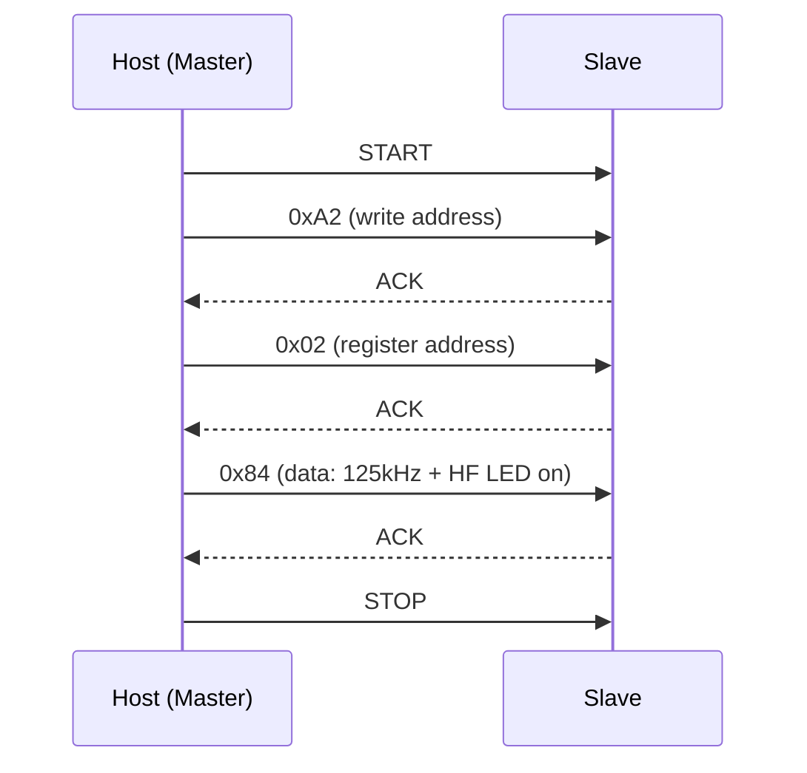
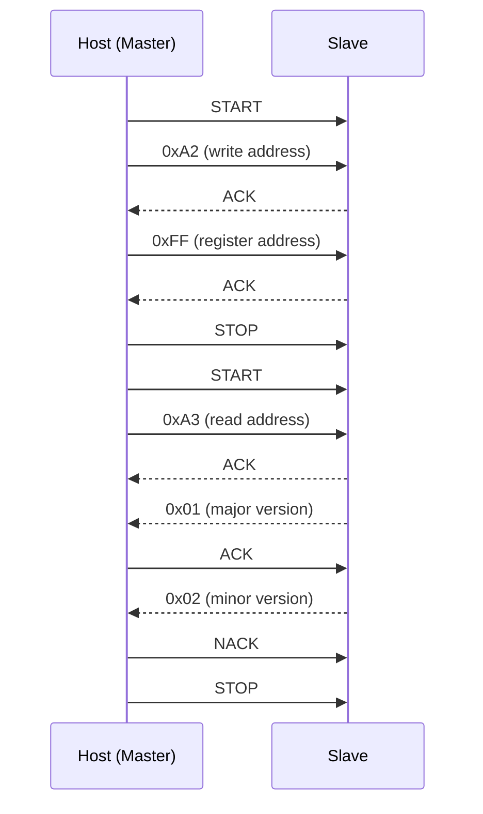

# Antenna Controller Technical Manual

> Intended audience: host-side (integration) developers who need to communicate with this antenna controller over the I2C bus.
> This document describes only the external interface and business logic, not the internal hardware or implementation details.

- Author: DXL
- Document version: v1.0
- Date: 2026-08-24

## Table of Contents

1. [Overview](#1-overview)
2. [I2C Communication Basics](#2-i2c-communication-basics)
3. [Register Map Overview](#3-register-map-overview)
4. [Register Details](#4-register-details)
5. [Operation Methods](#5-operation-methods)
6. [Register Mutual Exclusion and Constraint Conditions](#6-register-mutual-exclusion-and-constraint-conditions)
7. [Business Logic Feature Summary](#7-communication-and-register-defaults-summary)
8. [Flowcharts](#8-flowcharts)

## 1. Overview

This controller's communication interface is a standard I2C **slave**, used to control the antenna's operating frequency, Q value, and LED indication. The host can perform all control and status queries by reading and writing several I2C registers. Supported capabilities are as follows:

| Capability | Description |
|------|------|
| Operating frequency | Five levels: 125 kHz / 134 kHz / 250 kHz / 375 kHz / 500 kHz |
| LED indication | HF (high-frequency) LED and LF (low-frequency) LED, each independently controllable on/off |
| Q value | High Q / low Q switching |

## 2. I2C Communication Basics

### 2.1 Slave Address

| Item | Value |
|----|----|
| 7-bit slave address | `0x51` |
| 8-bit write address | `0xA2` (`0x51 << 1 | 0`) |
| 8-bit read address | `0xA3` (`0x51 << 1 | 1`) |

### 2.2 Communication Rate

It is recommended to keep the I2C clock rate at **around 10 kHz**; an excessively high rate may cause communication failures.

### 2.3 Communication Model

Register operations follow the **"write the register address first, then read/write data"** convention:

- Before any register operation, a **write** operation must be performed first to tell the slave which register is to be operated on subsequently;
- **Read operation**: first perform a write operation passing only 1 byte (the register address), then initiate a read transaction;
- **Write operation**: perform one write operation where byte 1 is the register address and the subsequent bytes are the register data.

## 3. Register Map Overview

| Address | Name | Access | Data Length | Description |
|------|------|------|:---:|------|
| `0x00` | Invalid register (default) | — | — | Power-on default address; not readable, and rejected if written as an address |
| `0x01` | IO data register | Read / Write | 1 byte | Directly reads/writes the raw levels of the antenna control lines (low-level pass-through interface) |
| `0x02` | IO mapping register | Read / Write | 1 byte | Logical control of frequency / LED / Q value (recommended) |
| `0xFE` | Device identification register | Read-only | 8 bytes | Device identity signature |
| `0xFF` | Firmware version register | Read-only | 2 bytes | Major version + minor version |

## 4. Register Details

### 4.1 `0x00` — Invalid Register

- The default "current register" address after power-on;
- Before a valid register address is written, any **read** operation will be rejected (NACK);
- Writing `0x00` as a register address is also rejected.

### 4.2 `0x01` — IO Data Register (Read / Write, 1 byte)

- Directly reads/writes the 8-bit raw levels of the antenna control I/O group;
- **Read**: returns the real-time state of the current 8 control lines;
- **Write**: directly sets these 8 control lines, **without** going through the arbitration and constraint logic of `0x02`;
- The 8 bits logically cover the same group of control signals as `0x02` (frequency selection, Q value, HF/LF LED), but the bit ordering is a hardware implementation detail and is not publicly guaranteed;
- ⚠️ This register is a low-level "pass-through" interface; for normal control, use `0x02`.
- ⚠️ Unless for debugging purposes, do not operate this register; otherwise, if the antenna hardware is revised, writing incompatible data could cause anomalies.

> **Relationship note**: writing `0x02` updates both the internal logical mapping and the actual control lines; writing `0x01` only directly changes the actual control lines and does **not** write back to the internal logical mapping. If the two are mixed, a subsequent read of `0x02` may return an old value inconsistent with what was written to `0x01`.

### 4.3 `0x02` — IO Mapping Register (Read / Write, 1 byte)

8-bit mapping:

| Bit | Meaning | Value |
|:---:|------|------|
| 7 | 125 kHz enable | 1 = enabled / 0 = disabled |
| 6 | 134 kHz enable | 1 = enabled / 0 = disabled |
| 5 | 250 kHz enable | 1 = enabled / 0 = disabled |
| 4 | 375 kHz enable | 1 = enabled / 0 = disabled |
| 3 | 500 kHz enable | 1 = enabled / 0 = disabled |
| 2 | HF LED | 1 = on / 0 = off |
| 1 | LF LED | 1 = on / 0 = off |
| 0 | Q value | 1 = high Q / 0 = low Q |

See Section 6 for constraint conditions.

### 4.4 `0xFE` — Device Identification Register (Read-only, 8 bytes)

- Returns a fixed 8-byte identity signature: `0x70 0x6D 0x35 0x5F 0x61 0x6E 0x74 0x78`
- Purpose: after reading, the host compares it with the expected value to confirm that the currently connected device is this antenna controller (rather than another I2C device);
- Circular reading: after the 8th byte is read, continued reading wraps back to the 1st byte.

### 4.5 `0xFF` — Firmware Version Register (Read-only, 2 bytes)

- Byte 1: major version
- Byte 2: minor version
- Current version: **v1.2** (major 1 / minor 2)
- Purpose: the host can use it for version adaptation and problem localization; after the 2nd byte is read, continued reading wraps back to the 1st byte.

## 5. Operation Methods

### 5.1 Write Register

```
START | write address 0xA2 | ACK | register address | ACK | data | ACK | STOP
```

1. Host sends `START`;
2. Host sends the 8-bit write address `0xA2`;
3. Slave replies `ACK`;
4. Host sends the register address (1 byte);
5. Slave replies `ACK`;
6. Host sends the data (each writable register of this controller has a 1-byte data body);
7. Slave replies `ACK`;
8. Host sends `STOP`.

> If a read-only register (`0xFE` / `0xFF`) or an illegal address is written, the slave terminates the communication with **NACK**.

### 5.2 Read Register

A read operation consists of two stages: "set address" and "read".

```
Set address: START | write address 0xA2 | ACK | register address | ACK | STOP
Read data:   START | read address 0xA3 | ACK | data0 | ACK | ... | dataN | NACK | STOP
```

1. Host sends `START`, then the write address `0xA2`; slave replies `ACK`;
2. Host sends the register address (1 byte); slave replies `ACK`;
3. Host sends `STOP` (or switches to a `repeated START`);
4. Host sends `START`, then the read address `0xA3`; slave replies `ACK`;
5. The slave sends data bytes in sequence; the host replies `ACK` for each intermediate byte and `NACK` for the last byte to end;
6. Host sends `STOP`.

> In a single read transaction, the slave sends data continuously (`0xFE` up to 8 bytes, `0xFF` 2 bytes, `0x01` / `0x02` 1 byte); the host terminates it actively with `NACK`.

### 5.3 Operation Examples

| Operation | Byte sequence |
|------|---------|
| Set 125 kHz, HF LED on, low Q | Write `0x02` = `0x84` (0b10000100) |
| Set 250 kHz, both LEDs on, low Q | Write `0x02` = `0x26` (0b00100110) |
| Read firmware version | Write address `0xFF`, then read 2 bytes |

## 6. Register Mutual Exclusion and Constraint Conditions

1. **Frequency bit mutual exclusion** (`0x02` bit7~bit3):
   - At most 1 bit may be 1 at a time;
   - If multiple bits are set simultaneously, priority follows **frequency from low to high**: 125k → 134k → 250k → 375k → 500k;
   - If all 5 bits are 0, **125 kHz** is automatically enabled as a fallback.

2. **Q value and frequency linkage** (`0x02` bit0):
   - High Q takes effect only when the frequency is **125 kHz or 134 kHz**;
   - Set bit0 = 1 with frequency 125/134 → high Q;
   - All other cases (other frequencies, or bit0 = 0) are forced to low Q.

3. **Read-only register protection**: `0xFE` and `0xFF` are read-only; writing data to them is rejected (NACK and communication terminated).

4. **Invalid address protection**: `0x00` is not a valid register; both writing and reading are rejected.

## 7. Communication and Register Defaults Summary

- **Power-on default**: 125 kHz + low Q + both LEDs off (`0x02` default value `0x80`).
- **Device identification**: the 8-byte signature `0x70 6D 35 5F 61 6E 74 78` identifies this device as a multi-frequency, full-featured antenna controller.
- **Firmware version**: major 1 / minor 2 (v1.2).
- **Multi-byte register wraparound**: `0xFE` (8 bytes) and `0xFF` (2 bytes) wrap back to the first byte after reaching the end.
- **Register address retained across transactions**: the register address is retained after `STOP` until the next write transaction resets it, so when reading the same register consecutively, the address only needs to be written once.
- **`0x01` and `0x02` are not synchronized**: `0x01` is the pass-through physical control lines, while `0x02` is the arbitrated logical mapping (see 4.2 for details).

## 8. Flowcharts

### 8.1 Power-on Initialization Flow



### 8.2 IO Mapping Update Flow



### 8.3 I2C Communication Handling Flow



> Note: regardless of the current processing stage, detecting a STOP (SDA↑ while SCL is high) immediately returns to the idle state.

### 8.4 Write Register Timing



### 8.5 Read Register Timing (reading the firmware version as an example)


