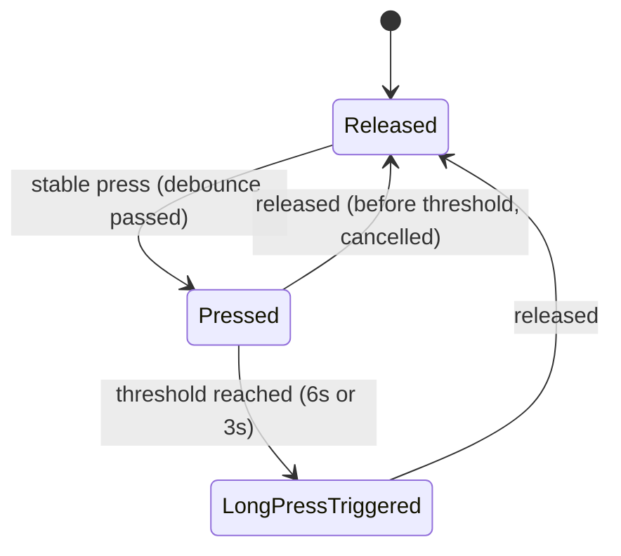
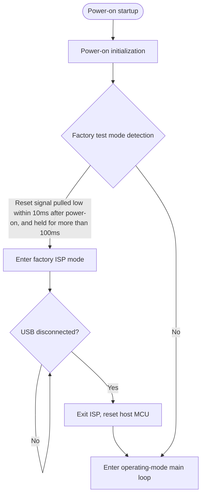
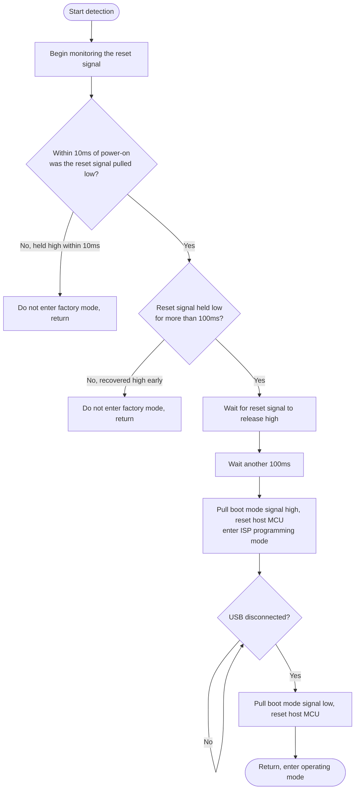
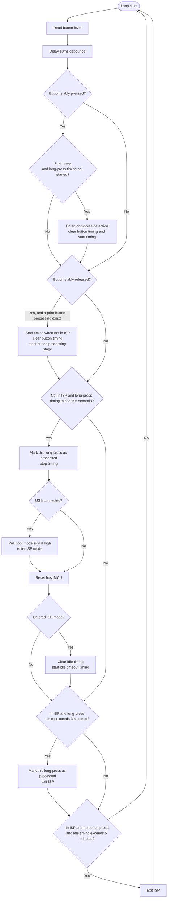

# Button Controller Technical Manual

> This document is intended for product users and integrators. It describes the button actions, timing parameters, and related business logic of this chip.

- Author: DXL
- Document version: v1.0
- Date: 2026-08-24

---

## Table of Contents

1. [Overview](#1-overview)
2. [External Signals and Key Actions](#2-external-signals-and-key-actions)
3. [Button Actions and Timing](#3-button-actions-and-timing)
4. [Effects of Various Conditions on Button Business Logic](#4-effects-of-various-conditions-on-button-business-logic)
5. [Detailed Flowcharts](#5-detailed-flowcharts)
6. [Typical Operation Scenarios](#6-typical-operation-scenarios)
7. [FAQ and Notes](#7-faq-and-notes)
8. [Appendix](#appendix)

---

## 1. Overview

This chip is used to assist the host MCU. It is primarily responsible for:

- **Reset control**: resetting (rebooting) the host MCU under specific conditions;
- **ISP mode management**: guiding the host MCU into or out of ISP (In-System Programming) mode through operations such as long presses, for firmware updates;
- **Factory test mode**: detecting the factory test signal at power-on and guiding the host MCU into a programming state, for production-line flashing.

> **Terminology**
> - **Host MCU**: the target chip managed by this chip, which runs the main application firmware.
> - **ISP (In-System Programming)**: in-system programming, used to update the host MCU firmware.

---

## 2. External Signals and Key Actions

### 2.1 External Signals

| Signal | Direction | Meaning | Active Level |
| --- | --- | --- | --- |
| `BTN_IN` | Input | Physical button | High = pressed, Low = not pressed |
| `USB_VBUS` | Input | USB connection / power detection | High = USB connected, Low = not connected |
| `MCU_RST` | Output | Host MCU reset control | Low = reset, High = normal operation |
| `MCU_BOOT0` | Output | Host MCU boot mode selection | High = programming (ISP) mode, Low = normal operation |

### 2.2 Key Actions

| Action | Behavior |
| --- | --- |
| Reset host MCU | Pull `MCU_RST` low, hold for about 5ms, then release (pull high), causing the host MCU to restart |
| Exit ISP | Stop the auto-exit timer → end the ISP state → pull `MCU_BOOT0` low → reset the host MCU |

---

## 3. Button Actions and Timing

### 3.1 Three Core Actions

| Scenario | Trigger Condition | Result |
| --- | --- | --- |
| ① Long press to enter ISP / reset (non-ISP mode) | Long press exceeding **6 seconds** | See the "USB connected?" branch below |
| ② Long press to exit ISP (ISP mode) | Long press exceeding **3 seconds** | Exit ISP, host MCU resets back to normal operation |
| ③ Idle auto-exit ISP (ISP mode) | No button operation for more than **5 minutes** | Automatically exit ISP, host MCU resets |

> The business logic of this chip currently only handles **long-press events**, not short-press events.  
> The timings are **estimations** and are not entirely accurate; this is caused by the limited precision of this chip's internal oscillator.

### 3.2 USB Branch of Action ①

When a long press exceeds 6 seconds in non-ISP mode:

- **USB connected** (`USB_VBUS` high): first pull `MCU_BOOT0` high, then reset the host MCU → the host MCU enters **ISP (programming) mode**;
- **USB not connected** (`USB_VBUS` low): only reset the host MCU (equivalent to a **restart**), without entering ISP.

### 3.3 Timing Parameter Summary

| Parameter | Value | Meaning |
| --- | --- | --- |
| Button debounce | 10ms | Duration for stable button-state determination |
| Timing base | 100ms | Minimum timing unit for long-press / idle duration |
| Non-ISP long-press threshold | 6 seconds | Long-press threshold in non-ISP mode |
| ISP long-press exit threshold | 3 seconds | Long-press exit threshold in ISP mode |
| ISP idle timeout | 5 minutes | Idle auto-exit duration in ISP mode |

---

## 4. Effects of Various Conditions on Button Business Logic

### 4.1 Key Conditions Affecting Button Behavior

The final behavior of the button is jointly determined by the following three conditions:

1. **Whether the device is currently in ISP mode**;
2. **Whether USB is connected** (`USB_VBUS`);
3. **Which processing stage the button is currently in**.

### 4.2 Decision Table

**Non-ISP mode:**

| Button State | Duration | USB | Action |
| --- | --- | --- | --- |
| Long-pressing | Released before reaching 6 seconds | — | Cancelled, no action |
| Long-pressing | Exceeds 6 seconds | Connected | Enter ISP mode (pull `MCU_BOOT0` high, then reset) |
| Long-pressing | Exceeds 6 seconds | Not connected | Only reset the host MCU |

**ISP mode:**

| Button State | Duration | Action |
| --- | --- | --- |
| Long-pressing | Exceeds 3 seconds | Exit ISP (pull `MCU_BOOT0` low, then reset) |
| No press | Idle for more than 5 minutes | Automatically exit ISP |
| Holding | Any | ISP idle timing paused (not counted toward timeout) |

### 4.3 Button Processing Stage State Machine

### 4.4 Two Important Details

1. **After entering ISP, you must "release and then long-press again" to exit**: the long press used to enter ISP has already been marked as "processed" for that press. Therefore, to exit ISP via long press, you must **first release the button**, and then **long-press again for 3 seconds**.

2. **Starting point of the 5-minute idle timeout**: when entering ISP, the idle timing is cleared, but it only accumulates while the button is in the "released" state. Therefore, the 5-minute timeout actually begins counting **from the moment the button is released after entering ISP**; while the button is held, the timeout timing is paused.

---

## 5. Detailed Flowcharts

### 5.1 Overall Power-on Flow

### 5.2 Factory Test Mode Detection Flow

### 5.3 Operating-mode Main Loop Flow

---

## 6. Typical Operation Scenarios

### 6.1 Enter ISP to Flash Firmware

1. Confirm that USB is connected (`USB_VBUS` high);
2. Long-press the button for **more than 6 seconds**;
3. The host MCU is reset and enters ISP (programming) mode, at which point firmware can be flashed via the host PC.

### 6.2 Exit ISP and Return to Normal Operation

- **Manual exit**: first release the button, then long-press again for **more than 3 seconds**;
- **Automatic exit**: keep 5 minutes without button operation, and ISP is exited automatically.

### 6.3 Manually Restart the Host MCU

- Without USB connected, long-press the button for **more than 6 seconds**; the host MCU will be reset (restarted) without entering ISP.

### 6.4 Production-line Flashing (Factory Test Mode)

- Within **10ms** after power-on, pull the host MCU reset line low and hold it for **more than 100ms**;
- This chip and the host MCU enter factory ISP mode and remain there until **USB is disconnected**, after which the host MCU is automatically reset back to normal operation mode.

---

## 7. FAQ and Notes

| Question | Explanation |
| --- | --- |
| No ISP entry after a long press? | Confirm whether USB is connected; without a connection, a long press only restarts the host MCU. |
| Once in ISP, a continuous long press cannot exit? | You must first release the button, then long-press again for 3 seconds (the long press that entered ISP does not re-trigger the exit). |
| How is the long-press time calculated? | Timing starts from when the button is stably recognized as pressed, and is cleared if released midway. |
| Does ISP exit automatically? | Yes. If there is no button operation within 5 minutes after entering ISP, it exits and resets automatically. |
| The timing seems inaccurate? | That is expected, because this chip's internal oscillator is not highly precise and may have errors. |

---

## Appendix

### Appendix A: Timing Parameter Summary

| Parameter | Value | Description |
| --- | --- | --- |
| Debounce time | 10ms | Stable determination of button state |
| Non-ISP long-press threshold | 6 seconds | Triggers reset or ISP entry when exceeded |
| ISP long-press exit threshold | 3 seconds | Exits ISP when exceeded |
| ISP idle timeout | 5 minutes | Auto-exit ISP with no button operation |
| Reset pulse width | About 5ms | Low-level time required to reset the host MCU |

> Note: the times described above are not highly precise.

### Appendix B: Glossary

| Term | Meaning |
| --- | --- |
| This chip | The button controller chip, the subject of this manual |
| Host MCU | The target chip managed by this chip, which runs the main application firmware |
| ISP | In-System Programming, used to update the host firmware |
| Long press | A button held down continuously beyond the configured threshold |
