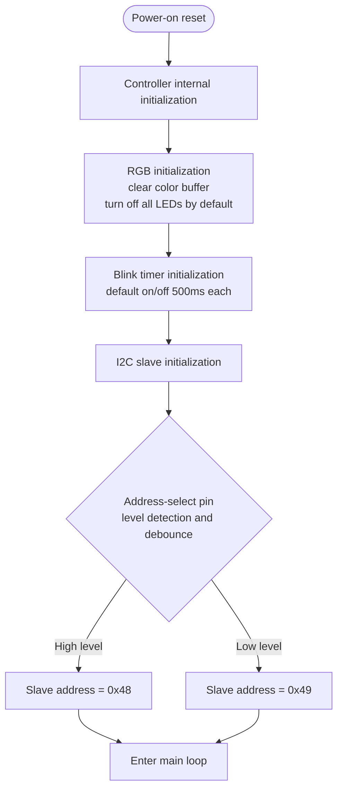
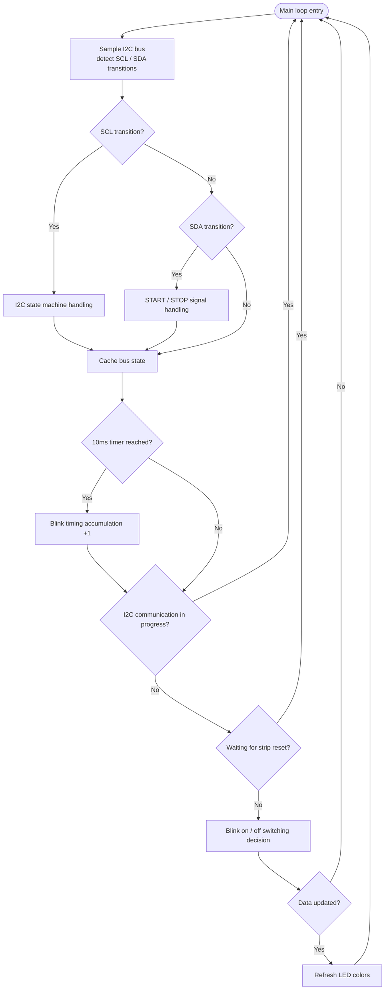
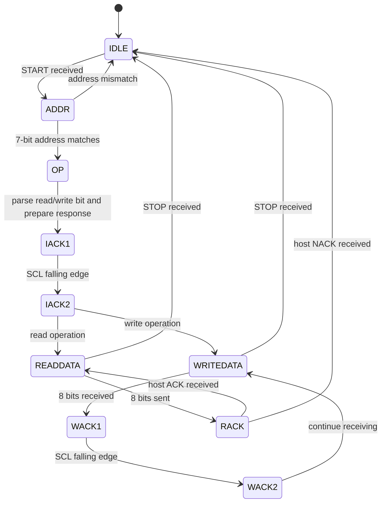
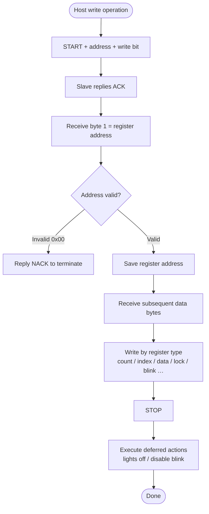
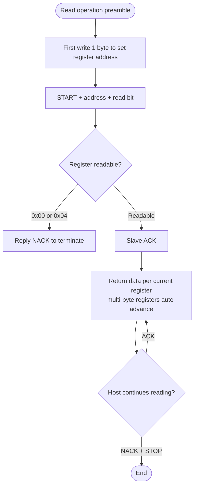
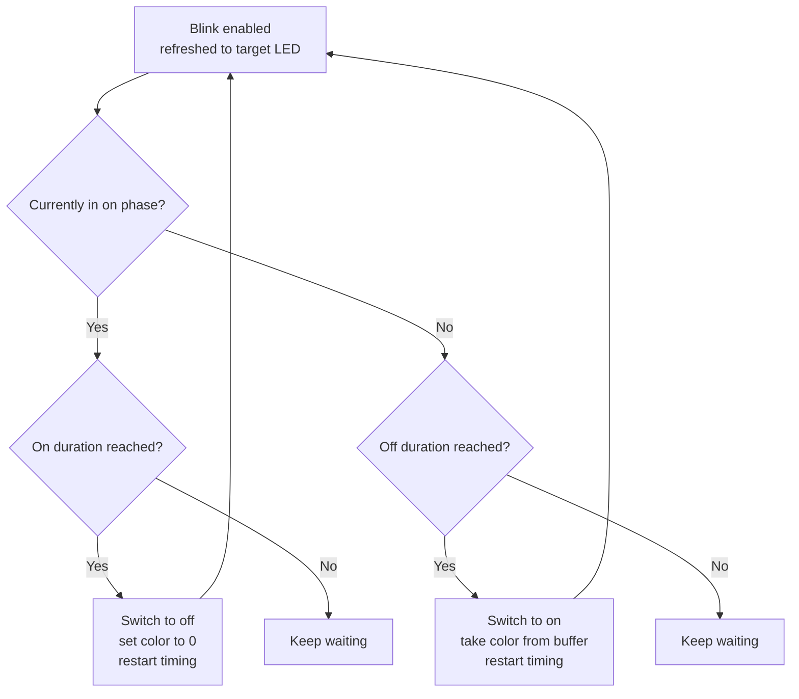

# RGB Controller Technical Manual

> This document is intended for host-side (Host) development and integration personnel. It describes the I2C communication interface, register model, and business behavior provided by this chip.
> This document describes only the **externally visible interface and business logic**.

- Author: DXL
- Document version: v1.0
- Date: 2026-08-25

---

## 1. Overview

This chip acts as an **I2C slave** and drives a chain of single-wire, daisy-chained RGB LEDs. The host sends LED color data and configuration commands to the chip over the I2C bus; the chip maintains a color buffer internally and automatically, continuously refreshes the data onto the LED strip.

Core capabilities:

| Capability | Description |
|------|------|
| Color setting | Set the RGB888 color value of each LED individually |
| Index management | Supports setting a start index, automatic index increment, and index locking |
| One-command lights off | Turn off all LEDs with a single command |
| Controllable blink | Hardware-timed on/off flashing, freeing the host CPU |
| Firmware version | Reads the firmware major/minor version for compatibility adaptation |

---

## 2. I2C Communication Interface

### 2.1 Slave Address

The chip supports selecting the slave address via the level state of an **address-select pin**:

| Address-select pin state | 7-bit slave address | Remarks |
|----------------|--------------|------|
| High level (tied to VCC) | `0x48` | Currently available |
| Low level (tied to GND) | `0x49` | Currently available |
| Tied to SCL | `0x68` | Reserved, not yet enabled |
| Tied to SDA | `0x69` | Reserved, not yet enabled |

> Note: the address-select pin performs a level detection with debounce during the **power-on initialization phase**; a high level uses `0x48`, a low level uses `0x49`.
> The two dynamic-detection schemes "tied to SCL / tied to SDA" in the table are currently reserved designs that are not yet enabled in the actual firmware — do not rely on them.

### 2.2 Register Addressing Method (Register Pointer)

The chip uses the "register pointer" addressing method: **before every operation, one byte of register address must be written first**. Once the chip remembers this address, subsequent reads and writes target that register.

- **Write operation**: when writing the data body, byte 1 is the register address, and the subsequent bytes are that register's data.
- **Read operation**: you must **first perform a write operation** (writing only 1 byte of register address) to set the target register, then initiate the read operation.

> Key point: the register address is **retained across transactions**. The register address set by the previous write operation remains valid in subsequent read transactions until the next write operation writes a new register address.

### 2.3 Read/Write Operation Timing

**Write register:**

```
START → 7-bit address + W(0) → ACK → [register address] → [data bytes…] → STOP
```

**Read register:**

```
Step 1 (set pointer): START → 7-bit address + W(0) → ACK → [register address] → STOP
Step 2 (read data)  : START → 7-bit address + R(1) → ACK → [data bytes…] → host NACK → STOP
```

### 2.4 Recommended Communication Rate

It is recommended to use a communication clock rate of **around 10 kHz**; an excessively high rate may cause communication failures.

### 2.5 Abnormal Acknowledge (NACK) Behavior

The chip replies NACK and terminates the current communication in the following cases:

| Case | Description |
|------|------|
| Address mismatch | The received 7-bit address differs from the configured slave address |
| Reading an invalid address | A read operation is initiated when no register address has been set (default `0x00`) |
| Reading a write-only register | Reading the lights-off register (`0x04`) |
| Writing a read-only register | Writing the firmware version register (`0xFF`) |
| Writing an invalid address | The register address is `0x00` |
| Index out of range | The written index value ≥ the current valid LED count |

---

## 3. Register Map

### 3.1 Register Overview Table

| Address | Name | Access | Data Length | Description |
|------|------|------|----------|------|
| `0x00` | Invalid address | — | — | Power-on default address; not readable or writable |
| `0x01` | Count register | Read / Write | 1 byte | Number of LEDs actually mounted on the hardware |
| `0x02` | Index register | Read / Write | 1 byte | Index of the LED currently being operated on |
| `0x03` | Data register | Read / Write | 3×N bytes | LED color value (RGB888) |
| `0x04` | Lights-off register | Write-only | No data body | Turn off all LEDs |
| `0x05` | Index lock register | Read / Write | 1 byte | Whether to lock the operation index |
| `0x06` | Blink enable register | Read / Write | 1 byte | Whether to enable controllable blink |
| `0x07` | Blink duration register | Read / Write | 2 bytes | On duration + off duration |
| `0xFF` | Firmware version register | Read-only | 2 bytes | Major version + minor version |

### 3.2 Register Detailed Descriptions

#### 0x00 — Invalid Address (Reserved)

Power-on default value. No read operation can be performed at this address; writing this address causes NACK and terminates the communication.

#### 0x01 — Count Register (Read/Write)

Indicates the number of LEDs actually mounted on the current hardware.

- **Write**: writes 1 byte. If multiple bytes are written, the **last byte** takes effect. If the written value exceeds the chip's supported upper limit, it is **clamped** to the upper limit.
- **Read**: returns the current valid LED count.
- **Default**: the chip's supported upper-limit count after power-on.

#### 0x02 — Index Register (Read/Write)

Indicates the LED index to be operated on (starting from 0).

- **Write**: writes 1 byte. If multiple bytes are written, the last byte takes effect. If the written value ≥ the current valid LED count, it is an illegal operation; the chip replies NACK and terminates the communication.
- **Read**: returns the current operation index.
- **Side effect**: writing **triggers blink disable**.
- **Constraint**: the legal index range is `0 ~ (valid count - 1)`.

#### 0x03 — Data Register (Read/Write)

LED color data. **Every 3 bytes is the RGB888 color value of one LED**, in the byte order **R, G, B**.

- **Write**: writes a multiple of 3 bytes consecutively. Each time 3 bytes (one complete LED) are written, the index auto-increments by 1 (unless locked, see `0x05`).
- **Read**: reads consecutively; every 3 bytes returns one LED's R, G, B, and the index auto-increments by 1.
- **Index wraparound**: when the index increments to the valid count, it resets to zero, enabling circular read/write of the buffer.
- **Persistence**: the index does **not** reset to zero after communication ends; the next operation continues from the current index.
- **Side effect**: both read and write **trigger blink disable**.

> Example: after setting count = 8 and index = 0, writing 24 bytes (8 LEDs) each time covers the entire LED strip.

#### 0x04 — Lights-off Register (Write-only)

Turns off all LEDs (all colors set to R0-G0-B0).

- **Write**: no data body required; writing triggers it.
- **Read**: not supported; reading causes NACK.
- **Deferred effect**: the lights-off action actually executes after the current I2C communication **ends (STOP)**.
- **Side effect**: also disables blink.
- **Note**: after writing, allow about **10ms** to ensure the lights-off completes; if the data or index register is written again during this period, the lights-off may fail (color disorder or some LEDs not properly turned off).

#### 0x05 — Index Lock Register (Read/Write)

Controls whether the index auto-increments when writing the data register.

- **Write**: writing `0` means unlocked (index auto-increments when writing data); writing a non-`0` value means locked (index does not increment when writing data).
- **Read**: returns the current lock state (`0` / `1`).
- **Purpose**: when locked, it is suitable for repeatedly writing data commands to **refresh a single LED** (index unchanged).
- **Note**: locking affects only the index auto-increment of **write** operations; the index of **read** operations still increments.

#### 0x06 — Blink Enable Register (Read/Write)

Controls the controllable blink function.

- **Write**: writing a non-`0` value enables blink (blink applies to the LED selected by the current index); writing `0` disables blink.
- **Read**: returns the current enable state (`0` / `1`).
- **Blink behavior**: once enabled, the selected LED automatically cycles through "on duration → off duration → on duration…".
- **Mutual exclusion**: see Section 4.

#### 0x07 — Blink Duration Register (Read/Write)

Sets the on and off durations of the blink.

- **Write**: byte 1 is the **on duration**, byte 2 is the **off duration**.
- **Read**: returns the on duration and off duration bytes in sequence.
- **Unit**: both are 10ms; a single byte ranges from 0 to 255, i.e., up to 2.55 seconds can be set.
- **Default**: 500ms each for on and off.

#### 0xFF — Firmware Version Register (Read-only)

- **Read**: byte 1 is the major version, byte 2 is the minor version.
- **Write**: not supported; writing causes NACK.
- **Purpose**: it is recommended that the host read the firmware version during specific flows, so that when compatibility issues arise they can be adapted and fixed accordingly.

---

## 4. Register Mutual Exclusion Conditions

Controllable blink (after `0x06` is enabled) is **mutually exclusive** with the following operations; performing these operations **automatically disables blink**:

| Triggering operation | Register | Disables blink? |
|----------|--------|--------------|
| Write index | `0x02` | ✅ Yes |
| Write data | `0x03` | ✅ Yes |
| Read data | `0x03` | ✅ Yes |
| Write lights-off | `0x04` | ✅ Yes (and turns off all LEDs) |
| Write blink enable (value 0) | `0x06` | ✅ Yes |

> Design rationale: blink applies to the "LED selected by the current index", while index, data, and lights-off operations all change that LED's state, conflicting with blink. Therefore blink must be disabled first before performing these operations.

**Other read/write restrictions (mutual exclusion / constraints)**:

| Restriction | Description |
|------|------|
| `0x04` write-only | Reading causes NACK |
| `0xFF` read-only | Writing causes NACK |
| `0x00` invalid | Both reading and writing cause NACK |
| Index out of range | Writing an index ≥ valid count causes NACK |
| Count clamping | Writing a count above the upper limit is clamped to the upper limit |

---

## 5. Business Flowcharts

### 5.1 Power-on Initialization Flow



### 5.2 Main Loop Overall Flow



### 5.3 I2C Communication State Machine



### 5.4 Write Operation Data Flow



### 5.5 Read Operation Data Flow



### 5.6 Blink On/Off Logic



---

## 6. Key Business Feature Summary

1. **Deferred effect of changes**: actions such as lights-off and blink-disable are not executed immediately when the command arrives; instead they are processed uniformly **after the I2C communication ends (STOP)**, avoiding refresh operations interfering with bus communication stability.

2. **Index management**:
   - When writing data, the index auto-increments after every 3 bytes (lockable).
   - When reading data, the index always auto-increments.
   - The index wraps around to 0 after reaching the valid count.
   - The index is retained across transactions and does not reset when communication ends.

3. **Data refresh mechanism**: when data changes, a refresh-enable flag is set, and the main loop refreshes all LEDs once in a **full pass**; when there is no change, it refreshes only once, avoiding unnecessary refresh overhead.

4. **Blink frees the host**: blink is driven by the chip's internal timer; the host only needs to set the on/off durations and enable it, without continuously sending commands, thereby freeing the host CPU.

5. **Safety protection**:
   - Out-of-range protection: a count above the upper limit is automatically clamped; an out-of-range index returns NACK.
   - Communication priority: while I2C communication is in progress, LED refresh is skipped, reducing the probability of communication failure.

---

## 7. Usage Notes

1. It is recommended that the host first read the firmware version register (`0xFF`) after power-on, to adapt when compatibility issues arise.
2. After executing lights-off (`0x04`), allow about 10ms; do not write the data/index register during this period.
3. After setting the count (`0x01`), the legal range of the index (`0x02`) changes accordingly; be careful to avoid out-of-range writes.
4. Before using the blink function, confirm that the current index points to the target LED; index/data/lights-off operations disable blink.
5. It is recommended to keep the communication rate at around 10 kHz; an excessively high rate may cause communication failures.
6. The current slave address supports only two static selections, `0x48` (high level) and `0x49` (low level); `0x68`/`0x69` are reserved.
