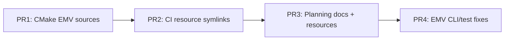

# PR split plan: CMake CI green + docs cleanup

The work in [PR #13](https://github.com/andrew867/proxmark3/pull/13) is a single commit that fixes cmake CI and reorganizes planning docs. It should land as **four stacked PRs** so reviewers can approve the critical build fix independently of documentation churn.

## Recommended merge order



| PR | Branch | Base | Purpose | CI impact |
|----|--------|------|---------|-----------|
| **1** | `cursor/cmake-emv-terminal-sources-e836` | `master` | Add missing `emv/terminal/*.c` to both CMakeLists; guard `pm3_enable_stdout_pipe` for `LIBPM3` | Fixes `_CmdEMVTerminal` link/runtime error on cmake builds |
| **2** | `cursor/cmake-ci-resource-symlinks-e836` | PR 1 | Symlink `resources/` + `dictionaries/` into `client/build/` in cmake CI jobs | cmake `make client/check` finds profiles/keys from build dir |
| **3** | `cursor/emv-planning-docs-reorg-e836` | PR 2 | Move `docs/` → `doc/planning/`; ship example JSON in `client/resources/`; drop `docs/` fallbacks in source | No functional change if resources already exist |
| **4** | `cursor/emv-terminal-cli-fixes-e836` | PR 3 | Fix host-keys test guard, profile `validate <file>` parsing, test script paths | Hardens offline tests |

## File ownership per PR

### PR 1 — CMake EMV terminal sources (smallest, highest priority)

```
client/CMakeLists.txt
client/experimental_lib/CMakeLists.txt
client/src/proxmark3.c          # #ifndef LIBPM3 around pm3_enable_stdout_pipe
```

**Review focus:** Source list matches `client/Makefile` EMV terminal section.

### PR 2 — CI cmake layout

```
.github/workflows/ubuntu.yml
.github/workflows/macos.yml
.github/workflows/windows.yml    # both cmake prepare steps
```

**Review focus:** Four symlinks per job (`cmdscripts`, `luascripts`, `pyscripts`, `lualibs` already existed; add `resources`, `dictionaries`).

### PR 3 — Planning docs and runtime resource paths

```
.gitignore
README.md
CHANGELOG.md
doc/emv_notes.md
doc/planning/**                 # moved from docs/emv-terminal-emulator/
client/resources/*.json         # interac_test_keys, terminal_aid_candidates, etc.
client/src/emv/terminal/emv_term_banner.c
client/src/emv/terminal/emv_term_host.c
client/src/emv/terminal/emv_term_profile.c
client/src/emv/terminal/emv_term_scheme.c
client/src/emv/test/fixtures/README.md
tools/pm3_tests.sh              # resource path updates only
```

**Review focus:** No top-level `docs/` folder; runtime code uses `RESOURCES_SUBDIR` only.

### PR 4 — EMV terminal CLI and test fixes

```
client/src/emv/test/terminal_host_test.c
client/src/emv/terminal/emv_term_cmd.c   # emv_term_profile_file_arg()
tools/pm3_tests.sh                       # profile validate test commands
```

**Review focus:** Nested `emv terminal profile validate <path>` works; host-keys self-test logic.

## Verification checklist (each PR)

```bash
# PR 1
mkdir -p client/build && ln -sf ../{cmdscripts,luascripts,pyscripts,lualibs,resources,dictionaries} client/build/
cd client/build && CC=gcc CXX=g++ cmake .. && make -j$(nproc)
./client/build/proxmark3 -h    # must not dyld-fail on CmdEMVTerminal

# PR 2 — same as above + CI workflow diff review

# PR 3
make client/check CC=gcc CXX=g++ LD=g++
CHECKARGS="--clientbin ./client/build/proxmark3" make client/check

# PR 4 — full client check + explicit:
./client/build/proxmark3 -c 'emv terminal profile validate client/resources/scheme_profiles/interac.json'
```

## Closing PR #13

After the four PRs are open and green:

1. Close draft PR #13 as superseded.
2. Merge PR 1 → PR 2 → PR 3 → PR 4 in order (or enable merge train).
3. Delete branch `cursor/fix-cmake-ci-green-e836`.

## Optional follow-ups (out of scope)

- Deduplicate `doc/planning/emv-terminal-emulator/examples/` copies now living in `client/resources/`
- Add a cmake `POST_BUILD` step or install rule so local cmake builds symlink resources automatically (not only CI)
