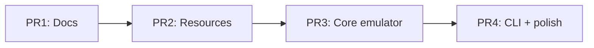

# Upstream PR split plan (RfidResearchGroup/proxmark3)

Replaces the monolithic fork PR [andrew867#3385](https://github.com/RfidResearchGroup/proxmark3/pull/3385) with **four small PRs** aligned with maintainer feedback:

> *"if its possible to break down this PR to smaller pull requests then it would be so much easier — like make one with documentation, one with all the extra / new resources files, and we get to smaller and smaller PR."*

Also note hardware context from the same review:

> *"The rdv4 sim module has a limitation on voltage supplied for card. the 5v cards will not work with 3v3"*

Document that in PR bodies and in `OPERATOR-GUIDE.md` (contactless lab cards are typically 3.3 V; 5 V legacy cards may need different hardware).

---

## Local integration status

All fork PR branches through `cursor/emv-terminal-cli-fixes-e836` are **merged into `andrew867/proxmark3` `master`**.

Before opening upstream PRs:

1. Confirm GitHub Actions green on fork `master` (ubuntu / macos / windows make + cmake).
2. Run locally: `make client/check CC=gcc CXX=g++ LD=g++`
3. Close or supersede upstream #3385 once PR 1 is open.

**Diff vs upstream `master`:** ~225 files, ~24 commits (full EMV terminal emulator + crypto lab + CI fixes).

---

## Recommended upstream merge order



| # | Title (suggested) | Build impact | Reviewer focus |
|---|-------------------|--------------|----------------|
| **1** | `docs(emv): EMV terminal emulator planning bundle` | None (markdown only) | Specs, legal disclaimer, no code |
| **2** | `chore(emv): terminal profiles, scheme JSON, golden fixtures` | None (data files + `.gitignore`) | Public test keys only, no real PANs |
| **3** | `feat(emv): terminal emulator core (phases, host, golden tests)` | Adds `client/src/emv/terminal/*` engine + Makefile/CMake + unit tests | ISO EMV logic, offline tests |
| **4** | `feat(emv): terminal CLI, crypto playground, CI fixes` | Commands, `pm3_tests.sh`, workflows | User-facing `emv terminal` tree |

Map to your mental model:

| Your bucket | Upstream PR |
|-------------|-------------|
| Code docs / planning specs | **PR 1** (`doc/planning/emv-terminal-emulator/SPEC-*`, milestones, architecture) |
| EMV emulator logic (engine) | **PR 3** (phases, transaction, host, mock, golden runner, profile/scheme loaders) |
| General improvements & bugfixes | **PR 4** (cp850 strings, cmake source list, CI symlinks, field activation, search polling, stream/RNG fixes) |
| Terminal UI commands + user docs | **PR 4** (`emv_term_cmd.c`, `emv_term_crypto_cmd.c`, `OPERATOR-GUIDE.md`, `doc/emv_notes.md` command section) |

**PR 2** is the maintainer’s explicit “resources files” slice (profiles, scheme JSON, host-sim keys, golden fixture JSON).

---

## PR 1 — Documentation only

**Target:** `RfidResearchGroup/proxmark3` `master`  
**Branch suggestion:** `docs/emv-terminal-planning`

### Include

```
doc/planning/emv-terminal-emulator/
  ARCHITECTURE.md, IMPLEMENTATION-PLAN*.md, MILESTONES*.md, OPEN-QUESTIONS.md
  PRODUCT-OVERVIEW.md, QA-CHECKLIST*.md, README.md
  RISKS-AND-ASSUMPTIONS.md, UPSTREAM-MERGE.md, UPSTREAM-PR-SPLIT-PLAN.md
  SPEC-*.md, TEST-PLAN-*.md, FEATURE-CATALOG*.md
  examples/TEST-CARD-MATRIX.md, examples/exception_file_sample.txt (text only)
doc/emv_pcap_format.md
```

### Exclude (defer to PR 4)

- `OPERATOR-GUIDE.md` — operator command workflows (pairs with CLI)
- `doc/emv_notes.md` terminal command sections — user-facing

### Exclude (fork-only)

- `AGENTS.md`, `scripts/dev-env-setup.sh`

### CHANGELOG / README

- One-line README link: `doc/planning/emv-terminal-emulator/README.md`
- CHANGELOG unreleased: “Added planning docs for EMV terminal emulator (lab use only)”

### CI

Should not trigger heavy builds if workflows use `paths-ignore` for `doc/**` (already configured).

---

## PR 2 — Resources & fixtures

**Base:** upstream `master` after PR 1 merged (or parallel if maintainer prefers; PR 1 is independent)  
**Branch suggestion:** `chore/emv-terminal-resources`

### Include

```
client/resources/emv_terminal_profile.json          # if new vs upstream
client/resources/host_sim_interac.json
client/resources/interac_test_keys.json
client/resources/emv_terminal_profile_interac.json
client/resources/terminal_aid_candidates.json
client/resources/exception_file_sample.txt
client/resources/scheme_profiles/**
client/src/emv/test/fixtures/**
.gitignore                                        # json exceptions for resources/fixtures only
```

### PR body must state

- Keys are **public Interac interoperability test pack** / synthetic lab material
- **No live card credentials**
- Reference PDF/source in `interac_test_keys.json` `description` field

### Exclude

- Any `.c` / `.h` changes
- `tools/pm3_tests.sh` (PR 4)

---

## PR 3 — Core emulator logic

**Base:** upstream after PR 2  
**Branch suggestion:** `feat/emv-terminal-core`

### Include (engine — no interactive CLI tables)

```
client/src/emv/terminal/
  phase_*.c, emv_terminal.c, emv_transaction.c
  emv_term_ctx.c, emv_term_profile.c, emv_term_scheme.c
  emv_term_session*.c, emv_term_tvr.c, emv_term_load.c
  emv_term_host.c, emv_term_host_tcp.c, emv_term_arqc.c
  emv_term_mock.c, emv_term_golden.c, emv_term_secure.c
  emv_term_exception.c, emv_term_redact.c, emv_term_sim_export.c
  emv_term_replay.c, emv_term_pcap.c, emv_term_timing.c
  emv_term_tlv.c, emv_term_probe.c (implementation)
  emv_term_crypto.c, emv_term_crypto_digest.c
  emv_term_lua.c, emv_term_reader_session.c, emv_term_banner.c
  emv_term_pin_prompt.c, emv_term_capabilities.c
  (+ matching .h files)

client/src/emv/test/terminal_*.c
client/src/emv/test/cryptotest.c              # terminal test registration only
client/src/emv/emvcore.c                      # contactless field / search polling
client/src/iso7816/iso7816core.c              # mock APDU hook if present
client/src/scripting.c                        # emv_term_lua_register
client/Makefile                              # EMV terminal source list
client/CMakeLists.txt                        # sync terminal sources
client/experimental_lib/CMakeLists.txt
```

### Minimal `cmdemv.c` / integration

- Register `emv test` hooks that call `exec_terminal_*_test` (already in cryptotest path)
- **Do not** add full `emv terminal` command table yet — land stub or hidden until PR 4?

**Practical approach:** Include `CmdEMVTerminal` registration in PR 3 with only `test` and `capabilities` subcommands enabled, or land full cmd table in PR 4 only. **Recommended:** put **all** `cmdemv.c` terminal wiring in PR 4 so PR 3 is “library + offline unit tests only” (`make client` links terminal objects; `emv test` runs terminal_* tests via cryptotest).

### Encoding

- Include cp850 / ASCII string fixes in PR 3 or PR 4 (required for Windows CI once C code lands).

### Tests

```bash
make client/check CC=gcc CXX=g++ LD=g++
# emv test includes terminal_* self-tests (no emv terminal CLI yet)
```

---

## PR 4 — CLI, user docs, CI, bugfixes

**Base:** upstream after PR 3  
**Branch suggestion:** `feat/emv-terminal-cli`

### Include

```
client/src/emv/terminal/emv_term_cmd.c
client/src/emv/terminal/emv_term_crypto_cmd.c
client/src/emv/cmdemv.c                    # terminal subcommand, search --nowait, reader hooks
client/src/proxmark3.c                     # --stream, LIBPM3 guard
client/src/emv/terminal/emv_term_banner.c  # legal banner text (if not in PR 3)

doc/planning/emv-terminal-emulator/OPERATOR-GUIDE.md
doc/emv_notes.md                           # terminal command section
README.md                                  # disclaimer + operator link
CHANGELOG.md                               # feature bullets

tools/pm3_tests.sh                         # emv terminal golden, profile validate
.github/workflows/ubuntu.yml               # cmake resource symlinks
.github/workflows/macos.yml
.github/workflows/windows.yml
.github/codeql/codeql-config.yml           # false-positive tuning
.github/workflows/codeql-analysis.yml      # use config-file

# Recent bugfix / improvement commits (squash appropriately):
# - profile validate path parsing
# - host-keys self-test guard
# - PIN prompt skip when CVM not verifiable
# - crypto RNG stream / bench
# - stream stdout pipe mode
```

### User-facing verification

```bash
./pm3 --offline -c 'emv terminal test --golden'
./pm3 --offline -c 'emv terminal profile validate'
./pm3 --offline -c 'emv terminal crypto run -s --quick'
CHECKARGS="--clientbin ./client/build/proxmark3" make client/check
```

---

## CodeQL / security false positives

Historic EMV interop **requires** 3DES retail MAC, single DES in places, and lab key material in JSON. Upstream PR 4 adds:

- `.github/codeql/codeql-config.yml` — `paths-ignore` for planning docs and lab JSON; `query-filters` to exclude `cpp/weak-cryptographic-algorithm` under `client/src/emv` and test harness credential warnings.

If alerts remain on specific lines, add inline suppressions:

```c
// codeql[cpp/weak-cryptographic-algorithm]: EMV retail MAC (ISO 9797-1 Alg 3) for lab test cards
```

Document in PR 4 body so security reviewers know this is intentional interop code.

---

## Fork branch workflow (creating upstream PRs)

From integrated fork `master`:

```bash
git fetch upstream
git checkout -b docs/emv-terminal-planning upstream/master
git checkout master -- doc/planning/emv-terminal-emulator/ doc/emv_pcap_format.md
# edit README/CHANGELOG for docs-only
git push -u origin docs/emv-terminal-planning
# Open PR to RfidResearchGroup/proxmark3

# Repeat for PR2–PR4 with cumulative bases
```

Alternatively keep **stacked PRs on the fork** targeting `andrew867:docs/...` branches and use GitHub’s “compare across forks” to `RfidResearchGroup/master`.

---

## What to do with #3385

1. Post comment linking to the four new PRs and this plan.
2. Mark #3385 as superseded / close when PR 1 is merged or when maintainer confirms split approach.
3. Do **not** force-push `andrew867:master` to upstream until the stack is landing incrementally.

---

## Optional fifth PR (if maintainer wants even smaller code chunks)

Split PR 3 into:

- **3a:** Phases + transaction + profile (`phase_*`, `emv_transaction`, session)
- **3b:** Host sim + crypto internals + golden (`emv_term_host`, `emv_term_crypto`, `emv_term_golden`)

Only do this if PR 3 review stalls on size (~80 files in `terminal/`).
