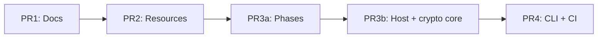

# Upstream PR split plan (RfidResearchGroup/proxmark3)

Replaces the monolithic fork PR [andrew867#3385](https://github.com/RfidResearchGroup/proxmark3/pull/3385) with **five stacked PRs** (PR 3 split into **3a** + **3b**) aligned with maintainer feedback:

> *"if its possible to break down this PR to smaller pull requests then it would be so much easier — like make one with documentation, one with all the extra / new resources files, and we get to smaller and smaller PR."*

Also note hardware context from the same review:

> *"The rdv4 sim module has a limitation on voltage supplied for card. the 5v cards will not work with 3v3"*

Document that in PR bodies and in `OPERATOR-GUIDE.md` (contactless lab cards are typically 3.3 V; 5 V legacy cards may need different hardware).

---

## Local integration status

Fork `andrew867/proxmark3` `master` integrates all internal cmake/docs/cli fixes through `662fb90e7` plus `tools/create_upstream_pr_branches.sh`.

**Branches cut for upstream (fork `origin`):**

| PR | Branch | Base (local stack) |
|----|--------|-------------------|
| 1 | `cursor/upstream-pr-1-docs-e836` | `upstream/master` |
| 2 | `cursor/upstream-pr-2-resources-e836` | PR 1 |
| 3a | `cursor/upstream-pr-3a-phases-e836` | PR 2 |
| 3b | `cursor/upstream-pr-3b-host-crypto-e836` | PR 3a |
| 4 | `cursor/upstream-pr-4-cli-e836` | PR 3b |

Regenerate with:

```bash
git fetch upstream master
./tools/create_upstream_pr_branches.sh
```

**Verified locally (gcc `make client` + `make client/check`):** tips of 3a, 3b, and 4.

Before opening upstream PRs:

1. Confirm GitHub Actions green on fork `master` (ubuntu / macos / windows make + cmake).
2. Run locally: `make client/check CC=gcc CXX=g++ LD=g++`
3. Close or supersede upstream #3385 once PR 1 is open.

**Diff vs upstream `master` (full stack):** ~225 files (EMV terminal emulator + crypto lab + CI fixes).

---

## Recommended upstream merge order



| # | Title (suggested) | Build impact | Reviewer focus |
|---|-------------------|--------------|----------------|
| **1** | `docs(emv): EMV terminal emulator planning bundle` | None (markdown only) | Specs, legal disclaimer, no code |
| **2** | `chore(emv): terminal profiles, scheme JSON, golden fixtures` | None (data + `.gitignore`) | Public test keys only, no real PANs |
| **3a** | `feat(emv): terminal emulator phase engine and offline unit tests` | Phase pipeline, session/profile, mock; `make client` + `emv test` (taa/cvm/exception) | ISO EMV offline logic |
| **3b** | `feat(emv): host simulator, golden runner, crypto playground core` | Orchestrator, online phase, host/TCP, crypto lab internals, Lua, remaining self-tests | Host sim + crypto internals |
| **4** | `feat(emv): terminal CLI, operator docs, and CI fixes` | `emv terminal` tree, `pm3_tests.sh`, workflows, CodeQL | User-facing commands + CI |

Map to buckets:

| Bucket | Upstream PR |
|--------|-------------|
| Planning specs | **PR 1** |
| Resources / fixtures JSON | **PR 2** |
| Phase engine + offline phases | **PR 3a** |
| Host sim, golden, crypto internals, orchestrator | **PR 3b** |
| CLI, operator guide, CI, cp850 strings | **PR 4** |

---

## PR 1 — Documentation only

**Branch:** `upstream-pr/1-docs-emv-planning` (upstream name: `docs/emv-terminal-planning`)

### Include

```
doc/planning/emv-terminal-emulator/   (all planning specs; no OPERATOR-GUIDE.md)
doc/planning/PR-SPLIT-PLAN.md
doc/planning/UPSTREAM-PR-SPLIT-PLAN.md
doc/emv_pcap_format.md
tools/create_upstream_pr_branches.sh
```

### Exclude (defer to PR 4)

- `OPERATOR-GUIDE.md`
- `doc/emv_notes.md` terminal sections

### Exclude (fork-only)

- `AGENTS.md`, `scripts/dev-env-setup.sh`

---

## PR 2 — Resources & fixtures

**Branch:** `upstream-pr/2-emv-terminal-resources`

### Include

```
client/resources/emv_terminal_profile*.json
client/resources/host_sim_interac.json
client/resources/interac_test_keys.json
client/resources/terminal_aid_candidates.json
client/resources/exception_file_sample.txt
client/resources/scheme_profiles/**
client/src/emv/test/fixtures/**
.gitignore
```

No `.c` / `.h` changes.

---

## PR 3a — Phase engine (offline core)

**Branch:** `upstream-pr/3a-emv-terminal-phases`

### Include

**Terminal engine (no orchestrator, no online phase, no CLI):**

```
client/src/emv/terminal/
  phase_init … phase_complete, phase_scripts (not phase_online)
  emv_term_ctx, emv_term_profile, emv_term_scheme, emv_term_session*
  emv_term_tvr, emv_term_load, emv_transaction
  emv_term_mock, emv_term_secure, emv_term_exception, emv_term_redact
  emv_term_tlv, emv_term_reader_session
  emv_term_pcap, emv_term_pin_prompt   # required by ctx/mock and phase_cvm

client/src/emv/test/terminal_taa_test.c
client/src/emv/test/terminal_cvm_test.c
client/src/emv/test/terminal_exception_test.c

client/src/emv/emvcore.c, emvjson.c, emv_pk.c   # profile/session + CAPK load hooks
client/src/iso7816/iso7816core.c
client/Makefile                                 # terminal sources minus 3b/CLI slice
client/src/emv/test/cryptotest.c                # registers taa/cvm/exception only
```

### Exclude (3b or 4)

- `emv_terminal.c`, `phase_online.c`, host/golden/crypto/replay/lua/banner/probe/timing
- `emv_term_cmd.c`, `emv_term_crypto_cmd.c`, `cmdemv.c` terminal registration
- CMake terminal lists (land in 3b)

### Tests

```bash
make client/check CC=gcc CXX=g++ LD=g++
# cryptotest runs terminal_taa/cvm/exception self-tests
```

---

## PR 3b — Host, golden, crypto core

**Branch:** `upstream-pr/3b-emv-terminal-host-crypto`

### Include

```
client/src/emv/terminal/
  emv_terminal.c, phase_online.c
  emv_term_host*, emv_term_arqc, emv_term_golden
  emv_term_sim_export, emv_term_replay, emv_term_timing, emv_term_probe
  emv_term_crypto*, emv_term_capabilities, emv_term_banner, emv_term_lua

client/src/emv/test/terminal_host_test.c … terminal_replay_test.c
client/src/scripting.c, client/luascripts/emv_terminal_demo.lua
client/Makefile, client/CMakeLists.txt, client/experimental_lib/CMakeLists.txt
  (full terminal source list minus emv_term_cmd / emv_term_crypto_cmd)
client/src/emv/test/cryptotest.c   # all terminal self-tests except pin-audit
```

User-facing `emv terminal` commands remain in **PR 4**.

### Tests

```bash
make client/check CC=gcc CXX=g++ LD=g++
```

---

## PR 4 — CLI, user docs, CI, bugfixes

**Branch:** `upstream-pr/4-emv-terminal-cli`

### Include

```
client/src/emv/terminal/emv_term_cmd.c, emv_term_crypto_cmd.c
client/src/emv/cmdemv.c
client/src/proxmark3.c, client/src/ui.h          # --stream / stdout_pipe
client/Makefile, client/CMakeLists.txt, client/experimental_lib/CMakeLists.txt

doc/planning/emv-terminal-emulator/OPERATOR-GUIDE.md
doc/emv_notes.md, README.md, CHANGELOG.md
tools/pm3_tests.sh

.github/workflows/{ubuntu,macos,windows}.yml
.github/codeql/codeql-config.yml
.github/workflows/codeql-analysis.yml

client/src/emv/test/cryptotest.c   # pin-audit flag + exec_terminal_pin_audit_test

# Field / HF14B hooks when changed vs upstream:
armsrc/iso14443b.c, include/protocols.h, include/iso14b.h, client/src/cmdhf14b.c
client/resources/{aidlist.json,capk.txt,emv_defparams.json}  # if changed
```

### User-facing verification

```bash
./pm3 --offline -c 'emv terminal test --golden'
./pm3 --offline -c 'emv terminal profile validate'
./pm3 --offline -c 'emv terminal crypto run -s --quick'
CHECKARGS="--clientbin ./client/build/proxmark3" make client/check
```

---

## CodeQL / security false positives

Historic EMV interop **requires** 3DES retail MAC, single DES in places, and lab key material in JSON. **PR 4** adds:

- `.github/codeql/codeql-config.yml` — `paths-ignore` for planning docs and lab JSON; `query-filters` for `cpp/weak-cryptographic-algorithm` under `client/src/emv` and test harness credential warnings.

If alerts remain on specific lines:

```c
// codeql[cpp/weak-cryptographic-algorithm]: EMV retail MAC (ISO 9797-1 Alg 3) for lab test cards
```

Document in PR 4 body so security reviewers know this is intentional interop code.

---

## Opening PRs to RfidResearchGroup/proxmark3

```bash
git push -u origin upstream-pr/1-docs-emv-planning
git push -u origin upstream-pr/2-emv-terminal-resources
git push -u origin upstream-pr/3a-emv-terminal-phases
git push -u origin upstream-pr/3b-emv-terminal-host-crypto
git push -u origin upstream-pr/4-emv-terminal-cli

# Cross-fork PRs (draft), all target RRG master; merge in order 1 → 2 → 3a → 3b → 4
gh pr create --repo RfidResearchGroup/proxmark3 \
  --head andrew867:upstream-pr/1-docs-emv-planning --base master --draft ...
```

Until PR 1 merges, later PR diffs against `master` are cumulative (expected for stacked forks). Rebase downstream branches after each upstream merge.

---

## What to do with #3385

1. Post comment linking to the five new PRs and this plan.
2. Mark #3385 as superseded / close when PR 1 is open or maintainer confirms split.
3. Do **not** force-push fork `master` to upstream; land the stack incrementally.
