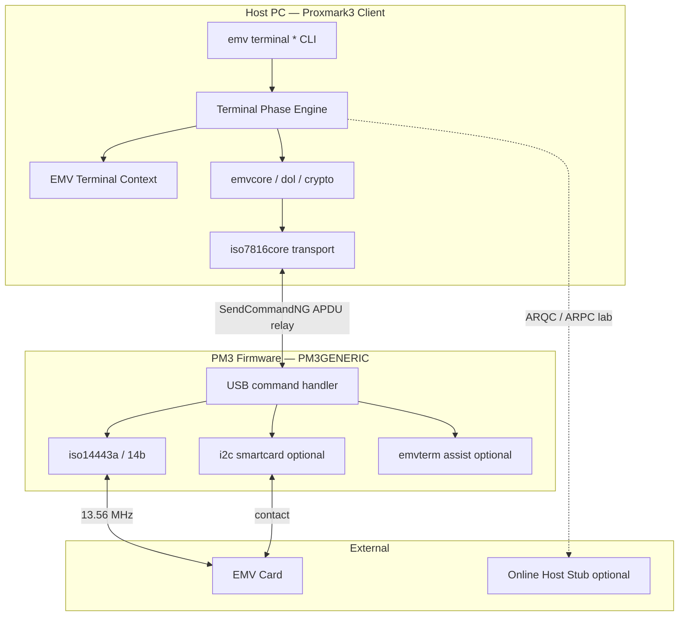
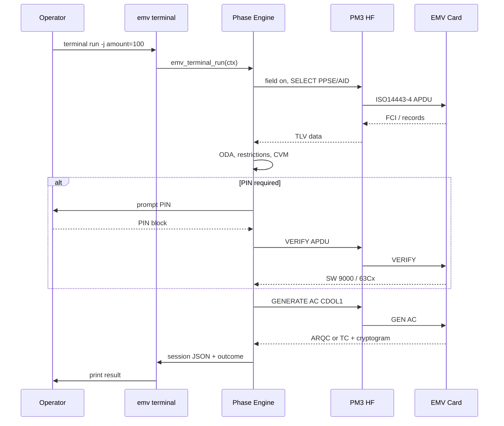

# Architecture — EMV Terminal Emulator

## System Overview

The terminal emulator splits work between the **host client** (phase logic, crypto, UI) and the **PM3 device** (RF field, ISO14443-4 / ISO7816 transport). This matches how existing `emv exec` already operates and avoids bloating PM3Easy firmware.



## Why Client-Heavy

| Factor | Implication |
|--------|-------------|
| PM3Easy 256 KB flash | Terminal engine in firmware would force large `SKIP_*` cuts |
| Existing EMV code is client-side | ~15 C files already in `client/src/emv/` |
| Crypto needs mbedtls / jansson | Available on host, tight on ARM |
| ntufar/EMV is C++ with services | Port **patterns**, not binary, into C modules |

Firmware additions stay **optional** and limited to timing assist (see [SPEC-firmware.md](./SPEC-firmware.md)).

## Major Modules

### 1. Terminal Phase Engine (new)

**Path:** `client/src/emv/terminal/emv_terminal.c`

Orchestrates EMV Book 3 phases in order, mirroring ntufar/EMV classes:

| Phase module | Responsibility |
|--------------|----------------|
| `phase_init.c` | Application selection, GPO, AFL reads |
| `phase_oda.c` | SDA / DDA / CDA wrappers around `trSDA`, `trDDA`, `trCDA` |
| `phase_restrict.c` | Dates, AUC, version checks |
| `phase_cvm.c` | CVM list, VERIFY, enciphered PIN |
| `phase_trm.c` | Floor limit, random selection |
| `phase_taa.c` | TAC/IAC → requested AC type |
| `phase_caa.c` | GENERATE AC parse, AC2 |
| `phase_online.c` | ARPC stub, scripts |
| `phase_complete.c` | Final outcome, receipt fields |

Single entry: `emv_terminal_run(&emv_term_ctx_t *ctx)`.

### 2. EMV Terminal Context (new)

**Path:** `client/src/emv/terminal/emv_term_ctx.h`

Central state (ntufar `EMV_Context` equivalent):

- `tlvdb *card` — card TLV tree from scan/exec
- `tlvdb *terminal` — terminal parameters (PDOL/CDOL sources)
- `emv_term_phase_t phase` — current phase
- `emv_term_decision_t decision` — AAC / ARQC / TC request and outcome
- `emv_cvm_result_t cvm` — CVM performed / result
- `emv_session_trace_t *trace` — ordered phase log for JSON export

### 3. Existing EMV Core (extend)

**Path:** `client/src/emv/emvcore.c`, `cmdemv.c`

Keep low-level APDU functions. Refactor shared code out of `CmdEMVExec` / `CmdEMVScan` into callable APIs used by both legacy commands and `emv terminal`.

### 4. Transport Layer (existing)

**Path:** `client/src/iso7816/iso7816core.c`

- `CC_CONTACTLESS` — default for PM3Easy antenna
- `CC_CONTACT` — requires `PLATFORM_EXTRAS=SMARTCARD` hardware mod

### 5. Firmware (minimal)

**Existing:** `iso14443a.c`, `iso14443b.c`, optional `i2c.c`, `emvsim.c`

**New (optional):** `armsrc/emvterm.c` — only if measured timing gaps require firmware-side WTX or APDU pipelining. Default: **no new firmware for MVP**.

## Data Flow — Contactless Terminal Transaction



## Control Flow

1. Parse CLI args → populate terminal TLV defaults + `emv_defparams.json`
2. Initialize context, open trace
3. For each phase: `pre_check → execute → post_update → trace_event`
4. On failure: classify error (see [SPEC-error-handling.md](./SPEC-error-handling.md)); fail-closed for ODA/CVM hard failures
5. Export session JSON; drop field

Phase engine supports **step mode** (`emv terminal step`) for debugging — runs one phase per invocation.

## External Dependencies

| Dependency | Use |
|------------|-----|
| mbedtls (via libpcrypto) | RSA, DES, SHA for ODA and PIN |
| jansson | Session export, param load |
| Existing CA PK store | `emv_pki.c`, `client/resources/` |
| EMV test card profiles | Lab validation (not bundled) |

## State Ownership

| State | Owner | Lifetime |
|-------|-------|----------|
| Card TLV tree | `emv_term_ctx_t` | Session |
| Terminal parameters | `emv_term_ctx_t` | Session; loaded from JSON |
| APDU log | `iso7816core` global | Configurable per session |
| PIN buffer | stack, zeroized | VERIFY command only |
| Firmware BigBuf | device | Per APDU command |

## Persistence Model

- **Session files:** JSON written to operator-specified path (`emv terminal run -o session.json`)
- **Terminal profile:** `client/resources/emv_terminal_profile.json` (new, extends defparams)
- **No firmware persistence** for terminal config in v1

## Failure Modes

| Failure | Behavior |
|---------|----------|
| Card removed mid-session | Abort with `PM3_EIO`, partial trace saved |
| ODA failure | TVR updated; TAA may request online or decline per TAC |
| PIN blocked (63C0) | CVM failure recorded; continue per CVM list rules |
| Missing CA key | ODA skip or fail per terminal policy flag |
| USB disconnect | Session lost; operator re-runs |
| 256 KB firmware OOM | N/A for client-heavy MVP |

## Observability / Logging

- `-a` — APDU trace (existing)
- `-t` — TLV decode (existing)
- `--trace-phases` — phase boundary log with REQ-ID references
- Session JSON includes `phases[]` with timestamps, SW codes, decisions
- Never log full PIN, full track 2, or issuer MAC keys

## Deployment Shape

```text
Host: proxmark3 client binary + resources/emv_*.json
Device: PM3GENERIC fullimage (PM3Easy LED order)
Connection: USB serial / TCP bridge
Optional: SMARTCARD mod for contact EMV
```

No cloud component. Online host stub runs locally if enabled.
