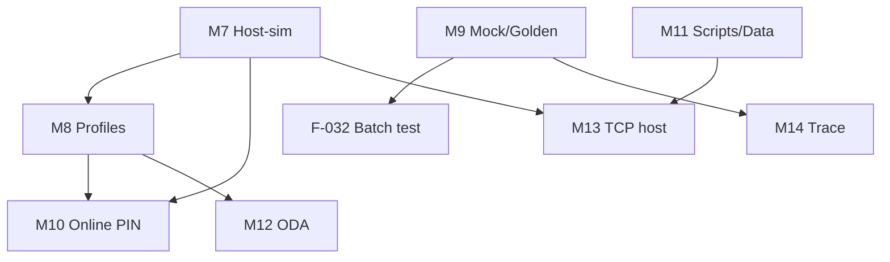

# Implementation Plan v2 — Post-MVP Terminal Enhancements

## Prerequisites

Milestones 1–6 (Phases 0–8) **complete**:

- Full phase pipeline through `complete`
- CVM (plain + enciphered offline)
- TAA, CAA, online lab stub, session JSON
- `emv terminal load`, `profile validate`

## Target Repo Structure (v2 additions)

```text
client/src/emv/
├── terminal/
│   ├── emv_term_host.c/h          # F-001, F-011, F-023, F-038
│   ├── emv_term_arqc.c/h          # ARQC verify + ARPC compute
│   ├── phase_scripts.c/h          # F-004, F-037 (71 + 72)
│   ├── emv_term_session_view.c/h  # F-010
│   ├── emv_term_compare.c/h       # F-009
│   ├── emv_term_redact.c/h        # F-028
│   ├── emv_term_replay.c/h        # F-016, F-033
│   └── scheme/                    # F-002, F-015, F-024, F-036
│       ├── profile_interac.c
│       ├── profile_visa.c
│       └── profile_mc.c
├── test/
│   ├── fixtures/                  # F-017 golden files
│   │   ├── README.md
│   │   ├── interac_tc01/
│   │   └── visa_qvsdc/
│   ├── terminal_host_test.c
│   ├── terminal_mock_apdu_test.c
│   └── terminal_golden_test.c
└── iso7816/
    └── iso7816_mock.c             # F-016 transport mock

client/resources/
├── scheme_profiles/
│   ├── interac.json
│   ├── visa_qvsdc.json
│   └── mc_mchip.json
└── capk_interac_extra.txt         # F-012

client/resources/
├── host_sim_interac.json          # keys + ARPC-RC defaults
└── exception_file_sample.txt      # F-014
```

---

## Milestone M7 — Host Simulator + ARQC Crypto (Wave A)

**Goal:** Real online completion without manual `--arpc` hex.

**Features:** F-001, F-011, F-038

### Tasks

1. Add `emv_term_host.c`: load keys from `interac_test_keys.json` / profile
2. Implement ARQC verify (3DES CVN18 / scheme-specific) per [SPEC-v2-host-online.md](./SPEC-v2-host-online.md)
3. Compute ARPC + append ARPC-RC (`8840` Interac default)
4. Wire `phase_online_run()` to call host when `--host-sim` or profile enables it
5. New CLI: `emv terminal host-sim --session s.json [--keys file]`
6. Log: `ARQC verify: OK (CVN18)` or `FAIL (bad MAC)`

### Completion criteria

- Interac TC01–TC04 contact paths complete online with `--host-sim` (manual)
- AUTO-V2-001–015 pass
- No regression in manual `--arpc` path

**Estimate:** ~800–1200 LOC C + tests

---

## Milestone M8 — Scheme Profiles + Kernel Hints (Wave A/B)

**Goal:** Per-scheme TAA/CVM/contactless defaults without hand-editing JSON.

**Features:** F-002, F-015, F-024, F-036, F-040, F-034

### Tasks

1. `client/resources/scheme_profiles/{interac,visa_qvsdc,mc_mchip}.json`
2. `--profile <name|auto>` on `run`, `step`, `host-sim`
3. Auto-detect: map AID prefix → profile (see `terminal_aid_candidates.json`)
4. Load TTQ (9F66), CTQ (9F6C), TAC overrides, CVM policy into terminal TLV
5. Simplified kernel dispatcher: Visa path vs MC path before TAA
6. Document test-card matrix in SPEC-v2-scheme-kernels.md § Test Card Matrix

### Completion criteria

- `--profile interac` selects Interac TACs on contactless Flash TC01
- `--profile auto` picks correct profile for A0000002771010
- MAN-V2-011–020 pass

---

## Milestone M9 — CI / Mock / Golden Regression (Wave A)

**Goal:** Terminal logic testable without PM3 hardware in CI.

**Features:** F-016, F-017, F-009, F-032, F-018

### Tasks

1. APDU trace format (JSON lines: `{ "cmd": "...", "rsp": "...", "sw": "9000" }`)
2. `--mock-apdu-file trace.json` hooks `Iso7816ExchangeEx`
3. Golden sessions under `client/src/emv/test/fixtures/`
4. `emv terminal test --golden` runs fixture suite
5. `emv terminal compare exec.json terminal.json` — APDU diff
6. CI job: `PLATFORM=PM3GENERIC PLATFORM_SIZE=256 make -C arms` size check (F-018)

### Completion criteria

- `tools/pm3_tests.sh` runs golden suite when client built
- GitHub Actions green on Ubuntu without device
- AUTO-V2-089–160 documented and passing

---

## Milestone M10 — CVM + PIN + Online PIN (Wave B)

**Goal:** Complete CVM matrix including online PIN deferral.

**Features:** F-003, F-006, F-029, F-040

### Tasks

1. CVM code `02`: build PIN block, set TVR, stash for CDOL/host
2. Interactive PIN: `getpass()` / Windows `getch` wrapper in `emv_term_pin_prompt.c`
3. Audit: zeroize on all exit paths; filter PIN digits from APDU log when `-a`
4. Interac Flash matrix: skip VERIFY on contactless when profile says so

### Completion criteria

- MAN-V2-021–025, MAN-V2-036–040, MAN-V2-120–122 pass
- AUTO-V2-026–030, AUTO-V2-041–045, AUTO-V2-145–148 pass

---

## Milestone M11 — Data, Scripts, Session UX (Wave B/C)

**Goal:** Session tooling and full issuer script support.

**Features:** F-004, F-005, F-010, F-028, F-037

### Tasks

1. `phase_scripts.c`: process tag `72` after AC2; improve `71` chaining
2. `emv terminal session print|merge|export`
3. `--full-tlv` session export; `merge` into scan JSON
4. Default redaction: mask AC, IAD; `--no-redact` for full crypto
5. TVR/TSI/CVMR human decode in session print

### Completion criteria

- Script 72 TVR bit set on simulated failure (fixture)
- Merge produces valid `emv sim` input (manual spot check)

---

## Milestone M12 — ODA Depth + Restrictions (Wave B/D)

**Goal:** Stronger authentication paths and risk stubs.

**Features:** F-012, F-013, F-014, F-026

### Tasks

1. `--capk-extra file` merge at ODA init
2. fDDA: UN + SDAD verify on qVSDC path (extend `phase_oda.c`)
3. Terminal CDA verify after GEN AC (reuse `trCDA` checks)
4. `--exception-file`: SHA-256(PAN) lookup before TAA

---

## Milestone M13 — Integration Layer (Wave C/D)

**Goal:** PM3 ecosystem glue.

**Features:** F-019, F-020, F-021, F-022, F-023, F-025

### Tasks

1. `emv terminal export-sim session.json → card_patch.json`
2. Lua: `emv_terminal_run()`, `emv_terminal_step()` in bindings
3. `emv reader --terminal-trace` shared session
4. Contact: ATR banner, mod detection messages
5. TCP host on `127.0.0.1:8583` — JSON ARQC in, ARC+ARPC out
6. MSD path: explicit branch in `phase_caa.c`

---

## Milestone M14 — Trace, Replay, Polish (Wave D)

**Goal:** Research-grade observability.

**Features:** F-030, F-031, F-033, F-035, F-039

### Tasks

1. One-time legal banner (`~/.proxmark3/emv_terminal_ack` or env `EMV_TERMINAL_I_ACK`)
2. `--pcap-out trace.pcap` EMV APDU dissector friendly format
3. `emv terminal replay trace.json --from-phase cvm`
4. Per-phase ms timing in session JSON
5. `emv terminal capabilities` — lists mods, 14a, smartcard, recommended profile

---

## Dependency Graph (simplified)



---

## What NOT to build in v2

| Item | Track separately |
|------|------------------|
| Firmware WTX assist (F-027) | v3 / only if timing measured |
| Production ISO 8583 acquirer | Never in PM3 core |
| EMVCo L3 certification tooling | Partner / external |

---

## Definition of Done (v2 program)

- [ ] All P0 features (F-001, F-002, F-011, F-016, F-017, F-032) shipped
- [ ] ≥ 80% P1 features shipped
- [ ] [QA-CHECKLIST-v2.md](./QA-CHECKLIST-v2.md) complete
- [ ] Interac + Visa + MC manual smoke on hardware (one card each minimum)
- [ ] `doc/emv_notes.md` and README updated
- [ ] `commands.json` regenerated for new subcommands
