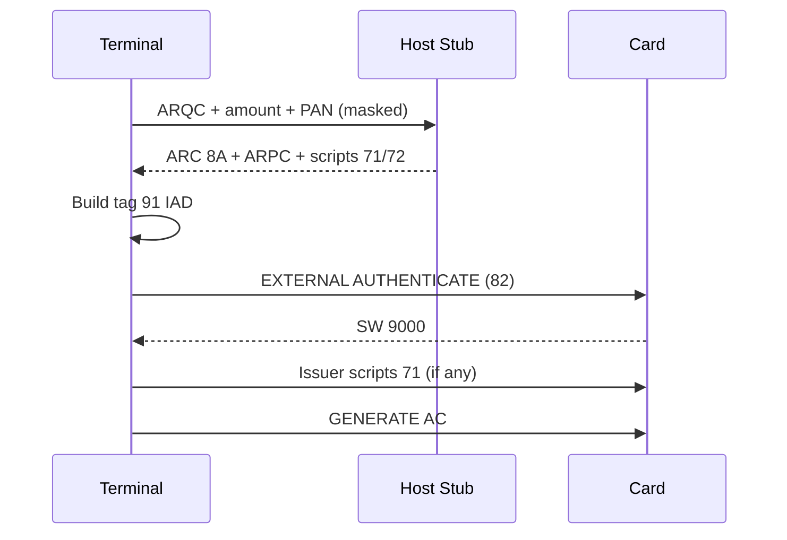

# SPEC: Advanced Terminal Features — CVM, TAA, AC2, External Auth, Issuer Scripts

## Purpose

Detailed specification for the **missing terminal capabilities** identified in `doc/emv_notes.md` and the user MVP: PIN VERIFY, CVM list processing, Terminal Action Analysis, second Generate AC, external authenticate (ARPC), and issuer script relay.

Maps to ntufar/EMV phases: `CardholderVerification`, `TerminalActionAnalysis`, `CardActionAnalysis`, `OnLineProcessing`, `IssuerScriptProcessing`.

## Scope

Client-side `client/src/emv/terminal/` implementation on PM3 host.

## Non-Goals

- PCI PTS approved PIN Entry Device hardware
- Full ISO8583 acquirer protocol
- Decrypting issuer script payloads

---

## Module: `phase_cvm.c` — Cardholder Verification

### CVM List (tag `8E`) structure

Each rule is 4 bytes, after 8-byte amount X/Y thresholds:

```text
[XX XX] [XX XX]  — amount X, amount Y (BCD or binary per card)
[CM] [CFl] [CFl] [CRes]  — CVM Code, Condition Code, (padding/reserved)
```

**CVM Codes (high nibble of CM):**

| Code | Method |
|------|--------|
| `00` | Fail CVM processing |
| `01` | Plaintext PIN verification performed by ICC |
| `02` | Enciphered PIN verified online |
| `03` | Plaintext PIN + signature (paper) |
| `04` | Enciphered PIN verification performed by ICC |
| `05` | Enciphered PIN + signature |
| `1E` | Signature (paper) |
| `1F` | No CVM required |
| `3F` | This CVM is not allowed |

**Condition codes (examples):**

| Code | Condition |
|------|-----------|
| `00` | Always |
| `01` | If unattended cash |
| `02` | If not unattended cash and not manual cash and not purchase with cashback |
| `03` | If terminal supports the CVM |
| `06` | If manual cash |
| `08` | If transaction is in the application currency and under X amount |

**CFl nibble (low 4 bits of byte 2):** what to do if this CVM fails:

| Value | Action |
|-------|--------|
| `0` | Fail cardholder verification |
| `1` | Apply succeeding CVM rule |
| `2` | Skip this CVM; not allowed |
| `3` | Apply succeeding rule if unsuccessful |

Interac TC01 example: `44 03 01 03 02 03` = enciphered offline, if fail try plain, then online.

### REQ-CVM-001

Terminal shall parse `8E`, iterate rules in order, skip rules failing condition checks against transaction amount, currency, terminal capabilities (`9F33`, `9F66`).

### REQ-CVM-002

For CVM `01`, send VERIFY plain PIN block (ISO 9564-1 format 2).

### REQ-CVM-003

For CVM `04`, RSA-encrypt PIN block with recovered ICC PIN PK; send VERIFY.

### REQ-CVM-004

For CVM `02`, set TVR online PIN entered bit; include PIN data in CDOL if required; delegate to online stub (no live HSM in v1).

### REQ-CVM-005

For CVM `1F`, set CVM Results `9F34` to `1F0000` (no CVM required) and continue.

### REQ-CVM-006

Update TVR byte 3 bits per EMV on PIN fail (`63Cx`), try limit, enciphered fail.

### REQ-CVM-007

Write CVM Results `9F34` 3 bytes: `[CVM performed][CVM condition][CVM result]`.

### REQ-CVM-008

Interac contactless: if card profile indicates Flash with no contactless CVM rules, skip CVM phase (REQ-SCH-006).

### CLI integration

```bash
emv terminal pin --offline 1234
emv terminal run --pin 1234 --cvm-skip-online
emv terminal step cvm --session /tmp/s.json
```

---

## Module: `phase_taa.c` — Terminal Action Analysis

### Inputs

- TVR `95` (5 bytes)
- TAC Default / Denial / Online `DF8120`–`DF8122` (terminal profile)
- IAC Default / Denial / Online `9F0D`–`9F0F` (from card)
- AIP `82`, amount vs floor limit `9F1B`

### Algorithm (EMV Book 3)

For each action type (Denial, Online, Default):

```text
(TVR & TAC) || (TVR & IAC)  → if non-zero, that action applies
```

Priority: **Denial** > **Online** > **Default** (first match wins in standard implementation).

### REQ-TAA-001

Terminal shall compute requested cryptogram type: AAC (`00`), ARQC (`80`), or TC (`40`) for GEN AC P1.

### REQ-TAA-002

Terminal shall build CDOL1 using `dol_process()` on tag `8C` from card tree.

### REQ-TAA-003

Interac: incorporate CIAC tags `9F6B`/`9F6D` for contactless path when present.

### Scheme profile overrides

| Profile | TAC Denial (example) | Notes |
|---------|---------------------|-------|
| Visa qVSDC | from `emv_terminal_profile_visa.json` | TTQ-driven |
| Mastercard | from `emv_terminal_profile_mastercard.json` | MC uses different TVR bits |
| Interac | CIAC-driven contactless | Contact uses standard TAC |

---

## Module: `phase_caa.c` — Card Action Analysis (GEN AC 1 & 2)

### First GENERATE AC

Already partially in `CmdEMVExec` / `EMVGPO` path:

```text
80 AE [P1] 00 [Lc] [CDOL1 data] 00
```

Parse response template `77`:

- `9F27` CID — cryptogram type returned
- `9F26` AC — cryptogram value
- `9F36` ATC
- `9F10` IAD

### REQ-CAA-001

Terminal shall compare CID cryptogram type to requested type; record mismatch in TVR if applicable.

### REQ-CAA-002

If ARQC returned and online required, transition to `phase_online`.

### Second GENERATE AC (AC2)

When online completes (or offline TC path requires), build **CDOL2** from tag `8D`:

```text
80 AE [P1 for TC/AAC] 00 [Lc] [CDOL2 data] 00
```

**Current gap** in `cmdemv.c` (~2033–2051): CDOL2 built but AC2 commented out.

### REQ-CAA-010

Implement AC2 after successful EXTERNAL AUTHENTICATE when first AC was ARQC.

### REQ-CAA-011

Parse second CID for TC (approve) or AAC (decline) final outcome.

### CID reference

| CID & 0xC0 | Meaning |
|------------|---------|
| `0x00` | AAC |
| `0x40` | TC |
| `0x80` | ARQC |
| `0xC0` | RFU |

---

## Module: `phase_online.c` — Online Processing

### Flow



### REQ-ONL-001

Display ARQC, ATC, amount; prompt for host response or use `--host-sim interac|visa|mc`.

### REQ-ONL-002

Accept `--arc 00` (approve) / `--arc 05` (decline) ASCII hex for tag `8A`.

### REQ-ONL-003

Compute or accept `--arpc <16 hex>`; construct tag `91` = ARPC || ARPC-RC.

### REQ-ONL-004

Call `Iso7816Exchange` EXTERNAL AUTHENTICATE `00 82 00 00`.

### REQ-ONL-005

Interac default ARPC-RC `8840` when `--profile interac`.

### Host stub (v1)

```bash
emv terminal online --session s.json --arc 3030 --arpc <hex> --arpc-rc 8840
```

Future: `emv terminal host-sim --keys interac_test_keys.json`.

---

## Module: `phase_scripts.c` — Issuer Script Processing

### Tags

| Tag | When processed |
|-----|----------------|
| `71` | Before final GENERATE AC |
| `72` | After final GENERATE AC |

Structure: optional script ID + one or more `86` command templates.

### REQ-SCR-001

For each command in template, send C-APDU to card; stop on first SW1 error.

### REQ-SCR-002

Set TVR bit "Script failed before final GEN AC" (tag 71) or "after" (tag 72).

### REQ-SCR-003

Set TSI bit "Script processing performed" on any script sent.

### REQ-SCR-004

Do not log script command payloads containing PIN change in clear text.

---

## Consolidated Requirement Index (advanced)

| ID | Feature |
|----|---------|
| REQ-CVM-001–008 | CVM list + VERIFY |
| REQ-TAA-001–003 | Terminal Action Analysis |
| REQ-CAA-001–011 | GEN AC 1 & 2 |
| REQ-ONL-001–005 | Online + ARPC + external auth |
| REQ-SCR-001–004 | Issuer scripts |

---

## Mapping from current `cmdemv.c`

| Existing | Target module | Status |
|----------|---------------|--------|
| `CmdEMVExec` monolith | split into phases | Refactor |
| CDOL1 + GEN AC1 | `phase_taa` + `phase_caa` | Works |
| CDOL2 build | `phase_caa` AC2 | **Stub only** |
| ARPC XOR | `phase_online` | **Partial** |
| EXTERNAL AUTH | `phase_online` | **Missing** |
| VERIFY | `phase_cvm` | **Missing** |
| CVM list walk | `phase_cvm` | **Missing** |
| Issuer scripts | `phase_scripts` | **Missing** |

---

## Acceptance Criteria

AC-ADV-001: Full contact transaction on Interac TC01: ODA → enciphered PIN → ARQC → manual ARPC → AC2 TC.

AC-ADV-002: Visa qVSDC contactless: no PIN, ARQC or TC with TAA logged.

AC-ADV-003: CVM list failure walks to next rule when CFl=1 (Interac TC01 enciphered wrong → plain).

AC-ADV-004: Issuer script 71 failure sets TVR before AC2.

---

## Test Coverage

| ID | Test |
|----|------|
| MAN-ADV-001 | Interac TC01 full contact flow |
| MAN-ADV-002 | Interac TC02 enciphered PIN fail hard stop (CFl=0) |
| MAN-ADV-003 | Visa online ARQC manual ARPC |
| AUTO-ADV-001 | CVM list parser on fixed 8E vectors |
| AUTO-ADV-002 | TAA table: TVR+TAC → AAC/ARQC/TC |
| AUTO-ADV-003 | CDOL2 builder from 8D fixture |

---

## Implementation order (recommended)

1. `phase_cvm.c` — highest user value (PIN)
2. `phase_taa.c` — correct cryptogram request
3. `phase_caa.c` AC2 — complete offline/online boundary
4. `phase_online.c` + EXTERNAL AUTH — ARPC
5. `phase_scripts.c` — issuer script relay

See [IMPLEMENTATION-PLAN.md](./IMPLEMENTATION-PLAN.md) Phases 3–6.
