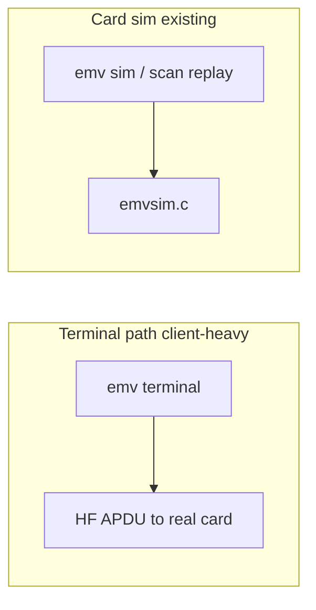

# SPEC: Firmware

## Purpose

Define when and how `armsrc/` changes for EMV terminal support on PM3GENERIC.

## Scope

PM3GENERIC / PM3Easy; relationship to existing `emvsim.c`

## Non-Goals

Porting ntufar/EMV C++ kernel to ARM
Replacing `emvsim.c` relay/card-side logic

## Current Firmware EMV Assets

| File | Role | Terminal relevance |
|------|------|-------------------|
| `iso14443a.c` | HF transport | **Required** — APDU to card |
| `iso14443b.c` | HF-B | Optional for some EMV cards |
| `i2c.c` / `i2c_direct.c` | Smartcard | Contact EMV only |
| `emvsim.c` | Card-side relay/sim | **Not** terminal; keep separate |
| `emvtags.h` | Tag structs | Reference only |

## Functional Requirements

### MVP (Phase 0–2)

REQ-FW-001: No mandatory firmware changes for terminal MVP.

REQ-FW-002: Existing USB command path for ISO14443-4 APDU exchange shall remain the transport.

### Optional Assist (Phase 4+)

REQ-FW-010: If client-measured timeouts exceed limits on PM3Easy, implement `armsrc/emvterm.c`:

- Opcode: `CMD_HF_EMV_TERMINAL_ASSIST` (proposed 0x0387)
- Behavior: maintain field + auto WTX response for contactless
- Size budget: **≤ 4 KB** compiled

REQ-FW-011: Assist module shall compile only when `WITH_EMVTERM` defined; default off.

REQ-FW-012: Assist shall not duplicate terminal crypto or PIN logic.

### Flash Budget

REQ-FW-020: Any firmware addition must preserve PM3GENERIC 512 KB default build.

REQ-FW-021: 256 KB builds: assist disabled; document `SKIP_*` if base image grows.

### Build Integration

REQ-FW-030: If added, register in `armsrc/Makefile`:

```make
ifeq ($(WITH_EMVTERM),1)
    SRC_EMVTERM = emvterm.c
endif
```

REQ-FW-031: Client detects assist via capability flag in `hw version` or command probe — fallback to pure client if absent.

## Separation: Terminal vs Card Simulation



Do not merge `emvsim.c` into terminal engine — different direction on the air interface.

## Acceptance Criteria

AC-FW-001: Default `make fullimage PLATFORM=PM3GENERIC` unchanged by terminal MVP merge.

AC-FW-002: If `WITH_EMVTERM=1`, image size increase documented in release notes.

## Test Coverage Notes

AUTO-FW-001: Firmware size regression script  
MAN-FW-001: WTX assist reduces timeout rate on reference slow card (if implemented)

## Open Questions

OQ-001: Opcode 0x0387 allocation
