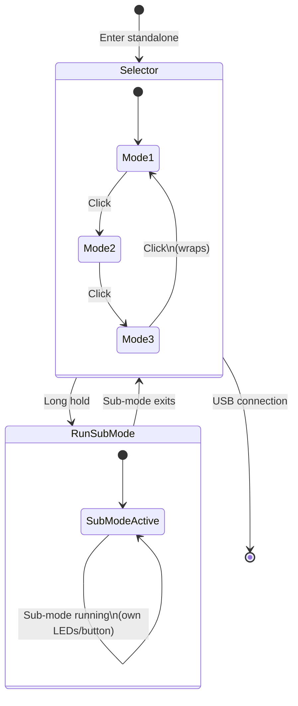

# DANKARMULTI — Multi-Mode Standalone Loader

> **Author:** Daniel Karling (dankarmulti)
> **Frequency:** Multi (LF + HF)
> **Hardware:** Generic Proxmark3

[Back to Standalone Modes Index](../../armsrc/Standalone/readme.md#individual-mode-documentation) | [Source Code](../../armsrc/Standalone/dankarmulti.c) | [Development Guide](../../armsrc/Standalone/readme.md#developing-standalone-modes)

---

## What

A meta-standalone mode that bundles **multiple** standalone modes into a single firmware image and lets you select which one to run at boot time using the button.

## Why

Normally the Proxmark3 can only have one standalone mode compiled in. If you want to switch modes, you must reflash the firmware. DANKARMULTI solves this by wrapping multiple standalone modes into one firmware — you cycle through them with button presses and hold to execute your chosen mode. This is ideal for field work where you need multiple capabilities without a laptop.

## How

1. **Boot**: On entering standalone mode, LEDs indicate the currently selected sub-mode.
2. **Cycle**: Press the button to cycle through available sub-modes. LEDs change to indicate the new selection.
3. **Execute**: Hold the button to launch the selected sub-mode. Once launched, that sub-mode takes full control (LEDs, button, etc.).
4. **Exit**: Exiting the sub-mode returns to the DANKARMULTI selector.

### Default Bundled Modes

By default, DANKARMULTI includes:

| Slot | Mode | Description |
|------|------|-------------|
| 1 | [HF_MATTYRUN](hf_mattyrun.md) | MIFARE Classic key check → nested → dump → emulate |
| 2 | [LF_EM4100RSWB](lf_em4100rswb.md) | EM4100 read/sim/write/brute |
| 3 | [HF_TCPRST](hf_tcprst.md) | IKEA Rothult / ST25TA password extractor |

> Modes can be customized by editing the `dankarmulti.c` source — add or remove `#include`s and update the mode array.

## LED Indicators

| LED | Meaning (Selector) |
|-----|---------------------|
| **A** only | Mode 1 selected |
| **B** only | Mode 2 selected |
| **C** only | Mode 3 selected |
| **D** only | Mode 4 selected (if present) |
| **A+B** | Mode 5 selected (if present) |

> Once a sub-mode is launched, that sub-mode's own LED scheme takes over.

## Button Controls

| Action | Effect |
|--------|--------|
| **Single click** | Cycle to next sub-mode |
| **Long hold** | Launch selected sub-mode |

## State Machine



## Customising Bundled Modes

Edit `armsrc/Standalone/dankarmulti.c`:

1. Add `#include` for the desired standalone mode header
2. Add entry to the `modes[]` array with the mode's `RunMod()` and `ModInfo()` functions
3. Recompile:

```bash
make clean
make STANDALONE=DANKARMULTI -j
./pm3-flash-fullimage
```

## Compilation

```
make clean
make STANDALONE=DANKARMULTI -j
./pm3-flash-fullimage
```

## Related

- [Standalone Modes Overview](../../armsrc/Standalone/readme.md) — Full list of all standalone modes
- [Advanced Compilation](../md/Installation_Instructions/4_Advanced-compilation-parameters.md) — Compilation with STANDALONE= parameter
