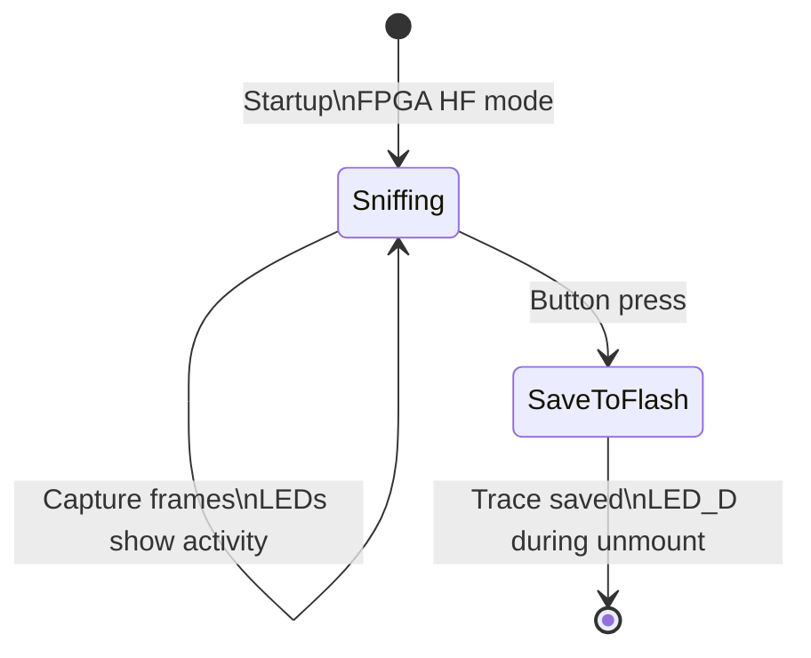

# HF_14ASNIFF — ISO14443A Passive Sniffer

> **Author:** Micolous
> **Frequency:** HF (13.56 MHz)
> **Hardware:** RDV4 (flash and battery recommended)

[Back to Standalone Modes Index](../../armsrc/Standalone/readme.md#individual-mode-documentation) | [Source Code](../../armsrc/Standalone/hf_14asniff.c) | [Development Guide](../../armsrc/Standalone/readme.md#developing-standalone-modes)

---

## What

Passively sniffs ISO14443A (NFC Type A) communication between a reader and a card, storing captured frames to the RDV4's onboard flash memory (or RAM on generic hardware).

## Why

Many HF access control and payment systems use ISO14443A. By placing the Proxmark3 between a legitimate reader and card, you can capture the full communication — revealing authentication exchanges, data reads/writes, and protocol behavior. This is essential for:

- **Protocol reverse engineering**: Understand how a reader communicates with cards
- **Authentication capture**: Record authentication handshakes for later analysis
- **System documentation**: Capture real traffic to document proprietary protocols

## How

1. Position the Proxmark3 antenna between a reader and card
2. The device captures both reader-to-card and card-to-reader frames with timestamps
3. Frames are buffered in RAM and flushed to flash on button press
4. Retrieve the trace file from flash via the client for analysis with `hf 14a list`

## LED Indicators

| LED | Meaning |
|-----|---------|
| **1** (A) | Sniffing active |
| **2** (B) | Tag command detected (off when reader finishes) |
| **3** (C) | Reader command detected (off when tag finishes) |
| **4** (D) | Flash unmounting / sync |

## Button Controls

| Action | Effect |
|--------|--------|
| **Short press** | Stop sniffing, save trace to flash, exit |
| **USB command** | Exit standalone mode |

## State Machine



## Retrieved Data

After sniffing, connect via client and retrieve the trace:
```
mem spiffs dump -s hf_14asniff.trace -d hf_14asniff.trace
trace load -f hf_14asniff.trace
hf 14a list
```

## Compilation

```
make clean
make STANDALONE=HF_14ASNIFF -j
./pm3-flash-fullimage
```

## Related

- [14B Sniffer](hf_14bsniff.md) — ISO14443B sniffer
- [15693 Sniffer](hf_15sniff.md) — ISO15693 sniffer
- [Universal Sniffer](hf_unisniff.md) — Multi-protocol sniffer with runtime selection
- [BogitoRun Auth Sniffer](hf_bog.md) — 14A sniffer with auth capture
- [Trace Notes](../trace_notes.md) — Working with trace files
