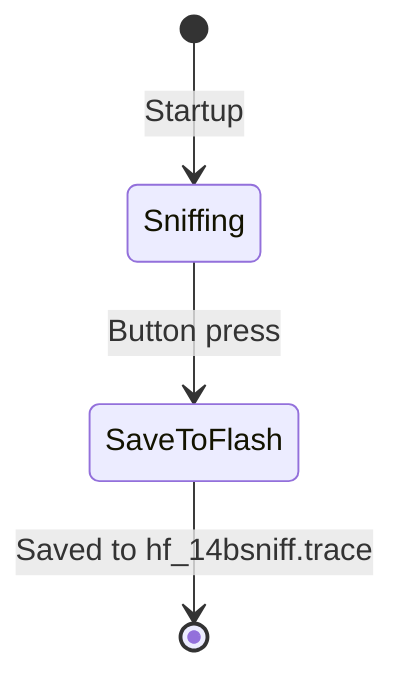

# HF_14BSNIFF — ISO14443B Passive Sniffer

> **Author:** jacopo-j
> **Frequency:** HF (13.56 MHz)
> **Hardware:** RDV4 (flash recommended, optional)

[Back to Standalone Modes Index](../../armsrc/Standalone/readme.md#individual-mode-documentation) | [Source Code](../../armsrc/Standalone/hf_14bsniff.c) | [Development Guide](../../armsrc/Standalone/readme.md#developing-standalone-modes)

---

## What

Passively sniffs ISO14443B communication between a reader and card, saving captured frames to flash (or RAM).

## Why

ISO14443B is used by certain transit cards, national ID cards, and access control systems (e.g., CEPAS, Calypso). This sniffer captures the full communication exchange for protocol analysis.

## How

Identical workflow to [14A Sniffer](hf_14asniff.md) but tuned for the 14443B modulation scheme. Captured frames include both PICC (card) and PCD (reader) traffic.

## LED Indicators

| LED | Meaning |
|-----|---------|
| **1** (A) | Sniffing active |
| **2** (B) | Tag command |
| **3** (C) | Reader command |
| **4** (D) | Flash unmounting |

## Button Controls

| Action | Effect |
|--------|--------|
| **Short press** | Stop sniffing, save to flash, exit |

## State Machine



## Compilation

```
make clean
make STANDALONE=HF_14BSNIFF -j
./pm3-flash-fullimage
```

## Related

- [14A Sniffer](hf_14asniff.md) — ISO14443A sniffer
- [Universal Sniffer](hf_unisniff.md) — Multi-protocol sniffer
