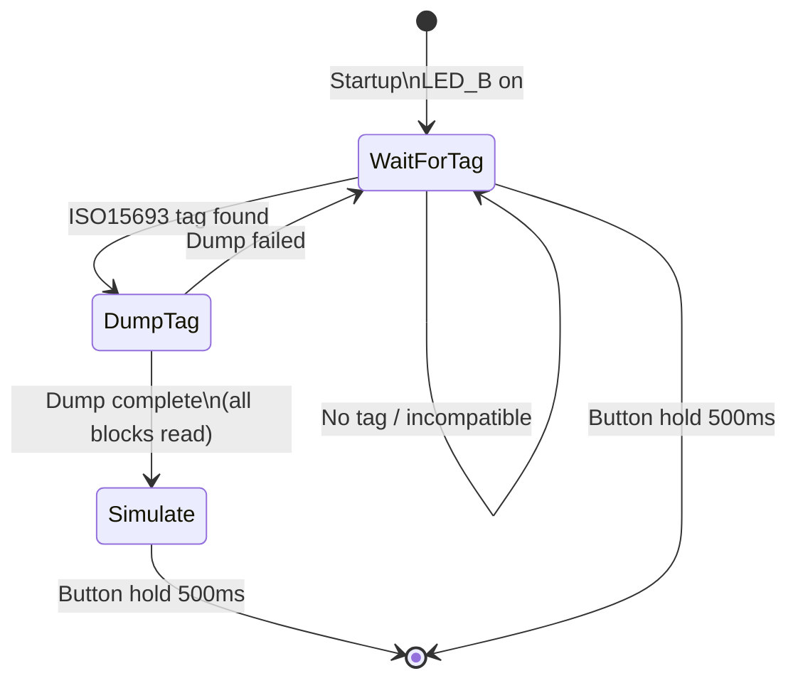

# HF_15SIM — ISO15693 Dump and Simulate

> **Author:** lnv42
> **Frequency:** HF (13.56 MHz)
> **Hardware:** RDV4 (flash memory)

[Back to Standalone Modes Index](../../armsrc/Standalone/readme.md#individual-mode-documentation) | [Source Code](../../armsrc/Standalone/hf_15sim.c) | [Development Guide](../../armsrc/Standalone/readme.md#developing-standalone-modes)

---

## What

Dumps an ISO15693 tag's complete memory, then simulates it. Auto-detects tag type (MIM1024, etc.) and specific attributes like DSFID and AFI.

## Why

ISO15693 tags are used in libraries, laundry systems, industrial asset tracking, and some access control. This mode enables read-then-replay attacks: capture a tag's full contents and then emulate it at a reader without the original tag present.

## How

1. **Wait**: Scans for an ISO15693 tag in the field
2. **Dump**: On detection, reads all memory blocks and tag system info (DSFID, AFI, block size)
3. **Simulate**: Begins emulating the captured tag with full memory contents

## LED Indicators

| LED | Meaning |
|-----|---------|
| **B** (solid) | Waiting for a dumpable tag |
| LEDs off | Dumping / simulating |

## Button Controls

| Action | Effect |
|--------|--------|
| **Hold 500ms** | Exit standalone mode |
| **USB command** | Exit standalone mode |

## State Machine



## Compilation

```
make clean
make STANDALONE=HF_15SIM -j
./pm3-flash-fullimage
```

## Related

- [ISO15693 UID Emulator](hf_tmudford.md) — Simpler 15693 UID emulation
- [15693 Sniffer](hf_15sniff.md) — ISO15693 protocol sniffer
