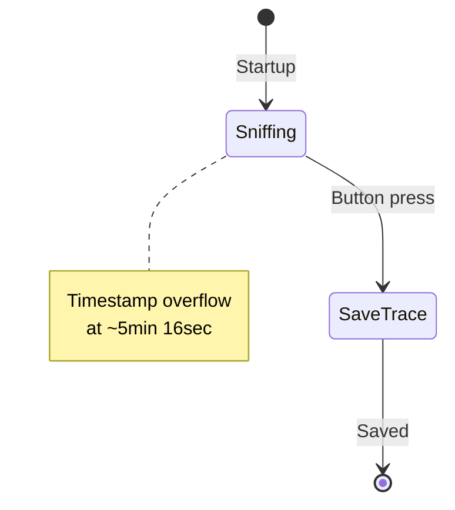

# HF_15SNIFF — ISO15693 Sniffer

> **Author:** Nathan Glaser
> **Frequency:** HF (13.56 MHz)
> **Hardware:** RDV4 (flash recommended)

[Back to Standalone Modes Index](../../armsrc/Standalone/readme.md#individual-mode-documentation) | [Source Code](../../armsrc/Standalone/hf_15sniff.c) | [Development Guide](../../armsrc/Standalone/readme.md#developing-standalone-modes)

---

## What

Passively sniffs ISO15693 communication between reader and tag, storing captured frames to flash.

## Why

Capture and analyze the communication protocol between ISO15693 readers and tags for reverse engineering or security assessment.

## How

Captures bidirectional 15693 frames with timestamps. Note: timestamp counter overflows after approximately 5 minutes 16 seconds of continuous sniffing.

## LED Indicators

| LED | Meaning |
|-----|---------|
| **1** (A) | Sniffing active |
| **2** (B) | Tag command |
| **3** (C) | Reader command |
| **4** (D) | Flash sync |

## Button Controls

| Action | Effect |
|--------|--------|
| **Short press** | Stop and save trace to flash |

## State Machine



## Compilation

```
make clean
make STANDALONE=HF_15SNIFF -j
./pm3-flash-fullimage
```

## Related

- [14A Sniffer](hf_14asniff.md) — ISO14443A sniffer
- [14B Sniffer](hf_14bsniff.md) — ISO14443B sniffer
- [Universal Sniffer](hf_unisniff.md) — Multi-protocol sniffer
- [15693 Simulator](hf_15sim.md) — ISO15693 dump and simulate
