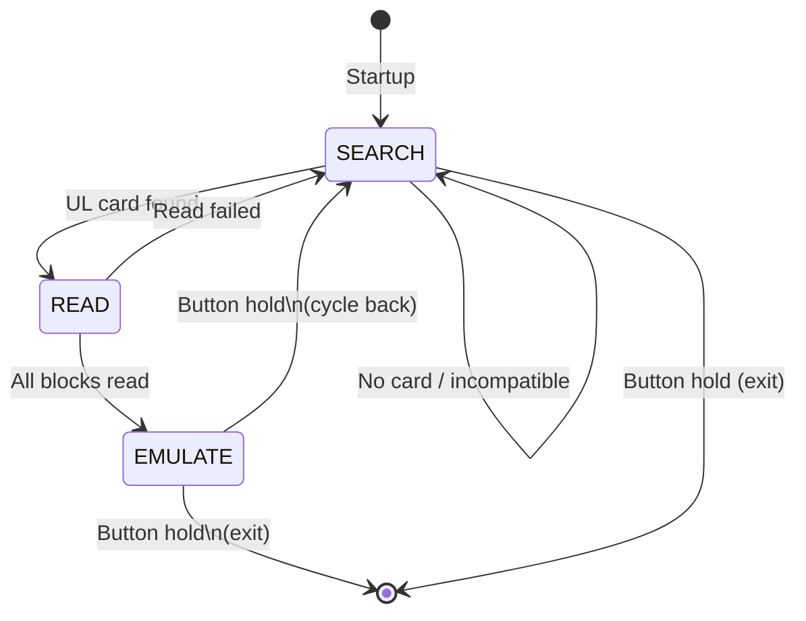

# HF_AVEFUL — MIFARE Ultralight Read/Simulation

> **Author:** Ave Ozkal
> **Frequency:** HF (13.56 MHz)
> **Hardware:** Generic Proxmark3

[Back to Standalone Modes Index](../../armsrc/Standalone/readme.md#individual-mode-documentation) | [Source Code](../../armsrc/Standalone/hf_aveful.c) | [Development Guide](../../armsrc/Standalone/readme.md#developing-standalone-modes)

---

## What

Reads MIFARE Ultralight family cards (UL, ULEV1, UL Nano, My-d Move) and then emulates the captured card. Auto-detects the card type and block count.

## Why

MIFARE Ultralight is widely used in transit systems, event tickets, and small-value tokens. This mode enables standalone read-and-replay for:

- **Transit fare evasion testing**: Capture a valid ticket and present it at a gate
- **Ticket cloning assessment**: Demonstrate that UL tickets can be replayed
- **NFC application testing**: Verify that applications properly validate UL tags

## How

1. **SEARCH**: Scans for MIFARE Ultralight cards using anticollision
2. **READ**: Upon finding a card, detects its type via the VERSION command and reads all accessible blocks
3. **EMULATE**: Loads the captured data into the emulator and broadcasts it as a MIFARE Ultralight tag

Supports auto-detection of: MIFARE Ultralight, Ultralight EV1, Ultralight Nano, and My-d Move.

## LED Indicators

| LED | Meaning |
|-----|---------|
| **D** (off during idle) | Blinks during tag search |
| LED patterns | Success/failure indication |

## Button Controls

| Action | Effect |
|--------|--------|
| **Hold 1000ms** | Cycle states or exit: SEARCH → READ → EMULATE → exit |
| **USB command** | Exit standalone mode |

## State Machine



## Supported Cards

| Card Type | Detection |
|-----------|-----------|
| MIFARE Ultralight | VERSION command response |
| MIFARE Ultralight EV1 | VERSION command response |
| MIFARE Ultralight Nano | VERSION command response |
| My-d Move | VERSION command response |

## Compilation

```
make clean
make STANDALONE=HF_AVEFUL -j
./pm3-flash-fullimage
```

## Related

- [UL-C/UL-AES Unlocker](hf_doegox_auth0.md) — Unlock password-protected UL cards
- [BogitoRun Auth Sniffer](hf_bog.md) — Capture UL authentication passwords
- [CraftByte UID Stealer](hf_craftbyte.md) — Generic 14A UID emulator
