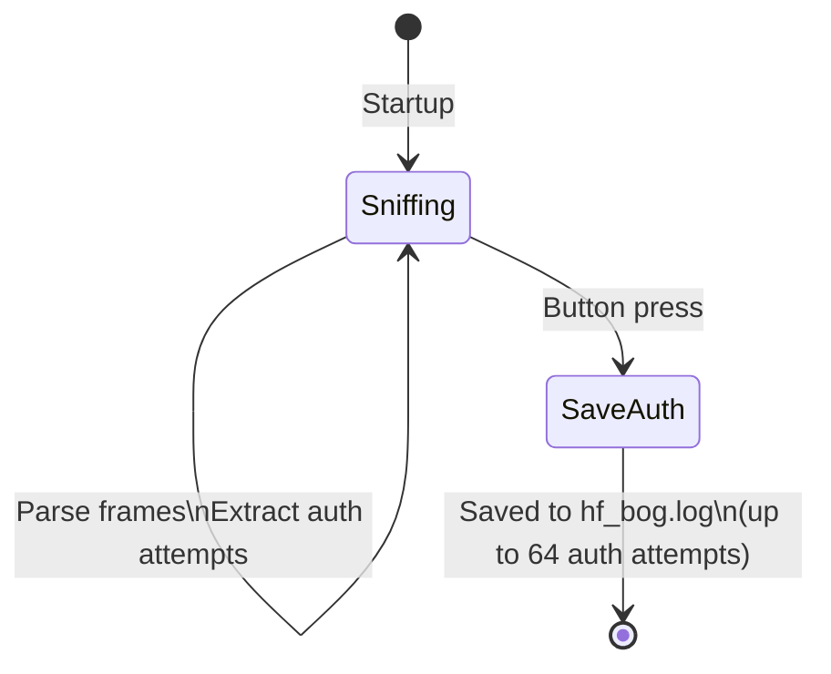

# HF_BOG — 14A Sniffer with ULC/ULEV1/NTAG Auth Capture

> **Author:** Bogito
> **Frequency:** HF (13.56 MHz)
> **Hardware:** RDV4 (requires flash memory)

[Back to Standalone Modes Index](../../armsrc/Standalone/readme.md#individual-mode-documentation) | [Source Code](../../armsrc/Standalone/hf_bog.c) | [Development Guide](../../armsrc/Standalone/readme.md#developing-standalone-modes)

---

## What

An enhanced ISO14443A sniffer that specifically extracts and stores ULC, ULEV1, and NTAG authentication passwords from sniffed traffic.

## Why

Many MIFARE Ultralight deployments use password authentication (PWD_AUTH) to protect data. By sniffing the communication between a legitimate reader and card, you capture the authentication passwords in plaintext. This is more targeted than generic sniffing — it automatically extracts and logs just the passwords.

## How

1. Passively sniffs ISO14443A traffic
2. Parses captured frames looking for authentication commands (PWD_AUTH, 3DES AUTH for ULC)
3. Extracts up to 64 authentication attempts per session
4. Saves extracted passwords to `hf_bog.log` on flash

## LED Indicators

| LED | Meaning |
|-----|---------|
| **A** (solid) | Sniffing activity |

## Button Controls

| Action | Effect |
|--------|--------|
| **Short press** | Stop sniffing, save auth data to flash |

## State Machine



## Flash Storage

- **Log file**: `hf_bog.log`
- Stores extracted authentication passwords/keys
- Up to 64 auth attempts per session

## Compilation

```
make clean
make STANDALONE=HF_BOG -j
./pm3-flash-fullimage
```

## Related

- [14A Sniffer](hf_14asniff.md) — Generic 14A sniffer (captures all frames)
- [Aveful UL Reader](hf_aveful.md) — Read and emulate UL cards
- [UL-C/UL-AES Unlocker](hf_doegox_auth0.md) — Unlock password-protected UL cards
