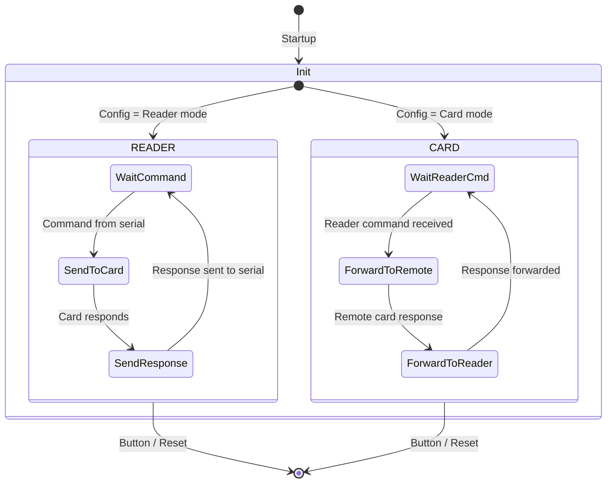

# HF_CARDHOPPER — Long-Range 14A Relay over IP

> **Author:** Sam Haskins
> **Frequency:** HF (13.56 MHz)
> **Hardware:** RDV4 with Bluetooth (BlueShark) or serial add-on

[Back to Standalone Modes Index](../../armsrc/Standalone/readme.md#individual-mode-documentation) | [Source Code](../../armsrc/Standalone/hf_cardhopper.c) | [Development Guide](../../armsrc/Standalone/readme.md#developing-standalone-modes)

---

## What

A relay attack framework that tunnels ISO14443A communication over a serial/IP backbone. One Proxmark3 sits near the target reader (CARD mode), another near the victim's card (READER mode), and the relayed data bridges any distance.

## Why

Relay attacks demonstrate that proximity-based access control can be defeated remotely. Even "tap to pay" and "tap to enter" systems are vulnerable when the communication can be tunneled over the internet. CardHopper demonstrates this in a practical, standalone way without requiring a laptop at either end.

Use cases:
- **Relay attacks on NFC payments**: Demonstrate contactless payment relay risks
- **Access control relay**: Bypass door readers by relaying a badge from another location
- **Security awareness**: Show stakeholders that NFC proximity offers limited protection

## How

1. **CARD mode** (at reader): Emulates an ISO14443A card and forwards all reader commands over serial/BT
2. **READER mode** (at card): Receives forwarded commands, sends them to the real card, and returns responses
3. The two devices communicate via serial/Bluetooth/IP, transparently relaying the full ISO14443A session

## LED Indicators

| LED | Meaning |
|-----|---------|
| **A + D** (solid) | Alive / running indicator |

## Button Controls

| Action | Effect |
|--------|--------|
| **Button press** | Exit mode |
| **USB command** | Exit standalone mode |

## State Machine



## Setup

Requires two Proxmark3 RDV4 devices:
1. **Near reader**: Running in CARD mode with BT/serial connection
2. **Near card**: Running in READER mode with BT/serial connection
3. Both connected via serial link (direct, Bluetooth, or TCP/IP bridge)

## Compilation

```
make clean
make STANDALONE=HF_CARDHOPPER -j
./pm3-flash-fullimage
```

Requires `PLATFORM_EXTRAS=BTADDON` or FPC serial connection.

## Related

- [Reblay BT Relay](hf_reblay.md) — Similar 14A relay over Bluetooth
- [14A Sniffer](hf_14asniff.md) — Passive capture instead of active relay
