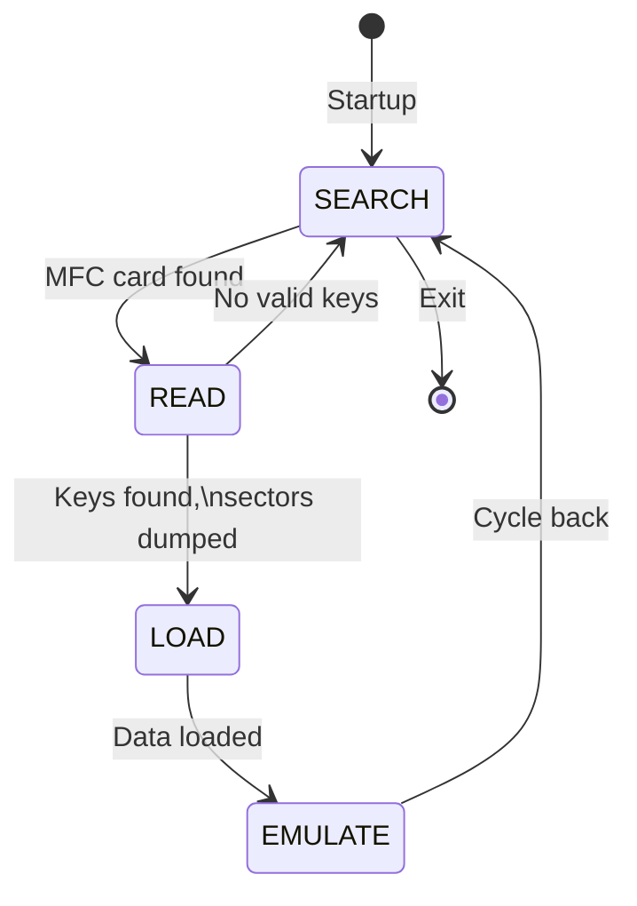

# HF_COLIN — VIGIKPWN MIFARE Classic Ultra-Fast Sniff/Sim/Clone

> **Author:** Colin Brigato
> **Frequency:** HF (13.56 MHz)
> **Hardware:** RDV4 (requires flash memory)

[Back to Standalone Modes Index](../../armsrc/Standalone/readme.md#individual-mode-documentation) | [Source Code](../../armsrc/Standalone/hf_colin.c) | [Development Guide](../../armsrc/Standalone/readme.md#developing-standalone-modes)

---

## What

A specialized MIFARE Classic attack mode designed for French VIGIK access control systems. It performs fast authentication attempts using ~37 hardcoded VIGIK keys, dumps the card, and can simulate or clone it.

## Why

VIGIK is a widely deployed intercom/access control system in French apartment buildings. It uses MIFARE Classic with a known set of keys. This mode automates the entire VIGIK attack chain — from key discovery to cloning — entirely on-device.

## How

1. **SEARCH**: Scans for MIFARE Classic cards
2. **READ**: Attempts authentication with hardcoded VIGIK keys, reads accessible sectors
3. **LOAD**: Loads captured data for simulation via JSON schema
4. **EMULATE**: Simulates the captured card

The mode uses a terminal-style UI with cursor positioning for status display.

## LED Indicators

| LED | Meaning |
|-----|---------|
| Complex terminal UI | Uses debug output for status rather than traditional LED patterns |

## Button Controls

| Action | Effect |
|--------|--------|
| Various presses | Trigger different functions in the UI |

## State Machine



## Compilation

```
make clean
make STANDALONE=HF_COLIN -j
./pm3-flash-fullimage
```

## Related

- [MattyRun MFC Clone](hf_mattyrun.md) — Generic MIFARE Classic attack
- [MFC Simulator](hf_mfcsim.md) — MFC simulation from flash
- [Young MFC Sniff/Sim](hf_young.md) — MFC sniff and simulation
- [MIFARE Classic Notes](../mfc_notes.md) — Key recovery techniques
- [Magic Cards Notes](../magic_cards_notes.md) — Writable magic card types
