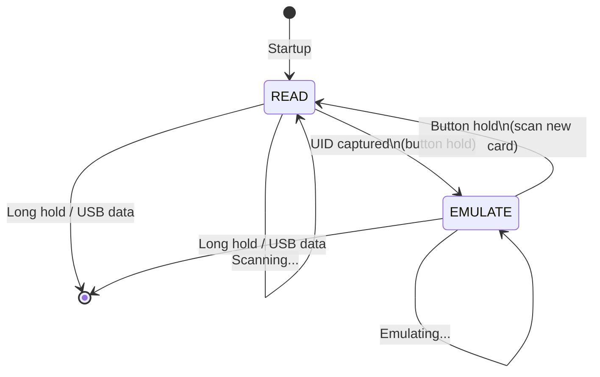

# HF_CRAFTBYTE — ISO14443A UID Stealer/Emulator

> **Author:** Anze Jensterle
> **Frequency:** HF (13.56 MHz)
> **Hardware:** Generic Proxmark3

[Back to Standalone Modes Index](../../armsrc/Standalone/readme.md#individual-mode-documentation) | [Source Code](../../armsrc/Standalone/hf_craftbyte.c) | [Development Guide](../../armsrc/Standalone/readme.md#developing-standalone-modes)

---

## What

Continuously scans for ISO14443A cards, captures their UIDs, and emulates them. Auto-detects card type (MFC 1K/4K, MIFARE Ultralight, DESFire).

## Why

Many access control systems rely primarily (or solely) on the UID of an NFC card for identification, without performing proper cryptographic authentication. CraftByte exploits this by capturing and replaying UIDs — demonstrating that UID-based access control is trivially defeated.

## How

1. **READ**: Performs ISO14443A anticollision to read the card's UID, ATQA, and SAK
2. **EMULATE**: Uses the captured UID to emulate the card at a reader

The mode detects the card type from ATQA/SAK and configures emulation accordingly.

## LED Indicators

| LED | Meaning |
|-----|---------|
| Minimal LED usage | Focus on read/emulate cycle |

## Button Controls

| Action | Effect |
|--------|--------|
| **Hold 1000ms** | Cycle: READ → EMULATE, or exit if held continuously |
| **USB command** | Exit standalone mode |

## State Machine



## Compilation

```
make clean
make STANDALONE=HF_CRAFTBYTE -j
./pm3-flash-fullimage
```

## Related

- [Aveful UL Reader](hf_aveful.md) — Full UL read/emulate (not just UID)
- [MattyRun MFC Clone](hf_mattyrun.md) — Full MFC attack (keys + data)
- [Young MFC Sniff/Sim](hf_young.md) — MFC UID capture with 2-bank storage
