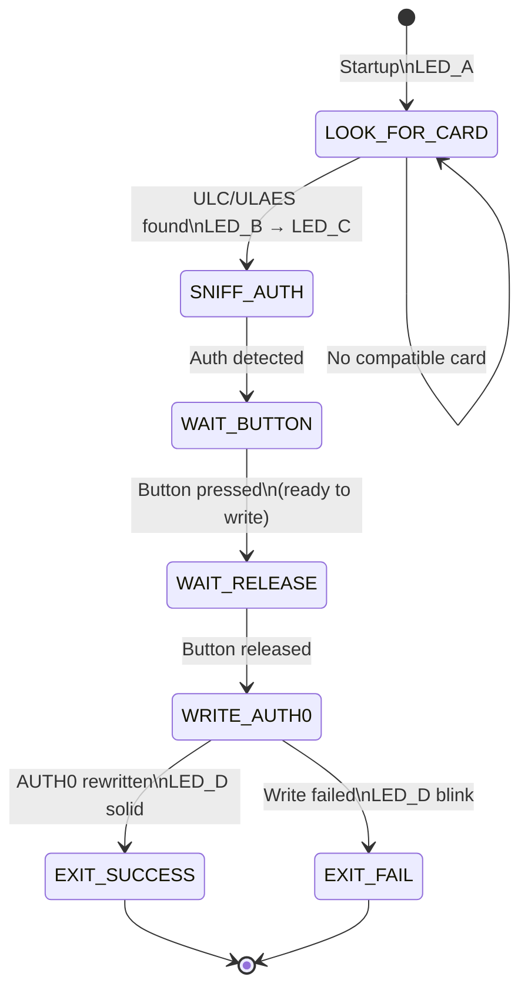

# HF_DOEGOX_AUTH0 — Ultralight C / Ultralight AES Unlocker

> **Author:** Philippe Teuwen (doegox)
> **Frequency:** HF (13.56 MHz)
> **Hardware:** Generic Proxmark3 (RDV4 with 9V antenna recommended)

[Back to Standalone Modes Index](../../armsrc/Standalone/readme.md#individual-mode-documentation) | [Source Code](../../armsrc/Standalone/hf_doegox_auth0.c) | [Development Guide](../../armsrc/Standalone/readme.md#developing-standalone-modes)

---

## What

Performs a relay-style attack to unlock password-protected MIFARE Ultralight C or Ultralight AES tags by rewriting the AUTH0 configuration byte during an authenticated session.

## Why

MIFARE Ultralight C and AES variants can password-protect their memory by setting an AUTH0 byte that specifies the first page requiring authentication. If AUTH0 itself is writable during an authenticated session, this mode exploits that window — during a legitimate reader's auth handshake — to rewrite AUTH0 to a higher page number, effectively unlocking all previously protected pages.

This is a sophisticated attack that requires precise timing and makes protected data permanently accessible.

## How

1. **LOOK**: Search for an Ultralight C or AES tag
2. **SNIFF**: Position the Proxmark3 to sniff the authentication exchange between the legitimate reader and the card
3. **WAIT**: Press button when ready to attempt the AUTH0 rewrite
4. **WRITE**: During the next auth session, inject a write command to AUTH0 that unlocks the card
5. **Result**: LED indicates success (solid) or failure (blink)

## LED Indicators

| LED | Meaning |
|-----|---------|
| **A** (solid) | Looking for card / preparing |
| **B** (solid) | Card found |
| **C** (solid) | Sniffing for auth exchange |
| **D** (solid) | Write successful |
| **D** (blinking) | Write failed |

## Button Controls

| Action | Effect |
|--------|--------|
| **Press (1 sec)** | Initiate AUTH0 write during next auth sniff |
| **Button press** | Exit mode (from other states) |

## State Machine



## Compilation

```
make clean
make STANDALONE=HF_DOEGOX_AUTH0 -j
./pm3-flash-fullimage
```

## Related

- [BogitoRun Auth Sniffer](hf_bog.md) — Capture UL auth passwords
- [Aveful UL Reader](hf_aveful.md) — Read/emulate UL cards
