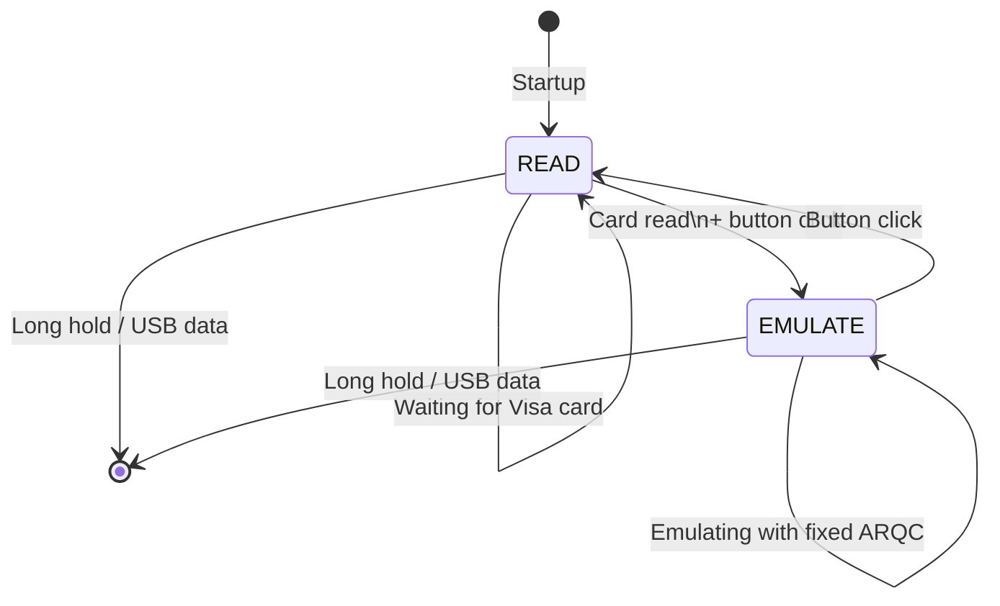

# HF_EMVPNG — EMV Visa Card Reader/Emulator

> **Author:** Davi Mikael (Penegui)
> **Frequency:** HF (13.56 MHz)
> **Hardware:** RDV4 (flash memory)

[Back to Standalone Modes Index](../../armsrc/Standalone/readme.md#individual-mode-documentation) | [Source Code](../../armsrc/Standalone/hf_emvpng.c) | [Development Guide](../../armsrc/Standalone/readme.md#developing-standalone-modes)

---

## What

Reads Visa EMV contactless payment cards and emulates the captured transaction data with a fixed ARQC (Authorization Request Cryptogram). **For educational and lab use only.**

## Why

Demonstrates the theoretical vulnerability of contactless payment cards to replay attacks when terminals don't properly validate cryptograms. This mode is designed for controlled lab environments to:

- **Educate**: Show how EMV contactless transactions work at the protocol level
- **Research**: Study EMV protocol behavior and terminal validation
- **Test terminals**: Verify that terminals properly reject replayed transactions

> ⚠ **Warning**: This mode uses a fixed ARQC. Modern payment terminals will reject these transactions. This is for educational purposes only.

## How

1. **READ**: Select the Visa application (PPSE/AID), read Track 2 data
2. **EMULATE**: Present captured Track 2 data with a fixed ARQC when queried by a terminal

## LED Indicators

| LED | Meaning |
|-----|---------|
| **A** (solid) | Reading mode |
| **B** (solid) | Activity indicator |
| **C** (solid) | Emulation mode |

## Button Controls

| Action | Effect |
|--------|--------|
| **Single click** | Toggle between READ and EMULATE modes |
| **Long hold** | Exit standalone mode |

## State Machine



## Compilation

```
make clean
make STANDALONE=HF_EMVPNG -j
./pm3-flash-fullimage
```

## Related

- [MSD Visa Reader](hf_msdsal.md) — Visa MSD (older format) reader/emulator
- [EMV Notes](../emv_notes.md) — EMV protocol documentation
