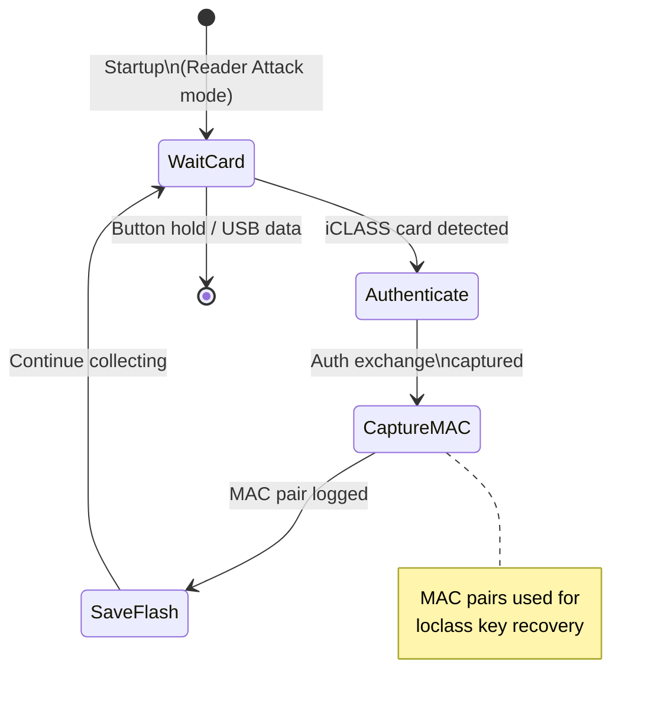
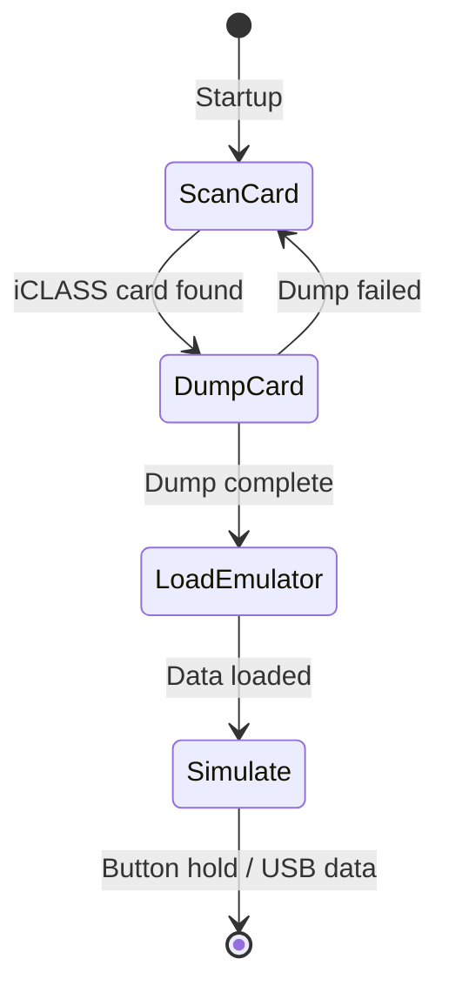

# HF_ICECLASS — iCLASS Multi-Mode Standalone

> **Author:** Iceman
> **Frequency:** HF (13.56 MHz)
> **Hardware:** RDV4 (requires flash memory)

[Back to Standalone Modes Index](../../armsrc/Standalone/readme.md#individual-mode-documentation) | [Source Code](../../armsrc/Standalone/hf_iceclass.c) | [Development Guide](../../armsrc/Standalone/readme.md#developing-standalone-modes)

---

## What

A multi-mode iCLASS standalone with **7 selectable modes** for different operations: full simulation, reader attack, dump-and-simulate, read-and-simulate, and configuration card creation. Only one mode is active per compile.

## Why

HID iCLASS is a widely deployed access control system. This mode provides a comprehensive toolkit for iCLASS assessment:

- **Credential recovery**: Capture authentication data for offline key recovery (loclass attack)
- **Badge simulation**: Emulate captured iCLASS credentials at readers
- **Reader configuration**: Create config cards that can reconfigure iCLASS readers (e.g., downgrade attacks)

## How

The mode selected at compile time (`ICE_USE` macro) determines behavior:

| ICE_USE Value | Mode | Description |
|---------------|------|-------------|
| ICE_USE_FULLSIM | Full Simulation | Emulate a complete iCLASS card from EEPROM dump |
| ICE_USE_READER_ATTACK | Reader Attack | Capture authentication MACs for loclass recovery |
| ICE_USE_DUMP_SIM | Dump & Simulate | Dump a card then immediately simulate it |
| ICE_USE_READ_SIM | Read & Simulate | Read credential blocks and simulate |
| ICE_USE_CONFIG_CARD | Config Card | Create configuration cards for reader reprogramming |

The reader attack mode is particularly powerful: it captures the authentication exchange between a reader and cards, producing MAC pairs that feed into the loclass attack for key recovery.

## LED Indicators

| LED | Meaning |
|-----|---------|
| **B** (solid/blink) | Attack mode activity |
| **D** (solid) | General operation indicator |
| Mode-specific patterns | Vary by selected ICE_USE mode |

## Button Controls

Vary by selected mode. Generally:

| Action | Effect |
|--------|--------|
| **Button press** | Mode-specific action |
| **Hold** | Exit standalone mode |

## State Machine (Reader Attack Mode)



## State Machine (Dump & Simulate Mode)



## Flash Storage

- Captured MAC pairs stored on SPI flash for later retrieval
- EEPROM dumps stored for simulation modes
- Configuration card templates

## Compilation

```
make clean
make STANDALONE=HF_ICECLASS -j
./pm3-flash-fullimage
```

## Related

- [Loclass Notes](../loclass_notes.md) — Loclass attack documentation
- [HID Downgrade Attacks](../hid_downgrade.md) — Reader downgrade techniques
- [IceHID Collector](lf_icehid.md) — LF HID credential collection (different protocol)
