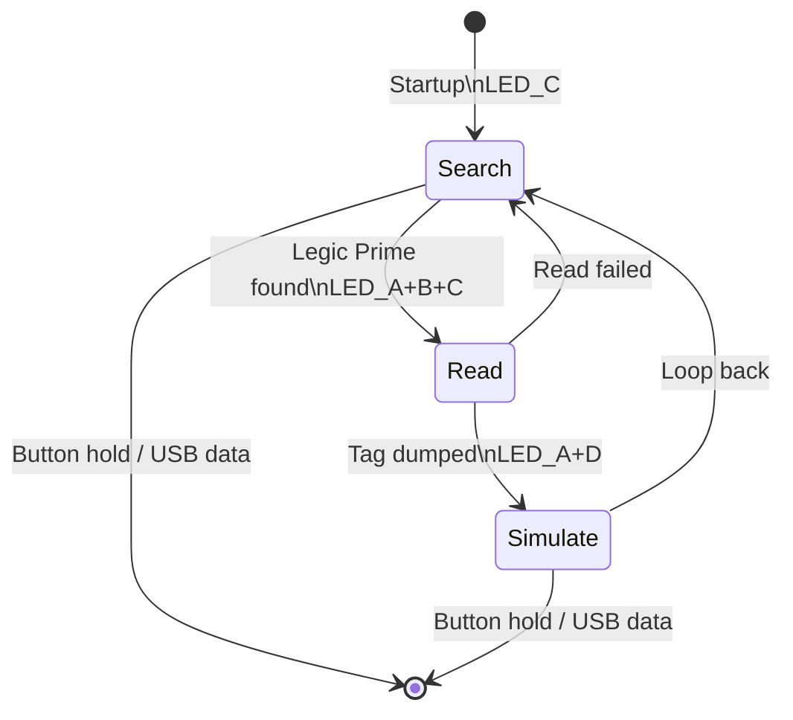

# HF_LEGIC — Legic Prime Read/Simulate

> **Author:** uhei
> **Frequency:** HF (13.56 MHz)
> **Hardware:** Generic Proxmark3

[Back to Standalone Modes Index](../../armsrc/Standalone/readme.md#individual-mode-documentation) | [Source Code](../../armsrc/Standalone/hf_legic.c) | [Development Guide](../../armsrc/Standalone/readme.md#developing-standalone-modes)

---

## What

Reads Legic Prime tags and simulates them. Auto-detects card type (MIM256, MIM512, MIM1024).

## Why

Legic Prime is a proprietary HF contactless technology used in European access control, time & attendance, and vending systems. This mode provides standalone read-and-replay capability.

## How

1. **Search**: Continuously scans for Legic Prime tags
2. **Read**: On detection, dumps the tag memory (auto-detects size)
3. **Simulate**: Broadcasts the captured tag data

## LED Indicators

| LED | Meaning |
|-----|---------|
| **C** (solid) | Searching for tag |
| **A + B + C** (solid) | Reading tag |
| **A + D** (solid) | Simulating tag |

## Button Controls

| Action | Effect |
|--------|--------|
| **Hold 280ms** | Exit standalone mode |
| **USB command** | Exit standalone mode |

## State Machine



## Compilation

```
make clean
make STANDALONE=HF_LEGIC -j
./pm3-flash-fullimage
```

## Related

- [Legic Prime Simulator](hf_legicsim.md) — Multi-slot Legic simulation from flash
