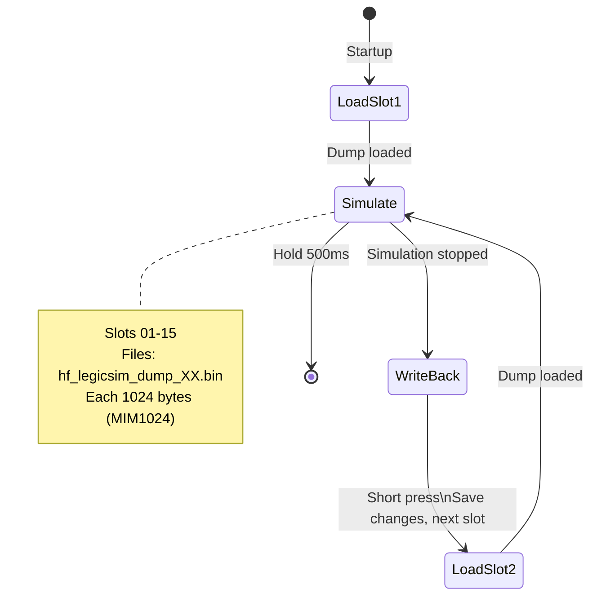

# HF_LEGICSIM — Legic Prime Multi-Slot Simulator

> **Author:** uhei
> **Frequency:** HF (13.56 MHz)
> **Hardware:** RDV4 (requires flash memory)

[Back to Standalone Modes Index](../../armsrc/Standalone/readme.md#individual-mode-documentation) | [Source Code](../../armsrc/Standalone/hf_legicsim.c) | [Development Guide](../../armsrc/Standalone/readme.md#developing-standalone-modes)

---

## What

Simulates Legic Prime MIM1024 dumps stored on flash memory. Supports up to **15 dump slots** that can be cycled through. Changes made by readers during simulation are written back to the dump.

## Why

When you need to emulate multiple Legic Prime cards on-site — for example, testing which credentials grant access to different areas. The 15-slot capacity and flash persistence means dumps survive power cycles.

## How

1. On startup, loads the first dump from flash (`hf_legicsim_dump_01.bin`)
2. Simulates the loaded dump as a Legic Prime MIM1024 tag
3. Short press cycles to the next slot
4. After simulation, any changes written by readers are saved back to the dump file

## LED Indicators

| LED | Meaning |
|-----|---------|
| LEDs (1–15) | Current slot number indication |

## Button Controls

| Action | Effect |
|--------|--------|
| **Short press** | Next dump slot |
| **Hold 500ms** | Exit standalone mode |

## State Machine



## Flash Files

Upload dumps before use:
```
mem spiffs load -s hf_legicsim_dump_01.bin -d hf_legicsim_dump_01.bin
mem spiffs load -s hf_legicsim_dump_02.bin -d hf_legicsim_dump_02.bin
...
```

Each file is 1024 bytes (Legic Prime MIM1024 dump).

## Compilation

```
make clean
make STANDALONE=HF_LEGICSIM -j
./pm3-flash-fullimage
```

## Related

- [Legic Prime Reader](hf_legic.md) — Read and simulate Legic tags (single shot)
