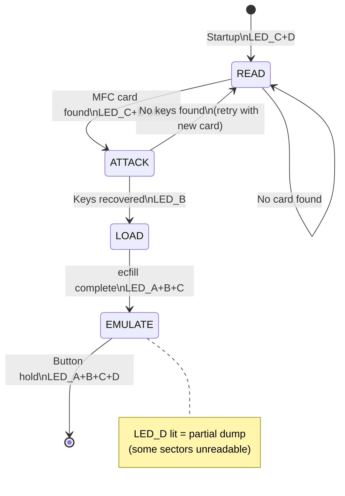

# HF_MATTYRUN — MIFARE Classic Key Check/Dump/Emulate

> **Author:** Matías A. Ré Medina
> **Frequency:** HF (13.56 MHz)
> **Hardware:** Generic Proxmark3

[Back to Standalone Modes Index](../../armsrc/Standalone/readme.md#individual-mode-documentation) | [Source Code](../../armsrc/Standalone/hf_mattyrun.c) | [Development Guide](../../armsrc/Standalone/readme.md#developing-standalone-modes)

---

## What

A full MIFARE Classic attack chain: discovers MFC cards, checks keys from a built-in dictionary, dumps the card using ecfill, then emulates it. Supports MIFARE Classic 1K and 4K.

## Why

MIFARE Classic is the most widely deployed contactless smart card worldwide — used in transit, access control, and loyalty systems. MattyRun automates the complete attack pipeline on-device:

1. Find the card
2. Recover the keys (from dictionary)
3. Dump all data
4. Emulate the full card at a reader

No laptop required at any step.

## How

1. **READ**: Scans for MIFARE Classic cards (anticollision, ATQA/SAK check)
2. **ATTACK**: Checks keys from the built-in dictionary against all sectors. Uses nested authentication attack if partial keys are found
3. **LOAD**: Performs ecfill to dump the card data into the emulator memory
4. **EMULATE**: Simulates the complete MIFARE Classic card including all sector keys and data

LED D lit during emulation indicates a partial dump (some sectors couldn't be read).

## LED Indicators

| LED | Meaning |
|-----|---------|
| **C + D** (solid) | Idle / searching for card |
| **C + D** (blinking) | Authenticating / checking keys |
| **B** (solid) | Attack mode (nested) |
| **A + B + C** (solid) | Loading data to emulator |
| **A + B + C + D** (solid) | Emulating (D = partial dump warning) |

## Button Controls

| Action | Effect |
|--------|--------|
| **Hold 280ms** | Exit standalone mode |
| **Short press** | No effect (purely state-machine driven) |

## State Machine



## Compilation

```
make clean
make STANDALONE=HF_MATTYRUN -j
./pm3-flash-fullimage
```

## Related

- [VIGIKPWN](hf_colin.md) — MIFARE Classic with VIGIK-specific keys
- [MFC Simulator](hf_mfcsim.md) — Simulate MFC from flash dumps
- [Young MFC Sniff/Sim](hf_young.md) — UID-based MFC sniff and sim
- [MIFARE Classic Notes](../mfc_notes.md) — Key recovery and attack techniques
- [Magic Cards Notes](../magic_cards_notes.md) — Writing to magic/CUID cards
