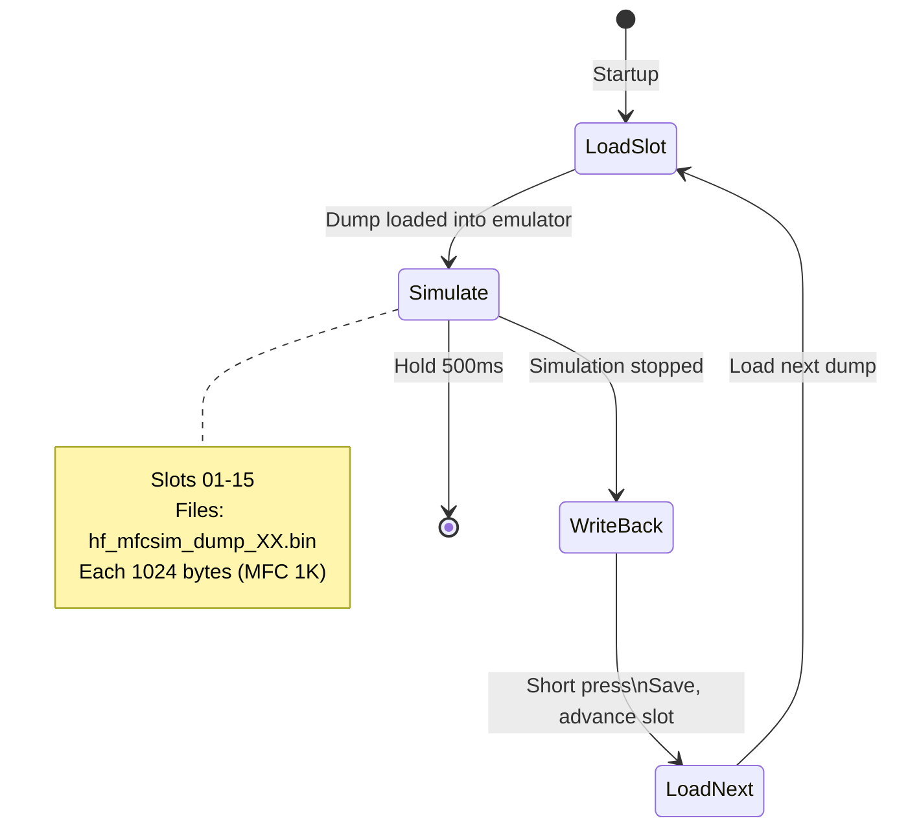

# HF_MFCSIM — MIFARE Classic 1K Multi-Slot Simulator

> **Author:** Ray Lee
> **Frequency:** HF (13.56 MHz)
> **Hardware:** RDV4 (requires flash memory)

[Back to Standalone Modes Index](../../armsrc/Standalone/readme.md#individual-mode-documentation) | [Source Code](../../armsrc/Standalone/hf_mfcsim.c) | [Development Guide](../../armsrc/Standalone/readme.md#developing-standalone-modes)

---

## What

Simulates MIFARE Classic 1K cards from dump files stored on flash. Supports up to **15 dump slots**. Changes written by readers during simulation are saved back to the dump file.

## Why

When you have multiple MIFARE Classic card dumps (from `hf mf dump` or other tools) and need to emulate them on-site without a laptop. The 15-slot capacity covers multiple credentials, and the write-back feature preserves any reader-induced changes.

## How

1. Loads dump number 1 from flash (`hf_mfcsim_dump_01.bin`)
2. Configures the emulator with full card data including all sector keys
3. Begins simulation
4. Cycle through slots for different cards
5. Any writes from readers are saved back to the dump file

## LED Indicators

| LED | Meaning |
|-----|---------|
| LEDs | Indicate current dump slot number (1–15) |

## Button Controls

| Action | Effect |
|--------|--------|
| **Short press** | Next dump slot |
| **Hold 500ms** | Exit standalone mode |

## State Machine



## Flash Files

Upload dumps before use:
```
mem spiffs load -s hf_mfcsim_dump_01.bin -d hf_mfcsim_dump_01.bin
mem spiffs load -s hf_mfcsim_dump_02.bin -d hf_mfcsim_dump_02.bin
...
```

Each file is 1024 bytes (MIFARE Classic 1K dump including sector keys).

## Compilation

```
make clean
make STANDALONE=HF_MFCSIM -j
./pm3-flash-fullimage
```

## Related

- [MattyRun MFC Clone](hf_mattyrun.md) — Full MFC attack chain (discover → dump → emulate)
- [VIGIKPWN](hf_colin.md) — VIGIK-specific MFC attacks
- [MIFARE Classic Notes](../mfc_notes.md) — Key recovery techniques
