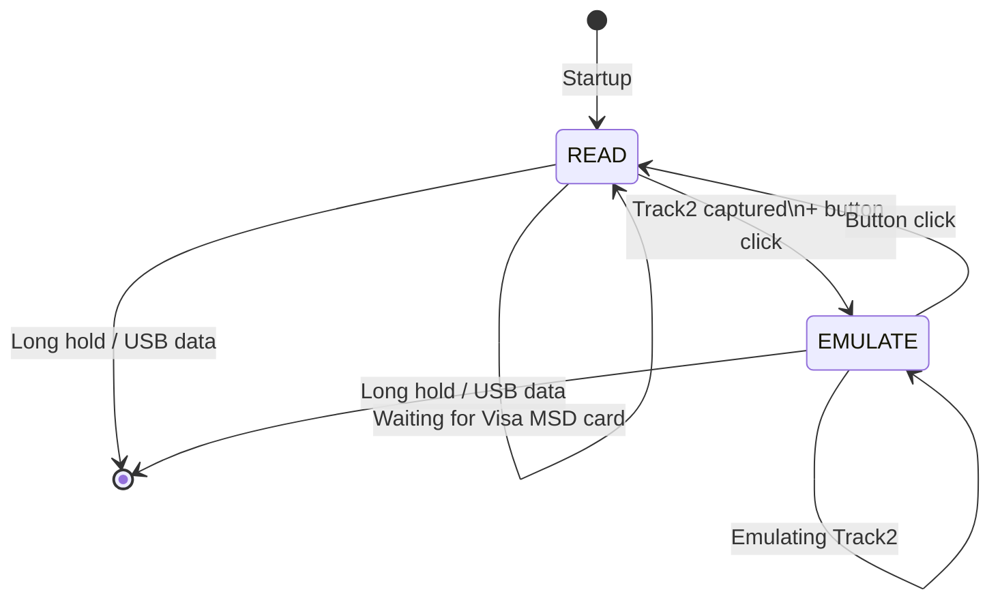

# HF_MSDSAL — Visa MSD Card Reader/Emulator

> **Author:** Salvador Mendoza
> **Frequency:** HF (13.56 MHz)
> **Hardware:** Generic Proxmark3

[Back to Standalone Modes Index](../../armsrc/Standalone/readme.md#individual-mode-documentation) | [Source Code](../../armsrc/Standalone/hf_msdsal.c) | [Development Guide](../../armsrc/Standalone/readme.md#developing-standalone-modes)

---

## What

Reads Visa MSD (Magnetic Stripe Data) cards and emulates the captured Track 2 equivalent data. MSD is an older EMV contactless mode that mirrors magnetic stripe data over NFC.

## Why

Visa MSD mode transmits Track 2 data in a format similar to magnetic stripe cards. This mode demonstrates the risk of MSD mode by capturing and replaying the transaction data. MSD has largely been superseded by EMV contactless (qVSDC), but some terminals still support it as a fallback.

> ⚠ **Note**: MSD mode is deprecated in many markets. Modern terminals may reject MSD transactions.

## How

1. **READ**: Selects PPSE → Visa AID → reads PDOL/SFI → extracts 19-byte Track 2 data
2. **EMULATE**: Presents the captured Track 2 data when queried by a terminal

## LED Indicators

| LED | Meaning |
|-----|---------|
| **A** (solid) | Reading mode |
| **B** (solid) | Activity indicator |
| **C** (solid) | Emulation mode (Track 2 loaded) |

## Button Controls

| Action | Effect |
|--------|--------|
| **Single click** | Toggle between READ and EMULATE |
| **Long hold** | Exit standalone mode |

## State Machine



## Compilation

```
make clean
make STANDALONE=HF_MSDSAL -j
./pm3-flash-fullimage
```

## Related

- [EMV Visa Reader/Emulator](hf_emvpng.md) — Modern EMV Visa reader/emulator
- [EMV Notes](../emv_notes.md) — EMV protocol documentation
