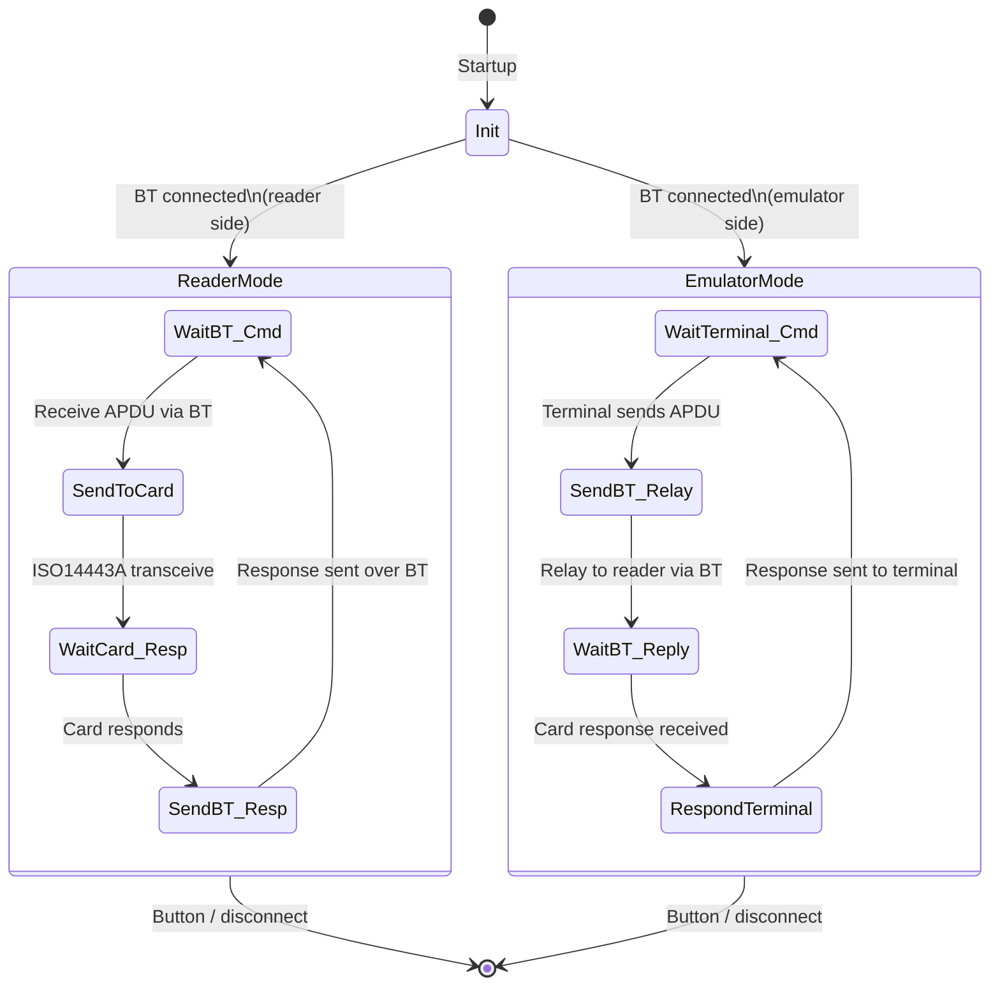

# HF_REBLAY — ISO 14443-A Relay over Bluetooth

> **Author:** Salvador Mendoza
> **Frequency:** HF (13.56 MHz)
> **Hardware:** RDV4 with Bluetooth module (required)

[Back to Standalone Modes Index](../../armsrc/Standalone/readme.md#individual-mode-documentation) | [Source Code](../../armsrc/Standalone/hf_reblay.c) | [Development Guide](../../armsrc/Standalone/readme.md#developing-standalone-modes)

---

## What

Relays ISO 14443-A NFC communications between a real card and a remote reader over Bluetooth. One Proxmark3 RDV4 acts as the reader (captures card responses), the other as the emulator (presents them to a terminal), with Bluetooth bridging the two.

## Why

Relay attacks demonstrate a fundamental weakness in proximity-based authentication: the assumption that the card is physically near the reader. By relaying messages in real-time, an attacker can use a card that is far away — for example, performing a contactless payment using a card in someone else's pocket. This mode is an educational tool for understanding relay attack mechanics.

> ⚠ **Security Research Only**: This tool demonstrates a known class of NFC vulnerability for research purposes.

## How

1. **Device A (Reader side)**: Placed near the victim's card. Receives APDU commands from Device B over BT, sends them to the card, relays responses back over BT.
2. **Device B (Emulator side)**: Placed near the target terminal. Receives terminal commands, forwards them to Device A over BT, plays back card responses to the terminal.
3. **Bluetooth Link**: USART-based BT serial bridge with a custom framing protocol (preamble `0xAA`, length, data, postamble `0xBB`).
4. **Timing**: Implements WTX (Waiting Time eXtension) and ACK management to keep the terminal patient during relay delay. This is important for terminals like SumUp that have tight timing requirements.

## LED Indicators

| LED | Meaning |
|-----|---------|
| **A** (solid) | Reader mode active (proximate to card) |
| **C** (solid) | Emulation mode active (proximate to terminal) |
| **A+C** (blink) | BT data exchange in progress |
| **B+D** (blink) | Error / timeout |

## Button Controls

| Action | Effect |
|--------|--------|
| **Button press** | Exit standalone mode |

## State Machine



## Prerequisites

- **Two** Proxmark3 RDV4 devices
- Both with Bluetooth modules connected and paired
- Flash each with `HF_REBLAY` standalone firmware
- One device near the card, one near the terminal

## Compilation

```
make clean
make STANDALONE=HF_REBLAY -j
./pm3-flash-fullimage
```

## Related

- [Card Hopper](hf_cardhopper.md) — Similar relay concept using BLE and phone-based bridge
