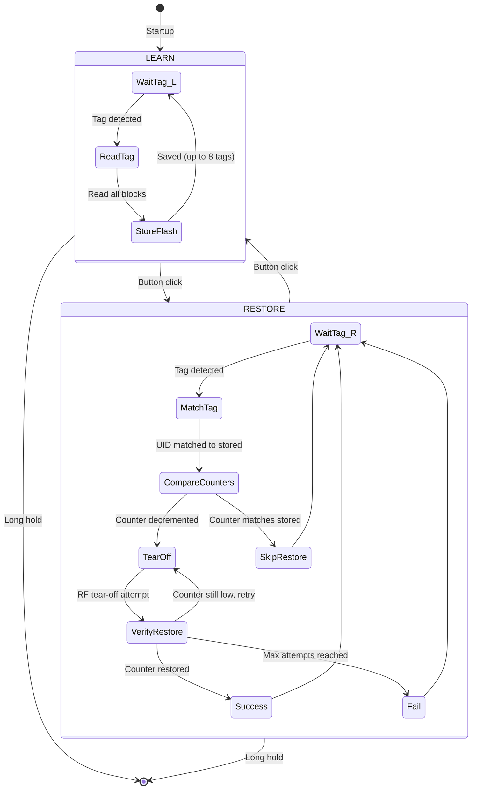

# HF_ST25_TEAROFF — ST25TB Tear-Off / Counter Restore

> **Author:** Doegox, Iceman
> **Frequency:** HF (13.56 MHz)
> **Hardware:** RDV4 with flash (required)

[Back to Standalone Modes Index](../../armsrc/Standalone/readme.md#individual-mode-documentation) | [Source Code](../../armsrc/Standalone/hf_st25_tearoff.c) | [Development Guide](../../armsrc/Standalone/readme.md#developing-standalone-modes)

---

## What

Store and restore ST25TB/SRx tags using a power tear-off technique on their decrementing counters (blocks 5 and 6). These counters normally can only count down, but a precisely timed tear-off can corrupt and reset them.

## Why

ST25TB and SRx NFC tags (used in transport tickets, access systems, etc.) contain one-way counters that decrement on each use. Normally these counters cannot be reset. The tear-off technique exploits the fact that if the RF field drops at the precise moment a counter write is completing, the write may fail or partially complete — potentially restoring a previous counter value. This enables research into counter-based anti-replay mechanisms.

## How

1. **LEARN mode**: Reads up to 8 ST25TB tags and stores their complete memory dump (including counter blocks 5 & 6) to Proxmark3 flash memory.
2. **RESTORE mode**: Reads a previously-learned tag, compares current counter values to stored values, and if the counters have decremented, attempts a tear-off write to restore the original counter values.
3. **Tear-off mechanism**: Rapidly toggles the RF field at the precise moment the counter write completes, attempting to corrupt the write. Retries with varied timing until the counter is restored or the maximum attempt count is reached.

## LED Indicators

| LED | Meaning |
|-----|---------|
| **D** (solid) | LEARN mode active |
| **C** (solid) | RESTORE mode active |
| **A** (solid) | Operation succeeded (counter restored) |
| **B** (solid) | Operation failed |
| **A+B+C+D** (blink) | Searching for tag |

## Button Controls

| Action | Effect |
|--------|--------|
| **Single click** | Toggle between LEARN and RESTORE mode |
| **Long hold** | Exit standalone mode |

## State Machine



## Stored Data

| Flash File | Contents |
|------------|----------|
| Tag dumps | Full block data for up to 8 ST25TB tags |

## Compilation

```
make clean
make STANDALONE=HF_ST25_TEAROFF -j
./pm3-flash-fullimage
```

## Related

- [ST25TA / IKEA Rothult](hf_tcprst.md) — Similar ST25 family, different attack
