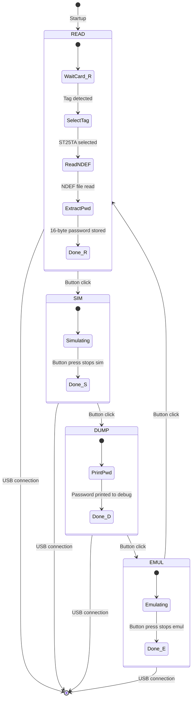

# HF_TCPRST — IKEA Rothult / ST25TA Password Extractor

> **Author:** Nick Draffen (tcprst)
> **Frequency:** HF (13.56 MHz)
> **Hardware:** Generic Proxmark3

[Back to Standalone Modes Index](../../armsrc/Standalone/readme.md#individual-mode-documentation) | [Source Code](../../armsrc/Standalone/hf_tcprst.c) | [Development Guide](../../armsrc/Standalone/readme.md#developing-standalone-modes)

---

## What

Reads, simulates, dumps, and emulates IKEA Rothult NFC lock tags (ST25TA series). Extracts the 16-byte password stored on the tag, which acts as the key to the lock.

## Why

The IKEA Rothult is a battery-operated NFC lock that uses ST25TA02K tags (ISO 14443A, Type 4 tag). The lock authenticates by reading a specific NDEF record from the tag. By extracting this 16-byte password, you can clone the tag or emulate it — useful for creating backup keys or for security research on the lock mechanism.

## How

1. **READ**: Selects the ST25TA tag via ISO 14443A anticollision, sends NDEF SELECT commands, reads the NDEF file containing the 16-byte password.
2. **SIM**: Simulates a tag with the previously read UID (basic UID-level simulation).
3. **DUMP**: Outputs the extracted password over USB debug (requires client connection).
4. **EMUL**: Full tag emulation — responds to reader commands with the captured NDEF data including password.

## LED Indicators

| LED | Meaning |
|-----|---------|
| **A** (solid) | READ mode |
| **B** (solid) | SIM mode (UID simulation) |
| **C** (solid) | DUMP mode |
| **D** (solid) | EMUL mode (full emulation) |
| **A-D** (sequential) | Cycling through active mode indicator |

## Button Controls

| Action | Effect |
|--------|--------|
| **Single click** | Advance to next mode (READ→SIM→DUMP→EMUL→READ) |
| **Long hold** | Execute current mode action |

## State Machine



## Compilation

```
make clean
make STANDALONE=HF_TCPRST -j
./pm3-flash-fullimage
```

## Related

- [ST25TB Tear-Off](hf_st25_tearoff.md) — Related ST25 family tag manipulation
- [MIFARE Classic Simulator](hf_mfcsim.md) — Another HF tag emulator
