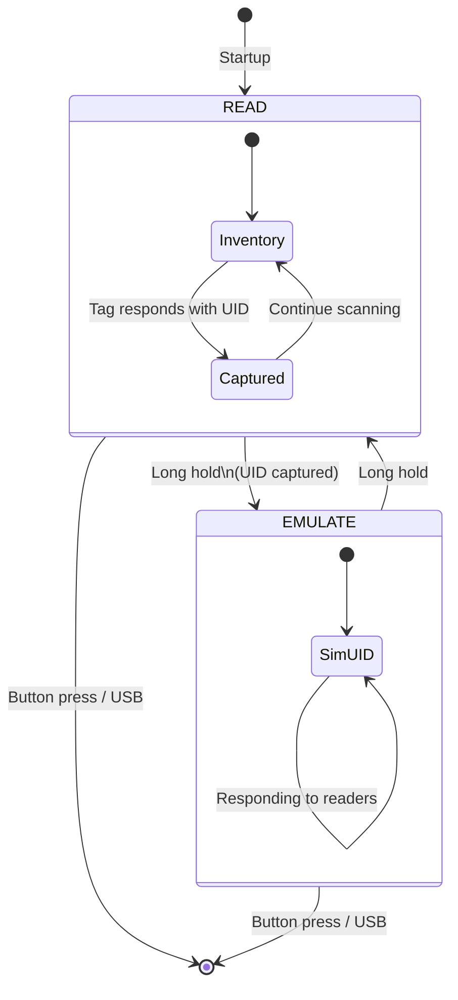

# HF_TMUDFORD — ISO 15693 UID Emulator

> **Author:** Tim Mudford
> **Frequency:** HF (13.56 MHz)
> **Hardware:** Generic Proxmark3

[Back to Standalone Modes Index](../../armsrc/Standalone/readme.md#individual-mode-documentation) | [Source Code](../../armsrc/Standalone/hf_tmudford.c) | [Development Guide](../../armsrc/Standalone/readme.md#developing-standalone-modes)

---

## What

Reads an ISO 15693 tag UID and emulates it. Simple two-state mode: read a tag, then replay its UID to 15693 readers.

## Why

ISO 15693 (iCODE, Tag-it, I-Code) tags are used in library systems, industrial automation, and access control. This mode provides a quick way to clone and emulate a 15693 tag's UID for testing readers and access systems that rely solely on UID-based identification.

## How

1. **READ**: Sends an ISO 15693 inventory request. When a tag responds, captures its 8-byte UID.
2. **EMULATE**: Emulates a 15693 tag with the captured UID, responding to inventory and select commands from a reader.

## LED Indicators

| LED | Meaning |
|-----|---------|
| **A+D** (solid) | READ mode — waiting for tag |
| **B+C** (solid) | EMULATE mode — replaying UID |
| **A-D** (sequential blink) | Transition / activity |

## Button Controls

| Action | Effect |
|--------|--------|
| **Long hold (≥1000ms)** | Switch between READ and EMULATE modes |
| **Button press** | Exit standalone mode (while idle) |

## State Machine



## Compilation

```
make clean
make STANDALONE=HF_TMUDFORD -j
./pm3-flash-fullimage
```

## Related

- [ISO 15693 Dump & Simulate](hf_15sim.md) — Full 15693 memory dump and emulation
- [ISO 15693 Sniffer](hf_15sniff.md) — Passive 15693 sniffing
