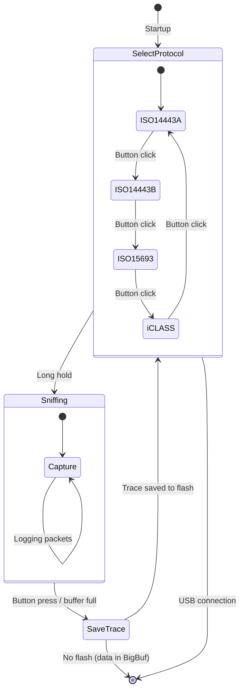

# HF_UNISNIFF — Multi-Protocol HF Sniffer

> **Author:** Equip
> **Frequency:** HF (13.56 MHz)
> **Hardware:** RDV4 recommended (flash for config persistence)

[Back to Standalone Modes Index](../../armsrc/Standalone/readme.md#individual-mode-documentation) | [Source Code](../../armsrc/Standalone/hf_unisniff.c) | [Development Guide](../../armsrc/Standalone/readme.md#developing-standalone-modes)

---

## What

A universal HF sniffer that supports multiple protocols — ISO 14443A, ISO 14443B, ISO 15693, and iCLASS — selectable at runtime via button press before sniffing begins.

## Why

Rather than flashing different standalone firmware for each protocol you want to sniff, this mode combines all four HF sniffing protocols into a single firmware. You select the protocol at startup using the button, then sniff. This is especially useful when you don't know which protocol a target system uses.

## How

1. **Protocol Selection**: On startup, the LEDs indicate the currently selected protocol. Press the button to cycle through protocols.
2. **Sniff**: Hold the button to start sniffing the selected protocol. The Proxmark3 passively captures RF traffic between a reader and tag.
3. **Data Storage**: If flash is available, captured trace data is saved to `hf_unisniff.trace`. Otherwise data is held in BigBuf (volatile — lost on power cycle).
4. **Retrieval**: Connect to the client and download the trace data for analysis.

## LED Indicators — Protocol Selection

| LED Pattern | Protocol |
|-------------|----------|
| **A** only | ISO 14443A |
| **B** only | ISO 14443B |
| **C** only | ISO 15693 |
| **D** only | iCLASS |

## LED Indicators — Operation

| LED | Meaning |
|-----|---------|
| **Selected LED** (blink) | Sniffing in progress |
| **A+B+C+D** (solid) | Error |

## Button Controls

| Action | Effect |
|--------|--------|
| **Single click** | Cycle to next protocol (A→B→C→D→A) |
| **Long hold** | Start sniffing selected protocol |
| **Press during sniff** | Stop sniffing |

## Configuration File

If flash is available, the mode reads `hf_unisniff.conf` to remember the last-used protocol. Format is a single byte:

| Value | Protocol |
|-------|----------|
| `0x01` | ISO 14443A |
| `0x02` | ISO 14443B |
| `0x03` | ISO 15693 |
| `0x04` | iCLASS |

## State Machine



## Flash Files

| File | Contents |
|------|----------|
| `hf_unisniff.conf` | Last-selected protocol (1 byte) |
| `hf_unisniff.trace` | Captured trace data |

## Compilation

```
make clean
make STANDALONE=HF_UNISNIFF -j
./pm3-flash-fullimage
```

## Related

- [ISO 14443A Sniffer](hf_14asniff.md) — Dedicated 14443A sniffer
- [ISO 14443B Sniffer](hf_14bsniff.md) — Dedicated 14443B sniffer
- [ISO 15693 Sniffer](hf_15sniff.md) — Dedicated 15693 sniffer
- [iCLASS](hf_iceclass.md) — iCLASS multi-mode (includes sniffing)
