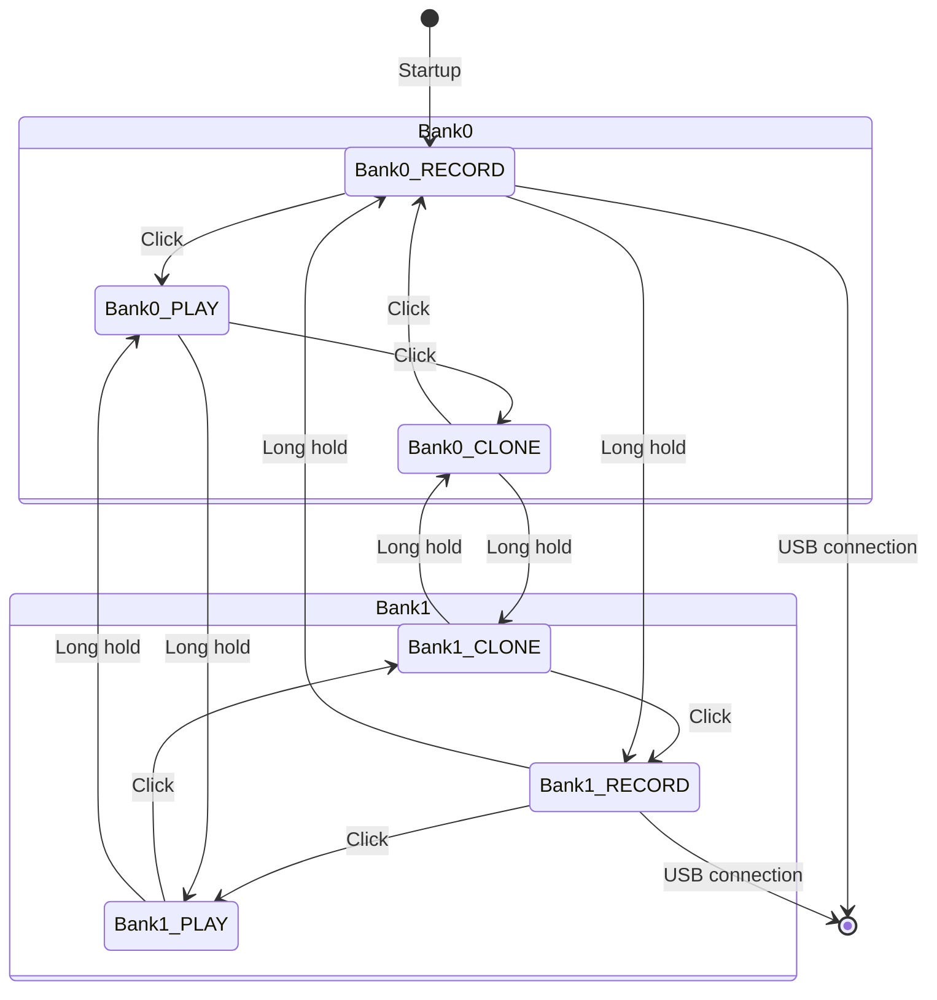

# HF_YOUNG — MIFARE Classic Sniffer/Simulator (2-Bank)

> **Author:** Craig Young
> **Frequency:** HF (13.56 MHz)
> **Hardware:** Generic Proxmark3

[Back to Standalone Modes Index](../../armsrc/Standalone/readme.md#individual-mode-documentation) | [Source Code](../../armsrc/Standalone/hf_young.c) | [Development Guide](../../armsrc/Standalone/readme.md#developing-standalone-modes)

---

## What

Sniffs MIFARE Classic 1K communications between a reader and card, then simulates or clones the captured data. Features two memory banks for storing different card captures.

## Why

MIFARE Classic is the most widely deployed contactless smart card. This mode enables field-based capture of reader-card transactions followed by immediate simulation or cloning — useful for testing access control systems and understanding their authentication sequences without needing a laptop.

## How

1. **RECORD**: Places the Proxmark3 in sniffer mode to capture ISO 14443A / MIFARE Classic communications. The captured UID, ATQA, SAK, and key data are stored in the selected bank.
2. **PLAY**: Emulates a MIFARE Classic card using the captured UID and data, responding to reader authentication requests.
3. **CLONE**: Writes captured data to a "magic" Gen1a MIFARE Classic card (one with a writable Block 0).

Each of the two banks can independently store a captured card's data.

## LED Indicators

| LED | Meaning |
|-----|---------|
| **A** (solid) | Bank 0 selected |
| **B** (solid) | Bank 1 selected |
| **C** (solid) | RECORD mode |
| **D** (solid) | PLAY (simulate) mode |
| **C+D** (solid) | CLONE mode |
| **A-D** (blink) | Activity |

## Button Controls

| Action | Effect |
|--------|--------|
| **Single click** | Advance state: RECORD → PLAY → CLONE → RECORD |
| **Long hold** | Switch between Bank 0 and Bank 1 |

## State Machine



## Compilation

```
make clean
make STANDALONE=HF_YOUNG -j
./pm3-flash-fullimage
```

## Related

- [MattyRun](hf_mattyrun.md) — Automated MFC key check, nested attack, dump, and emulate
- [CraftByte](hf_craftbyte.md) — 14443A UID stealer/emulator
- [MIFARE Classic Simulator](hf_mfcsim.md) — Multi-slot MFC simulator from flash dumps
