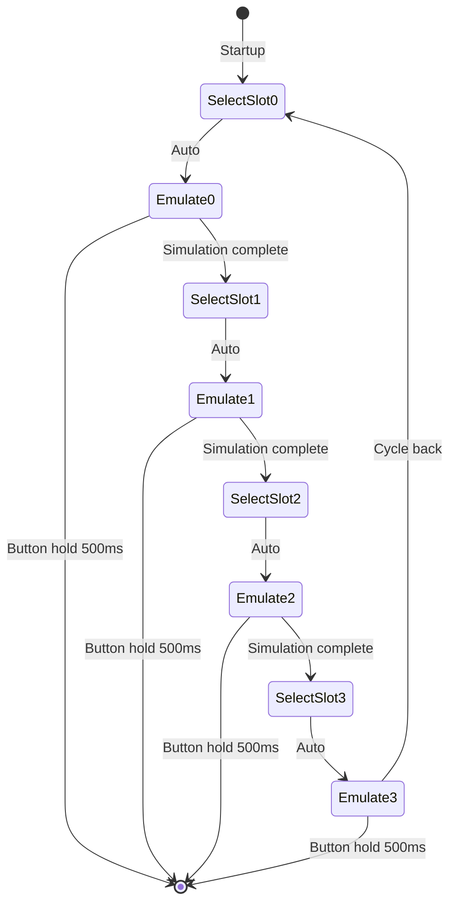

# LF_EM4100EMUL — EM4100 Simulator

> **Author:** temskiy
> **Frequency:** LF (125 kHz)
> **Hardware:** Generic Proxmark3

[Back to Standalone Modes Index](../../armsrc/Standalone/readme.md#individual-mode-documentation) | [Source Code](../../armsrc/Standalone/lf_em4100emul.c) | [Development Guide](../../armsrc/Standalone/readme.md#developing-standalone-modes)

---

## What

Simulates a set of predefined EM4100 tag IDs in sequence. The Proxmark3 cycles through a list of hardcoded EM4100 IDs, broadcasting each one for a period before moving to the next.

## Why

This is useful when you already know the EM4100 IDs you want to replay and need a simple, standalone way to cycle through them without a host connection. Common scenarios:

- **Testing access control readers**: Verify which IDs are accepted
- **Red team walk-through**: Pre-load known badges and cycle through them at doors
- **Development & debugging**: Verify your EM4100 reader code against known-good IDs

## How

1. The firmware contains a hardcoded array of EM4100 IDs
2. On startup, it selects the first slot and begins simulating
3. It automatically advances to the next slot after each simulation cycle
4. The device shows the current slot number via LED binary encoding

The simulation uses Manchester encoding at the configured bit rate to emulate an EM4100 tag.

## LED Indicators

| LED | Meaning |
|-----|---------|
| **A/B/C/D** (binary) | Current slot number displayed in binary (LED A = bit 0, etc.) |
| All LEDs off | Idle / transitioning between slots |

## Button Controls

| Action | Effect |
|--------|--------|
| **Hold 500ms** | Exit standalone mode |
| **USB command** | Exit standalone mode |

## State Machine



## Compilation

```
make clean
make STANDALONE=LF_EM4100EMUL -j
./pm3-flash-fullimage
```

## Related

- [EM4100 RSWB](lf_em4100rswb.md) — Full read/sim/write/brute for EM4100
- [EM4100 RSWW](lf_em4100rsww.md) — Read/sim/write/wipe/validate
- [EM4100 RWC](lf_em4100rwc.md) — Read/sim/clone with 16 slots
- [T5577 Introduction Guide](../T5577_Guide.md) — Background on T5577/EM4100 technology
