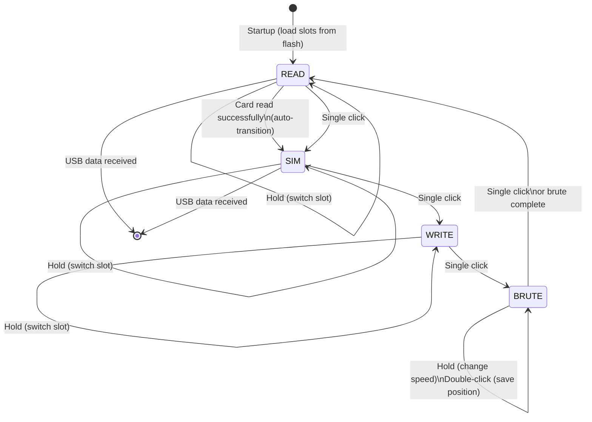

# LF_EM4100RSWB — EM4100 Read/Simulate/Write/Brute

> **Author:** Monster1024
> **Frequency:** LF (125 kHz)
> **Hardware:** RDV4 (requires flash memory for slot storage)

[Back to Standalone Modes Index](../../armsrc/Standalone/readme.md#individual-mode-documentation) | [Source Code](../../armsrc/Standalone/lf_em4100rswb.c) | [Development Guide](../../armsrc/Standalone/readme.md#developing-standalone-modes)

---

## What

A full-featured EM4100 attack mode with four operations: **read**, **simulate**, **write to T55x7**, and **brute force**. Supports 4 card storage slots with flash persistence on RDV4 hardware.

## Why

This is the most versatile EM4100 standalone mode. While simpler modes only read or simulate, RSWB combines all four essential operations — plus brute forcing — into a single firmware image. This is ideal for:

- **Pentesting EM4100 access control**: Read a badge, simulate it, then write a clone, all standalone
- **Brute force attacks**: Iterate through card numbers to find valid ones when you don't have a known-good badge
- **Multi-target assessments**: Store up to 4 different badges and switch between them on-site

## How

1. **READ mode**: Listens for EM4100 cards. On successful read, stores the ID in the current slot and automatically transitions to SIM mode
2. **SIM mode**: Broadcasts the stored EM4100 ID. Button press moves to WRITE mode
3. **WRITE mode**: Writes the stored ID to a T55x7 blank card placed on the antenna
4. **BRUTE mode**: Sequentially transmits incrementing card numbers. Double-click saves a working number; hold changes brute speed

Slot data persists across reboots via the RDV4's SPI flash memory.

## LED Indicators

| LED | Meaning |
|-----|---------|
| **A, B** (binary) | Current mode: 00=READ, 01=SIM, 10=WRITE, 11=BRUTE |
| **C, D** (binary) | Current slot: 00=Slot1, 01=Slot2, 10=Slot3, 11=Slot4 |
| All flash on operation | Success confirmation |

## Button Controls

| Context | Action | Effect |
|---------|--------|--------|
| Any mode | **Single click** | Switch mode (READ → SIM → WRITE → BRUTE → READ) |
| Any mode | **Hold** | Switch slot (1 → 2 → 3 → 4 → 1) |
| BRUTE | **Single click** | Exit brute mode → READ |
| BRUTE | **Double-click** | Save current brute position |
| BRUTE | **Hold** | Change brute speed |

## State Machine



## Flash Storage

- Slot data is saved to and loaded from the RDV4 SPI flash
- 4 slots, each storing the raw EM4100 ID
- Data persists across power cycles

## Compilation

```
make clean
make STANDALONE=LF_EM4100RSWB -j
./pm3-flash-fullimage
```

## Related

- [EM4100 Emulator](lf_em4100emul.md) — Simple predefined EM4100 simulator
- [EM4100 RSWW](lf_em4100rsww.md) — Read/sim/write/wipe/validate variant
- [EM4100 RWC](lf_em4100rwc.md) — 16-slot read/sim/clone
- [T5577 Introduction Guide](../T5577_Guide.md) — Background on T5577/EM4100
