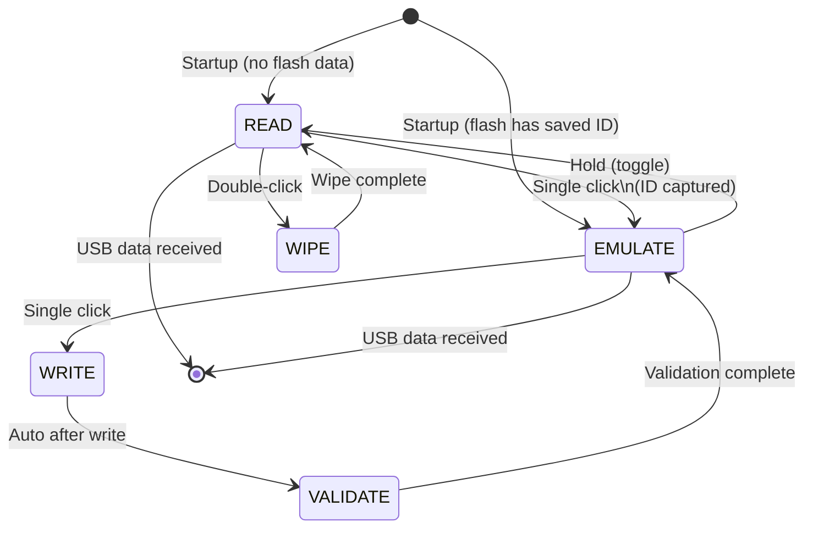

# LF_EM4100RSWW — EM4100 Read/Simulate/Write/Wipe/Validate

> **Author:** Łukasz "zabszk" Jurczyk
> **Frequency:** LF (125 kHz)
> **Hardware:** RDV4 (requires flash memory)

[Back to Standalone Modes Index](../../armsrc/Standalone/readme.md#individual-mode-documentation) | [Source Code](../../armsrc/Standalone/lf_em4100rsww.c) | [Development Guide](../../armsrc/Standalone/readme.md#developing-standalone-modes)

---

## What

An EM4100 multi-tool that adds **wipe** and **validate** operations on top of read/simulate/write. Automatically saves read IDs to flash memory for persistence across power cycles.

## Why

Unlike RSWB which focuses on brute forcing, RSWW focuses on the **clone verification workflow**: read a tag, write it to a T55x7, then validate the clone reads back correctly. The wipe function lets you reset T55x7 cards to a blank state. This is the mode to use when:

- **Quality-checking clones**: Verify the written data matches the original
- **Preparing blank cards**: Wipe T55x7 cards back to factory state
- **Field work with persistence**: Read IDs survive reboots via flash

## How

1. **READ**: Listens for EM4100 tags and stores the ID to flash
2. **EMULATE**: Broadcasts the stored ID (defaults to this mode if flash has data from a previous session)
3. **WRITE**: Writes the stored ID to a T55x7 tag
4. **VALIDATE**: Reads back a T55x7 and compares it to the stored ID to confirm a successful clone
5. **WIPE**: Resets a T55x7 tag to its default (empty) configuration

## LED Indicators

| LED | Meaning |
|-----|---------|
| **A** (solid) | READ mode active |
| **B** (solid) | EMULATE mode active |
| **C** (solid) | VALIDATE mode active |
| **D** (solid) | WIPE mode active |
| Blink pattern | Success/failure indication after operations |

## Button Controls

| Action | Effect |
|--------|--------|
| **Single click** | Advance mode (READ → EMULATE → WRITE/VALIDATE) |
| **Hold** | Toggle between READ and EMULATE |
| **Double-click in READ** | Enter WIPE mode |
| **USB command** | Exit standalone mode |

## State Machine



## Flash Storage

- Automatically saves the most recent read ID to SPI flash
- Loads stored ID on startup; if found, starts in EMULATE mode
- One slot for persistent storage

## Compilation

```
make clean
make STANDALONE=LF_EM4100RSWW -j
./pm3-flash-fullimage
```

## Related

- [EM4100 RSWB](lf_em4100rswb.md) — 4-slot variant with brute force
- [EM4100 Emulator](lf_em4100emul.md) — Simple hardcoded EM4100 simulator
- [EM4100 RWC](lf_em4100rwc.md) — 16-slot read/sim/clone
