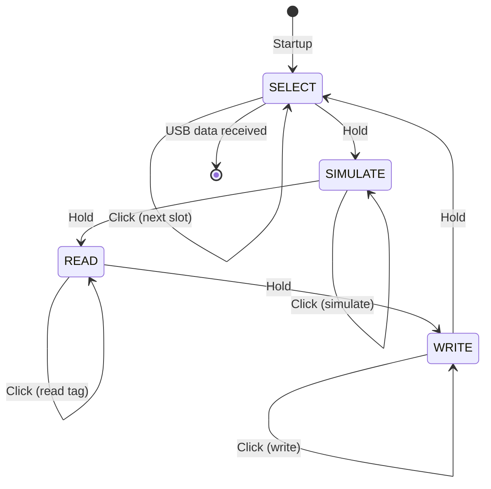

# LF_EM4100RWC — EM4100 Read/Write/Clone (16 Slots)

> **Author:** temskiy
> **Frequency:** LF (125 kHz)
> **Hardware:** RDV4 (flash memory for slot storage)

[Back to Standalone Modes Index](../../armsrc/Standalone/readme.md#individual-mode-documentation) | [Source Code](../../armsrc/Standalone/lf_em4100rwc.c) | [Development Guide](../../armsrc/Standalone/readme.md#developing-standalone-modes)

---

## What

Read, simulate, and clone EM4100 tags with **16 storage slots**. Pre-loaded with 3 sample IDs. Provides the largest card storage capacity of any EM4100 standalone mode.

## Why

When you need to collect and manage many EM4100 IDs on a single assessment — for example, reading badges from multiple employees — having 16 slots lets you capture a full team's credentials on-device. Each slot is independently selectable for simulation or cloning.

## How

1. **SELECT**: Navigate between the 16 slots using button clicks
2. **READ**: Read an EM4100 tag and store it in the currently selected slot
3. **SIMULATE**: Broadcast the selected slot's ID
4. **WRITE**: Clone the selected slot's ID to a T5555 card

The mode cycles through these four states with button holds to switch modes and clicks to execute within a mode.

## LED Indicators

| LED | Meaning |
|-----|---------|
| **A/B/C/D** (binary) | Slot number in binary (0–15) |
| Blink patterns | Operation success/failure |

## Button Controls

| State | Action | Effect |
|-------|--------|--------|
| SELECT | **Single click** | Next slot |
| SELECT | **Hold** | Switch to SIMULATE mode |
| READ | **Single click** | Read tag into current slot |
| READ | **Hold** | Switch to WRITE mode |
| SIMULATE | **Single click** | Start simulation |
| SIMULATE | **Hold** | Switch to READ mode |
| WRITE | **Single click** | Write current slot to T5555 |
| WRITE | **Hold** | Switch to SELECT mode |

## State Machine



## Compilation

```
make clean
make STANDALONE=LF_EM4100RWC -j
./pm3-flash-fullimage
```

## Related

- [EM4100 RSWB](lf_em4100rswb.md) — 4-slot variant with brute force
- [EM4100 Emulator](lf_em4100emul.md) — Simple predefined simulator
- [EM4100 RSWW](lf_em4100rsww.md) — Read/sim/write/wipe/validate
