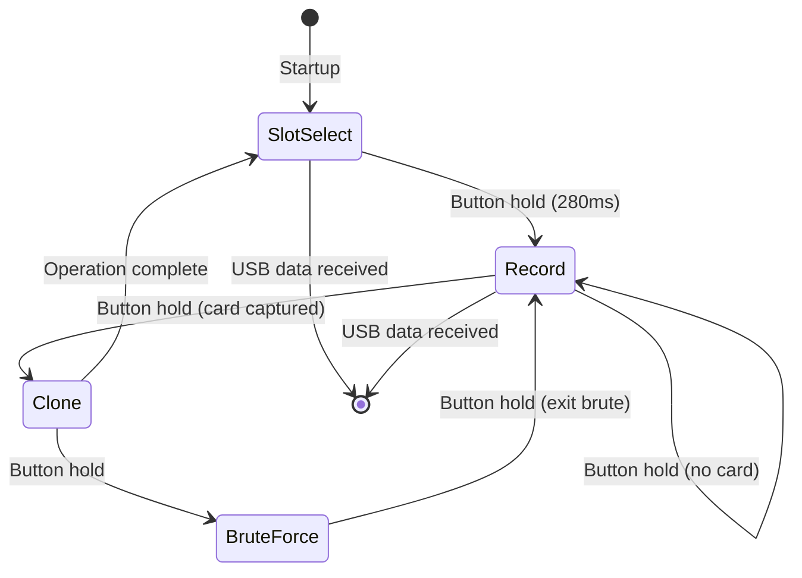

# LF_HIDBRUTE — HID Corporate 1000 Bruteforce

> **Authors:** Federico Dotta & Maurizio Agazzini
> **Frequency:** LF (125 kHz)
> **Hardware:** Generic Proxmark3

[Back to Standalone Modes Index](../../armsrc/Standalone/readme.md#individual-mode-documentation) | [Source Code](../../armsrc/Standalone/lf_hidbrute.c) | [Development Guide](../../armsrc/Standalone/readme.md#developing-standalone-modes)

---

## What

Reads an HID Corporate 1000 (35-bit) card, then brute forces the card number up/down from the captured value while preserving the facility code. Also supports direct simulation and cloning.

## Why

HID Corporate 1000 uses a 35-bit format with a facility code and card number. If you can read one card, you likely know the facility code for that site. By brute forcing the card number, you can test other valid badge numbers in the same facility — for example, finding an admin badge number when you only have a standard user badge.

Use cases:
- **Privilege escalation**: Find higher-privilege card numbers in the same facility
- **Adjacent badge discovery**: Walk through card numbers near a known-good badge
- **Access control testing**: Verify whether sequential card numbers are provisioned

## How

1. **Record**: Read an HID Corporate 1000 card to capture facility code + card number
2. **Clone**: Write the captured credentials to a T55x7 card
3. **Brute**: Simulate incrementing/decrementing card numbers with the same facility code

The brute force iterates the card number portion while keeping the facility code constant from the originally recorded card.

## LED Indicators

| LED | Meaning |
|-----|---------|
| **A** (solid) | Slot 0 selected / cloning active |
| **B** (solid) | Slot 1 selected / simulation active |
| **C** (solid) | Slot 2 selected |
| **D** (solid) | Status indicator |
| LED(slot+1) | Indicates currently active slot during recording |

## Button Controls

| Action | Effect |
|--------|--------|
| **Hold 280ms** | Advance state (select → record → clone/brute → repeat) |
| **USB command** | Exit standalone mode |

## State Machine



## Compilation

```
make clean
make STANDALONE=LF_HIDBRUTE -j
./pm3-flash-fullimage
```

## Related

- [SamyRun](lf_samyrun.md) — HID26 read/clone/simulate
- [HID FC Brute](lf_hidfcbrute.md) — Brute force HID facility codes
- [ProxBrute](lf_proxbrute.md) — HID ProxII card number brute force
- [Prox2Brute](lf_prox2brute.md) — ProxII brute force v2
- [HID Downgrade Attacks](../hid_downgrade.md) — Reader downgrade methods
