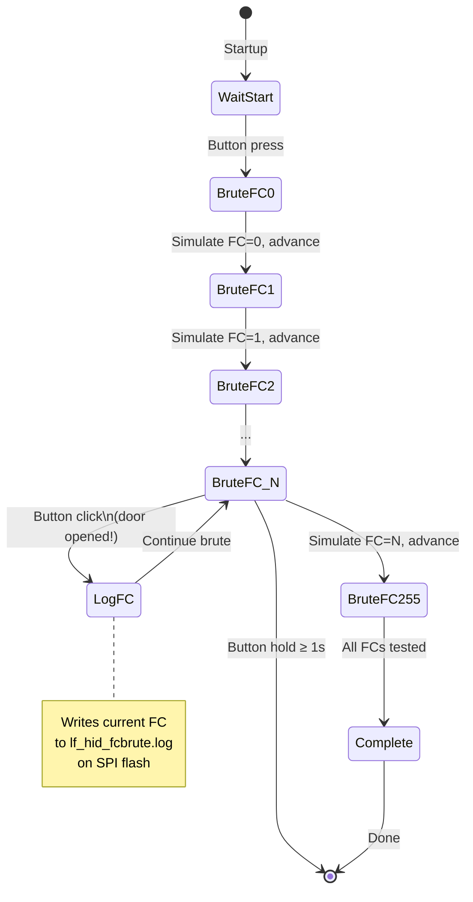

# LF_HIDFCBRUTE — HID Facility Code Bruteforce

> **Author:** ss23
> **Frequency:** LF (125 kHz)
> **Hardware:** RDV4 (requires flash for logging)

[Back to Standalone Modes Index](../../armsrc/Standalone/readme.md#individual-mode-documentation) | [Source Code](../../armsrc/Standalone/lf_hidfcbrute.c) | [Development Guide](../../armsrc/Standalone/readme.md#developing-standalone-modes)

---

## What

Brute forces all 256 possible HID facility codes (0–255) using a static card number of 1, and logs results to flash memory. When a reader accepts a facility code, you can mark it with a button press.

## Why

HID 26-bit (H10301) cards encode a facility code (FC, 0–255) and a card number (CN, 0–65535). If you don't have a valid card to clone, but you do have physical access to a reader, you can discover the correct facility code by trying all 256 possibilities. Once you know the FC, you can pair it with brute-forced card numbers.

This is the first step in a blind HID attack when you have no captured credentials.

## How

1. The mode simulates an HID 26-bit tag with FC cycling from 0 to 255 and CN fixed at 1
2. During each simulation, LED C toggles to show progress
3. Press the button to log the current FC to `lf_hid_fcbrute.log` on flash (this is your "the door opened" marker)
4. Hold the button for 1 second to exit
5. After completion, retrieve the log file via the client

## LED Indicators

| LED | Meaning |
|-----|---------|
| **A** (solid) | Brute force active |
| **C** (toggling) | Toggles on each FC attempt — visual progress indicator |
| **D** (solid) | Simulation transmission active |

## Button Controls

| Action | Effect |
|--------|--------|
| **Click / hold 10ms** | Begin brute force |
| **Single click** (during brute) | Log current FC to flash file |
| **Hold ≥ 1 second** | Exit brute force |
| **USB command** | Exit standalone mode |

## State Machine



## Flash Storage

- **Log file**: `lf_hid_fcbrute.log` on SPI flash
- Contains facility codes that were manually marked via button press
- Retrieve with the client after the assessment

## Compilation

```
make clean
make STANDALONE=LF_HIDFCBRUTE -j
./pm3-flash-fullimage
```

## Related

- [HID Corporate Brute](lf_hidbrute.md) — Brute force card numbers with known FC
- [SamyRun](lf_samyrun.md) — Read/clone/sim HID26
- [ProxBrute](lf_proxbrute.md) — HID ProxII brute force
- [IceHID Collector](lf_icehid.md) — Passive HID credential collection
