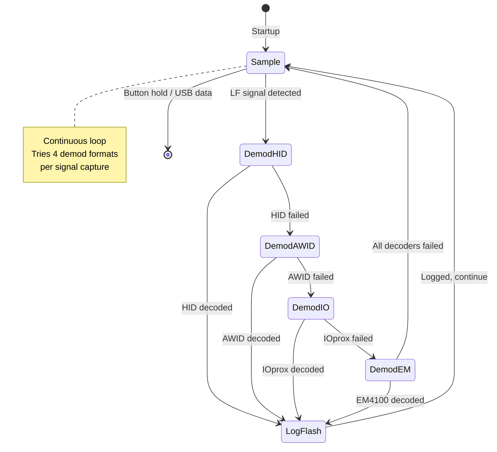

# LF_ICEHID — Multi-Format LF Credential Collector

> **Author:** Iceman
> **Frequency:** LF (125 kHz)
> **Hardware:** RDV4 (requires flash memory and battery)

[Back to Standalone Modes Index](../../armsrc/Standalone/readme.md#individual-mode-documentation) | [Source Code](../../armsrc/Standalone/lf_icehid.c) | [Development Guide](../../armsrc/Standalone/readme.md#developing-standalone-modes)

---

## What

A passive LF credential collector that continuously listens for **HID, IOprox, AWID, and EM4100** cards and logs all captured credentials to flash memory. Runs unattended — just power on and leave it.

## Why

This is the ultimate "drop and collect" standalone mode. Place a powered Proxmark3 RDV4 (with battery) near a high-traffic area (like a card reader or badge check-in point) and it silently captures every LF credential that comes into range. Unlike single-protocol modes, IceHID tries all four common LF formats on every signal, catching whatever cards employees are carrying.

Use cases:
- **Passive badge collection**: Covert long-duration credential harvesting
- **Multi-format sites**: Sites using a mix of HID, AWID, IOprox, and EM4100
- **Physical penetration testing**: Leave device near a turnstile, collect badges over hours

## How

1. The Proxmark3 continuously samples the LF antenna
2. On each sample, it attempts demodulation in four formats: HID → AWID → IOprox → EM4100
3. If any format decodes successfully, the credential is logged to `lf_hidcollect.log` on flash
4. The cycle repeats indefinitely until the button is held or USB data is received

The multi-format approach uses `ASKDemod()` and protocol-specific decoders in sequence.

## LED Indicators

| LED | Meaning |
|-----|---------|
| **A** (solid) | Reading / recording LF signal |
| **B** (solid) | Writing captured data to flash |
| **C** (solid) | Unmounting / syncing flash filesystem |

## Button Controls

| Action | Effect |
|--------|--------|
| **Hold 280ms** | Exit standalone mode |
| **USB command** | Exit standalone mode |

## State Machine



## Flash Storage

- **Log file**: `lf_hidcollect.log` on SPI flash
- Each entry contains the decoded credential data and format type
- Retrieve with client: `mem spiffs dump -s lf_hidcollect.log -d lf_hidcollect.log`

## Compilation

```
make clean
make STANDALONE=LF_ICEHID -j
./pm3-flash-fullimage
```

## Related

- [NexID Collector](lf_nexid.md) — Similar collector for Nexwatch credentials
- [SamyRun](lf_samyrun.md) — Active HID read/clone/sim
- [HID FC Brute](lf_hidfcbrute.md) — Active HID facility code brute force
