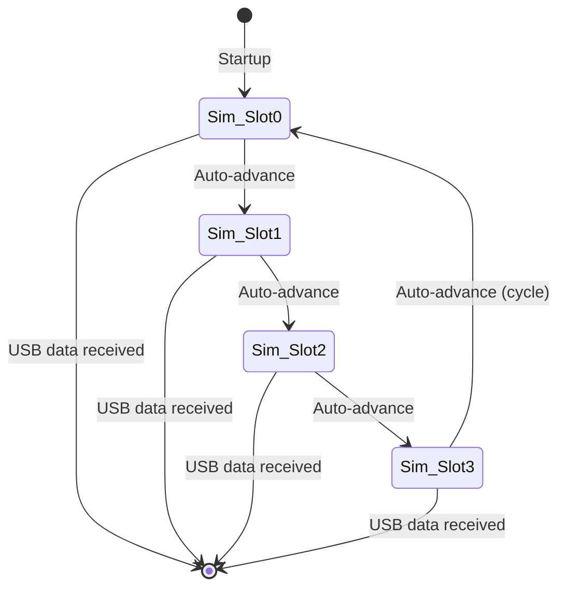

# LF_MULTIHID — HID 26-Bit Multi-Card Simulator

> **Author:** Shain Lakin
> **Frequency:** LF (125 kHz)
> **Hardware:** Generic Proxmark3

[Back to Standalone Modes Index](../../armsrc/Standalone/readme.md#individual-mode-documentation) | [Source Code](../../armsrc/Standalone/lf_multihid.c) | [Development Guide](../../armsrc/Standalone/readme.md#developing-standalone-modes)

---

## What

Cycles through 4 predefined HID 26-bit (H10301) raw card IDs, simulating each one in sequence automatically.

## Why

When you have multiple known-valid HID credentials and want to try them all at a reader without manual intervention. Edit the source with your target IDs, compile, and the device will automatically cycle through each one at the reader.

## How

1. The firmware contains 4 hardcoded raw HID values
2. On startup, it selects the first slot and begins simulating
3. After each simulation interval, it advances to the next slot
4. The cycle repeats continuously until exit

## LED Indicators

| LED | Meaning |
|-----|---------|
| **A/B/C/D** (binary) | Currently selected slot number |

## Button Controls

| Action | Effect |
|--------|--------|
| **USB command** | Exit standalone mode |

## State Machine



## Customization

Edit the raw ID array in the source code before compiling:

```c
// Example: change these to your target IDs
static const uint32_t ids[] = {
    0x2006EC0C86,  // Slot 0
    0x2006EC0C87,  // Slot 1
    0x2006EC0C88,  // Slot 2
    0x2006EC0C89,  // Slot 3
};
```

## Compilation

```
make clean
make STANDALONE=LF_MULTIHID -j
./pm3-flash-fullimage
```

## Related

- [SamyRun](lf_samyrun.md) — Read/clone/simulate single HID26
- [HID Corporate Brute](lf_hidbrute.md) — Brute force card numbers
- [IceHID Collector](lf_icehid.md) — Passive multi-format collector
