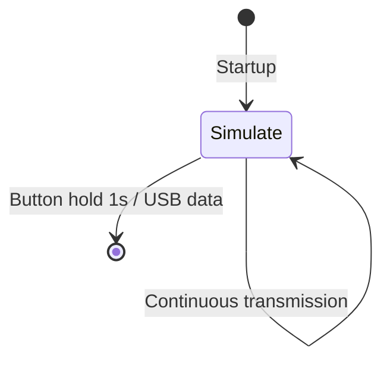

# LF_NEDAP_SIM — Nedap RFID Simple Simulator

> **Frequency:** LF (125 kHz)
> **Hardware:** Generic Proxmark3

[Back to Standalone Modes Index](../../armsrc/Standalone/readme.md#individual-mode-documentation) | [Source Code](../../armsrc/Standalone/lf_nedap_sim.c) | [Development Guide](../../armsrc/Standalone/readme.md#developing-standalone-modes)

---

## What

Simulates a Nedap RFID tag with a hardcoded ID. Supports both 64-bit and 128-bit Nedap formats, including proper CRC and framing.

## Why

Nedap is a less common but still-deployed access control system, particularly in Europe. This mode lets you test Nedap readers by simulating a known tag. Since Nedap cards are less commonly available than HID, having a simulator is valuable for testing.

## How

1. The firmware encodes a hardcoded Nedap tag structure (subType, customerCode, id)
2. It generates the proper bit sequence with CRC calculation
3. Continuously transmits the encoded tag via LF modulation
4. Supports 128-bit "long" format when `isLong=1`

Default hardcoded values: `subType=5`, `customerCode=0x123`, `id=42424`, `isLong=1`

## LED Indicators

| LED | Meaning |
|-----|---------|
| Minimal LED usage | Simple continuous simulation mode |

## Button Controls

| Action | Effect |
|--------|--------|
| **Hold 1000ms** | Exit standalone mode |
| **USB command** | Exit standalone mode |

## State Machine



## Customization

To change the simulated tag, edit the hardcoded values in the source:

```c
static NedapTag_t tag = {
    .subType = 0x5,
    .customerCode = 0x123,
    .id = 42424,
    .isLong = 1,
};
```

## Compilation

```
make clean
make STANDALONE=LF_NEDAP_SIM -j
./pm3-flash-fullimage
```

## Related

- [EM4100 Emulator](lf_em4100emul.md) — Simple EM4100 simulator
- [Skeleton Template](lf_skeleton.md) — Template for building new LF modes
