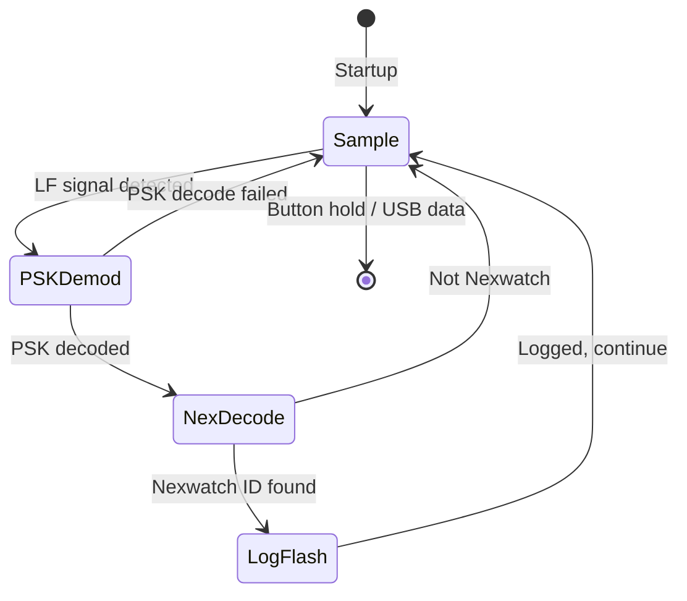

# LF_NEXID — Nexwatch Credential Collector

> **Authors:** jrjgjk & Zolorah
> **Frequency:** LF (125 kHz)
> **Hardware:** RDV4 (requires flash for logging)

[Back to Standalone Modes Index](../../armsrc/Standalone/readme.md#individual-mode-documentation) | [Source Code](../../armsrc/Standalone/lf_nexid.c) | [Development Guide](../../armsrc/Standalone/readme.md#developing-standalone-modes)

---

## What

Passively sniffs and logs Nexwatch/NexKey ID credentials to flash memory. Decodes the magic bytes and mode information from each captured card.

## Why

Nexwatch (by Honeywell) is an access control card format found in commercial buildings. This collector silently harvests Nexwatch credentials over time, analogous to [IceHID](lf_icehid.md) but specifically targeting the Nexwatch protocol with full decode information.

## How

1. Continuously samples the LF antenna using PSK demodulation
2. Attempts Nexwatch-specific decode on each signal burst
3. On successful decode, extracts the magic bytes, mode, and ID
4. Logs the decoded credential to `lf_nexcollect.log` on flash
5. Repeats until button hold or USB exit

## LED Indicators

| LED | Meaning |
|-----|---------|
| **A** (solid) | Reading / recording LF signal |
| **B** (solid) | Writing to flash |
| **C** (solid) | Unmounting / syncing flash |

## Button Controls

| Action | Effect |
|--------|--------|
| **Hold 280ms** | Exit standalone mode |
| **USB command** | Exit standalone mode |

## State Machine



## Flash Storage

- **Log file**: `lf_nexcollect.log` on SPI flash
- Each entry contains decoded Nexwatch credentials with magic bytes and mode
- Retrieve with: `mem spiffs dump -s lf_nexcollect.log -d lf_nexcollect.log`

## Compilation

```
make clean
make STANDALONE=LF_NEXID -j
./pm3-flash-fullimage
```

## Related

- [IceHID Collector](lf_icehid.md) — Multi-format LF collector (HID/AWID/IO/EM)
- [Tharexde EM4x50](lf_tharexde.md) — EM4x50 collector
