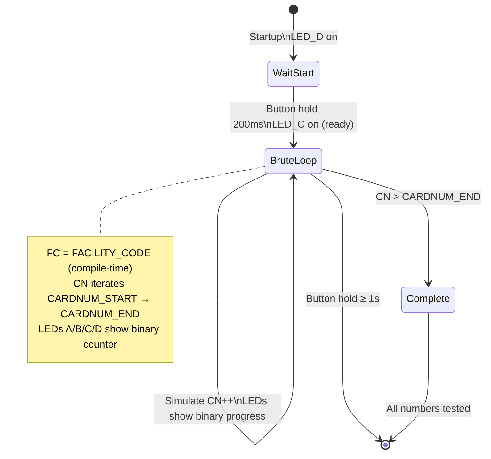

# LF_PROX2BRUTE — HID ProxII Bruteforce v2

> **Author:** Yann Gascuel
> **Frequency:** LF (125 kHz)
> **Hardware:** Generic Proxmark3

[Back to Standalone Modes Index](../../armsrc/Standalone/readme.md#individual-mode-documentation) | [Source Code](../../armsrc/Standalone/lf_prox2brute.c) | [Development Guide](../../armsrc/Standalone/readme.md#developing-standalone-modes)

---

## What

An improved version of [ProxBrute](lf_proxbrute.md) that brute forces HID ProxII H10301 26-bit card numbers over a **configurable range** with compile-time settings for facility code, start number, and end number.

## Why

The original ProxBrute requires reading a card first and only goes downward. Prox2Brute lets you pre-configure the exact facility code and card number range to test — no need to capture a card first. It's faster because it's purpose-built for the H10301 26-bit format with optimized timing between attempts.

Use this when:
- You already know the facility code (from reconnaissance or a previous capture)
- You want to test a specific card number range
- You need faster iteration than the original ProxBrute

## How

1. Configure the target parameters at compile time via `#define` directives: `FACILITY_CODE`, `CARDNUM_START`, `CARDNUM_END`
2. On startup, press the button to begin
3. The device iterates through each card number, simulating the HID 26-bit format
4. LEDs cycle in binary to show progress
5. Hold button for 1 second to exit

## LED Indicators

| LED | Meaning |
|-----|---------|
| **A** | Inverts every attempt — fast blink = running |
| **B** | Inverts every 8 attempts |
| **C** | Inverts every 16 attempts |
| **D** | Inverts every 32 attempts — slow blink = progress |
| **D** (initial) | Waiting for button press to start |
| **C** (initial) | Ready indicator |

The LED pattern creates a visual binary counter showing brute force progress at a glance.

## Button Controls

| Action | Effect |
|--------|--------|
| **Hold 200ms** | Start brute force |
| **Hold ≥ 1 second** (during brute) | Exit brute force |
| **USB command** | Exit standalone mode |

## State Machine



## Compile-Time Configuration

Edit the `#define` values in the source code before compiling:

```c
#define FACILITY_CODE  111  // Target facility code
#define CARDNUM_START  1    // First card number to try
#define CARDNUM_END    65535 // Last card number to try
```

## Compilation

```
make clean
make STANDALONE=LF_PROX2BRUTE -j
./pm3-flash-fullimage
```

## Related

- [ProxBrute](lf_proxbrute.md) — Original ProxII brute (reads card first, goes downward)
- [HID Corporate Brute](lf_hidbrute.md) — Corporate 1000 format brute force
- [HID FC Brute](lf_hidfcbrute.md) — Facility code brute force
