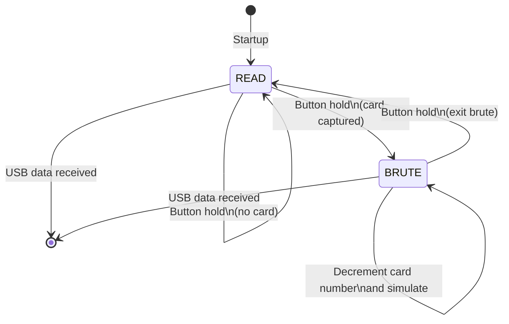

# LF_PROXBRUTE — HID ProxII Bruteforce

> **Author:** Brad Antoniewicz
> **Frequency:** LF (125 kHz)
> **Hardware:** Generic Proxmark3

[Back to Standalone Modes Index](../../armsrc/Standalone/readme.md#individual-mode-documentation) | [Source Code](../../armsrc/Standalone/lf_proxbrute.c) | [Development Guide](../../armsrc/Standalone/readme.md#developing-standalone-modes)

---

## What

Reads an HID ProxII tag, then brute forces all card numbers **downward** from the captured value, keeping the same facility code.

## Why

HID ProxII is one of the most widely deployed access control card formats. If you have one valid card, you can enumerate other valid card numbers by brute forcing downward (most organizations assign card numbers sequentially, so badges with lower numbers often belong to employees with longer tenure or higher access).

## How

1. **READ**: Capture an HID ProxII card to learn the facility code and starting card number
2. **BRUTE**: Simulate the card with decrementing card numbers, pausing briefly at each one
3. The facilty code is preserved from the original capture
4. Hold button during brute to exit back to READ

## LED Indicators

| LED | Meaning |
|-----|---------|
| **A** (solid) | Reading / simulation active |
| **C** (solid) | Brute force mode |
| **A+B+C+D** (flash) | Error or exiting |

## Button Controls

| Action | Effect |
|--------|--------|
| **Hold 280ms** | Advance state (READ → BRUTE) |
| **Hold during brute** | Exit brute → back to READ |
| **USB command** | Exit standalone mode |

## State Machine



## Compilation

```
make clean
make STANDALONE=LF_PROXBRUTE -j
./pm3-flash-fullimage
```

## Related

- [Prox2Brute](lf_prox2brute.md) — Faster, configurable ProxII brute force v2
- [HID Corporate Brute](lf_hidbrute.md) — Corporate 1000 brute force
- [SamyRun](lf_samyrun.md) — HID26 read/clone/sim
- [HID FC Brute](lf_hidfcbrute.md) — Facility code brute force
