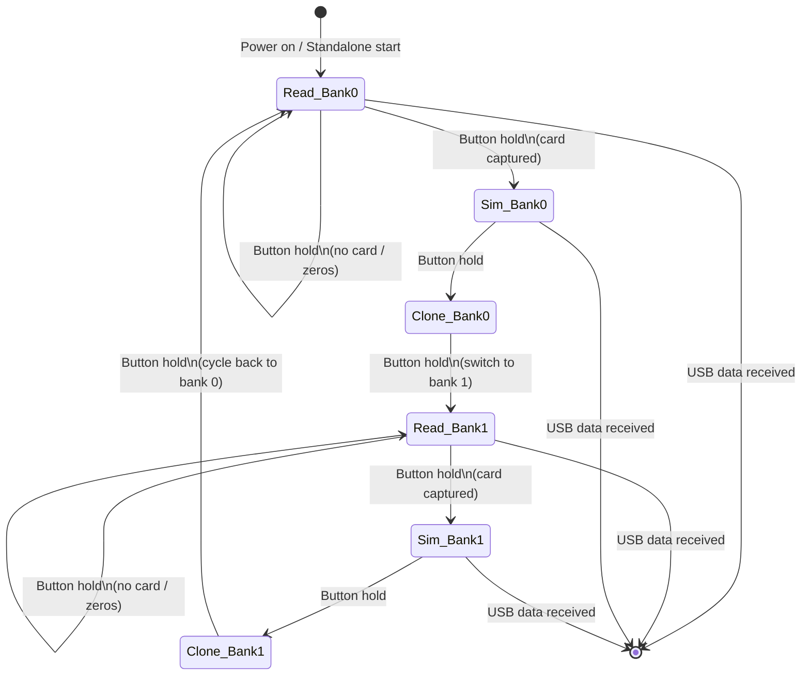

# LF_SAMYRUN — HID26 Read/Clone/Simulate

> **Author:** Samy Kamkar
> **Frequency:** LF (125 kHz)
> **Hardware:** Generic Proxmark3 (no special requirements)
> **Default mode:** Yes — this is the factory-default standalone mode

[Back to Standalone Modes Index](../../armsrc/Standalone/readme.md#individual-mode-documentation) | [Source Code](../../armsrc/Standalone/lf_samyrun.c) | [Development Guide](../../armsrc/Standalone/readme.md#developing-standalone-modes)

---

## What

SamyRun reads an HID 26-bit (H10301) proximity card, then allows you to simulate or clone that card to a T55x7 blank. It supports **2 storage banks**, so you can capture and replay two different cards without reconnecting to a host.

## Why

This is the classic "sniff and replay" attack for HID access control systems. Many physical security assessments require demonstrating that credentials can be captured and replayed. SamyRun is the simplest, most direct tool for this: walk up to a card, read it, then walk up to a reader and replay it — entirely on-device with no laptop required.

Use cases:
- **Red team engagements**: Capture a badge and replay it at a door reader
- **Credential cloning**: Write captured credentials to a T55x7 blank card
- **Physical security audits**: Demonstrate that HID 26-bit (H10301) is trivially clonable

## How

1. The Proxmark3 enters LF read mode and waits for an HID card to come into field range
2. The card's raw data (high + low words) is decoded and stored into the selected bank (0 or 1)
3. On the next button press, the Proxmark3 simulates the captured card — it acts as the card itself and will unlock any reader expecting that credential
4. On the next button press, the data is written to a T55x7 card, creating a physical clone
5. The mode then cycles to the second bank and repeats

The firmware uses `lf_hid_watch()` for reading, `CmdHIDsimTAGEx()` for simulation, and `CopyHIDtoT55x7()` for cloning.

## LED Indicators

| LED | Meaning |
|-----|---------|
| **A** (solid) | Bank 0 selected, reading mode |
| **B** (solid) | Bank 1 selected, reading mode |
| **A or B** (blinking) | Error — zero data read, retry |
| **C** (solid) | Simulation active |
| **D** (solid) | Cloning active |
| **A+B+C+D** (rapid blink) | Exiting standalone mode |

## Button Controls

| Action | Effect |
|--------|--------|
| **Hold 280ms** | Advance to next state (READ → SIM → CLONE → next bank) |
| **USB command** | Exit standalone mode and return to host shell |

## State Machine



## Compilation

```
make clean
make STANDALONE=LF_SAMYRUN -j
./pm3-flash-fullimage
```

Or in `Makefile.platform`:
```
STANDALONE=LF_SAMYRUN
```

## Related

- [HID Corporate Brute](lf_hidbrute.md) — Bruteforce HID Corporate 1000 card numbers
- [ProxBrute](lf_proxbrute.md) — Bruteforce HID ProxII card numbers
- [MultiHID](lf_multihid.md) — Simulate multiple predefined HID26 cards
- [IceHID Collector](lf_icehid.md) — Log HID credentials to flash memory
